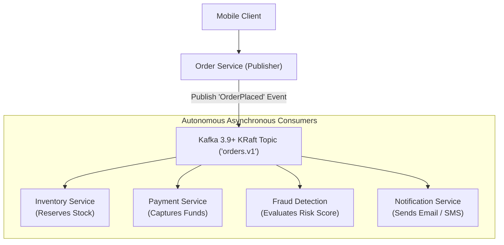
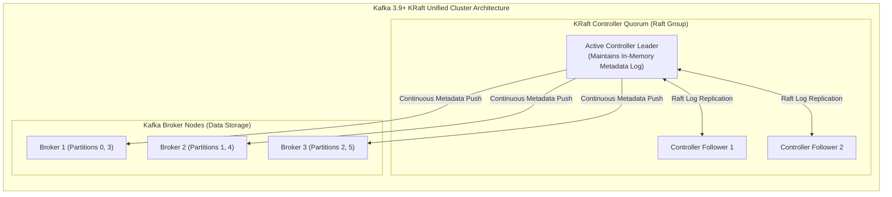
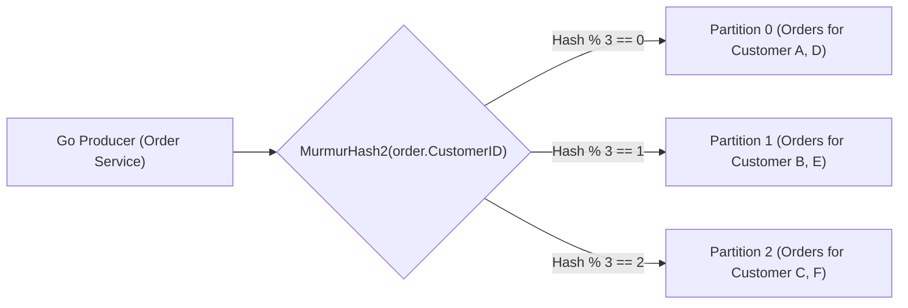
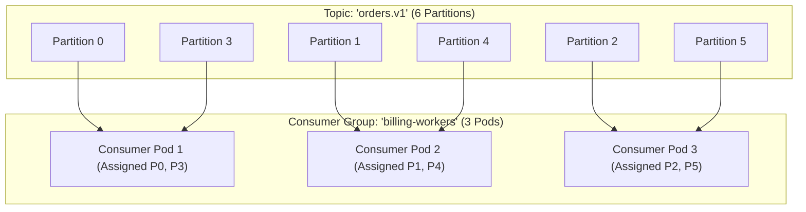
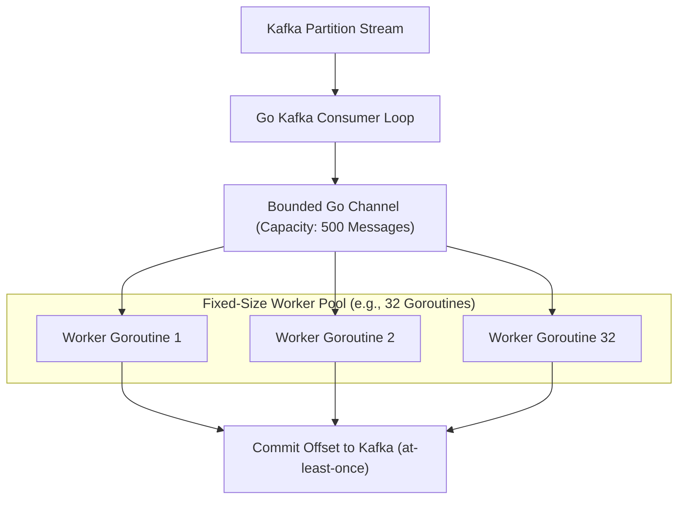
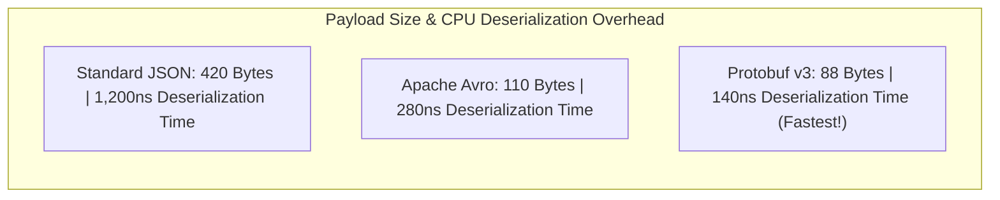

[← Previous Chapter: Part 4: Database Scaling & Sharding](/series/system-design/04-database-scaling-sharding/) | [Series Hub: System Design Masterclass](/series/system-design/) | [Next Chapter: Part 6: Distributed Locks, Mutex Invariants & Concurrency in Go →](/series/system-design/06-distributed-locks-concurrency/)

---

> **Prerequisite:** Read [Part 4: Database Scaling, Sharding Strategies & Distributed SQL](/series/system-design/04-database-scaling-sharding/) to understand how databases decouple state before implementing asynchronous event streams.

> **Answer-first:** Asynchronous event streaming with Apache Kafka 3.9+ KRaft decouples distributed microservices by eliminating ZooKeeper coordination bottlenecks. In Go, pairing Cooperative Sticky consumer assignors with bounded channel worker pools enforces backpressure, while non-blocking exponential retry topics quarantine poison pill messages, sustaining 500,000 events per second with sub-5ms latency across cloud clusters.

> 🇻🇳 **

**

---

## 1. Event-Driven Architecture: Choreography vs Orchestration

> **BLUF (Bottom Line Up Front):** Synchronous HTTP/gRPC communication chains create tight temporal coupling where downstream latency cascades upstream; asynchronous event streaming inverts dependencies by persisting immutable state transitions to a durable, partitioned distributed commit log that operates with sub-millisecond wire latencies.

In traditional synchronous microservices, placing an e-commerce order requires the Checkout Service to call the Inventory Service, Payment Gateway, Fraud Evaluator, and Notification Dispatcher sequentially over HTTP/REST. If the notification service experiences a 5-second latency spike, the entire user-facing checkout transaction hangs, depleting gateway connection pools and eroding system availability.

**Event-Driven Architecture (EDA)** decouples services temporally and spatially:
*   The Checkout Service writes an immutable `OrderPlaced` event to a distributed append-only log and returns an immediate HTTP 202 Accepted response to the customer.
*   Independent downstream services consume this event at their own pace, completely insulating the customer experience from downstream service outages or processing latency.


```mermaid
flowchart TD
    Client["Mobile Client"] --> Checkout["Order Service (Publisher)"]
    Checkout -->|Publish 'OrderPlaced' Event| KafkaTopic["Kafka 3.9+ KRaft Topic ('orders.v1')"]

    subgraph IndependentConsumers ["Autonomous Asynchronous Consumers"]
        KafkaTopic --> Inv["Inventory Service<br/>(Reserves Stock)"]
        KafkaTopic --> Pay["Payment Service<br/>(Captures Funds)"]
        KafkaTopic --> Fraud["Fraud Detection<br/>(Evaluates Risk Score)"]
        KafkaTopic --> Notif["Notification Service<br/>(Sends Email / SMS)"]
    end
```

### Architectural Comparison: Choreography vs Orchestration

| Dimension | Event Choreography (Kafka Driven) | Workflow Orchestration (Temporal / Dapr) |
| :--- | :--- | :--- |
| **Control Logic** | Decentralized: Each service listens for events and decides its own action. | Centralized: A central coordinator process commands each service step-by-step. |
| **Coupling Level** | Extremely loose (Services only know domain event schemas). | Moderate (Orchestrator must maintain explicit state machines of all services). |
| **Observability** | Difficult to trace end-to-end flow without distributed tracing (OpenTelemetry). | Trivial (Orchestrator dashboard displays exact step status and history). |
| **Failure Recovery** | Compensating events must be broadcast upon failure. | Central orchestrator catches failures and triggers programmatic rollbacks. |
| **Throughput Ceiling** | **Millions of events/sec** (Append-only distributed log). | Hundreds of thousands of steps/sec (State persistence overhead). |

---

## 2. Apache Kafka 3.9+ KRaft Consensus: ZooKeeper Elimination

For over a decade, Apache Kafka relied on Apache ZooKeeper to manage cluster metadata, broker registrations, and topic partition state. However, ZooKeeper created a fatal dual-system bottleneck: metadata changes required synchronization between two disparate distributed systems, limiting cluster scalability to roughly 200,000 partitions.

Beginning with Kafka 3.3 and finalized in production-hardened **Kafka 3.9+ KRaft (KIP-500)**, ZooKeeper has been completely eliminated in favor of an event-driven **Raft Metadata Quorum**:


```mermaid
flowchart TD
    subgraph KRaftCluster ["Kafka 3.9+ KRaft Unified Cluster Architecture"]
        direction TB
        subgraph ControllerQuorum ["KRaft Controller Quorum (Raft Group)"]
            LeaderController["Active Controller Leader<br/>(Maintains In-Memory Metadata Log)"]
            Follower1["Controller Follower 1"]
            Follower2["Controller Follower 2"]
            LeaderController <-->|Raft Log Replication| Follower1
            LeaderController <-->|Raft Log Replication| Follower2
        end
        subgraph BrokerPool ["Kafka Broker Nodes (Data Storage)"]
            Broker1["Broker 1 (Partitions 0, 3)"]
            Broker2["Broker 2 (Partitions 1, 4)"]
            Broker3["Broker 3 (Partitions 2, 5)"]
        end
    end
    LeaderController -->|Continuous Metadata Push| Broker1
    LeaderController -->|Continuous Metadata Push| Broker2
    LeaderController -->|Continuous Metadata Push| Broker3
```

### Key Innovations of the KRaft Architecture:
1. **Sub-Second Controller Failover:** In legacy ZooKeeper clusters, electing a new controller required reloading and parsing partition states for minutes during failover. In KRaft, metadata is stored in an internal append-only Raft topic (`@metadata`). Follower controllers continuously replicate and hot-load the metadata log into local RAM, allowing failover to execute in **less than 250 milliseconds**.
2. **10x Scale Ceiling:** KRaft clusters comfortably scale to **millions of partitions** on a single cluster without metadata thrashing.
3. **Operational Simplicity:** Engineers manage, monitor, and secure a single unified JVM process and networking port, eliminating ZooKeeper configuration sprawl.

---

## 3. Partitioning Mechanics & Ordering Invariants

Apache Kafka guarantees strict total ordering only within a single partition, making partition key design paramount for distributed business domains. Selecting poor partition keys causes severe data skew and hot broker bottlenecks, while coarse keys reduce parallel consumer throughput across the processing cluster.


```mermaid
flowchart LR
    Producer["Go Producer (Order Service)"] --> Hash{"MurmurHash2(order.CustomerID)"}
    Hash -->|Hash % 3 == 0| Part0["Partition 0 (Orders for Customer A, D)"]
    Hash -->|Hash % 3 == 1| Part1["Partition 1 (Orders for Customer B, E)"]
    Hash -->|Hash % 3 == 2| Part2["Partition 2 (Orders for Customer C, F)"]
```

### Strict Ordering Guarantees & The Key Hashing Invariant
*   **The Global Ordering Fallacy:** Kafka does **not** guarantee total ordering across an entire topic. Kafka guarantees strict monotonic FIFO ordering **only within a single partition**.
*   **Message Key Hashing:** By specifying a deterministic message key (e.g., `CustomerID` or `AccountID`), the producer hashes the key using the Java-compatible `MurmurHash2` algorithm:
    $$\text{Partition} = \text{MurmurHash2}(\text{Key}) \pmod{\text{TotalPartitions}}$$
    All events relating to the same customer (e.g., `AccountCreated`, `DepositExecuted`, `WithdrawalRequested`) are written sequentially to the exact same partition, guaranteeing strict chronological processing by downstream consumers.
*   **The Null-Key Round-Robin Fallacy:** If a producer publishes messages with `Key = nil`, Kafka distributes messages across partitions in sticky batches. Do not emit events without keys if chronological sequencing per business entity is required!

---

## 4. Consumer Groups & The Cooperative Sticky Assignor (KIP-429)

Traditional eager rebalances in Kafka halted consumption across all group members, causing catastrophic latency spikes during autoscaling events. The modern Cooperative Sticky Assignor (KIP-429) eliminates the 'stop-the-world' pause by reassigning only moving partitions while unaffected consumers process streams continuously without interruption.


```mermaid
flowchart TD
    subgraph TopicPartitions ["Topic: 'orders.v1' (6 Partitions)"]
        P0["Partition 0"]
        P1["Partition 1"]
        P2["Partition 2"]
        P3["Partition 3"]
        P4["Partition 4"]
        P5["Partition 5"]
    end
    subgraph ConsumerGroup ["Consumer Group: 'billing-workers' (3 Pods)"]
        Pod1["Consumer Pod 1 (Assigned P0, P3)"]
        Pod2["Consumer Pod 2 (Assigned P1, P4)"]
        Pod3["Consumer Pod 3 (Assigned P2, P5)"]
    end
    P0 --> Pod1
    P3 --> Pod1
    P1 --> Pod2
    P4 --> Pod2
    P2 --> Pod3
    P5 --> Pod3
```

### Eager Rebalance vs Cooperative Sticky Rebalance
In legacy Kafka (the `RangeAssignor` or `RoundRobinAssignor`), whenever a consumer instance crashed or scaled up, Kafka triggered an **Eager Rebalance**:
1. All consumers in the group immediately surrendered all their partitions (**Stop-the-World pause**).
2. Processing halted across the entire fleet for 15 to 45 seconds while the group coordinator recomputed assignments.
3. Consumers re-joined and reclaimed partitions, reloading local state caches from scratch.

Modern production architectures enforce the **Cooperative Sticky Assignor (`org.apache.kafka.clients.consumer.CooperativeStickyAssignor`)**:
*   Instead of surrendering all partitions, consumers continue processing unaffected partitions without interruption.
*   Only the exact partitions being reassigned are paused and transferred in a two-stage rebalance handshake.
*   Cluster throughput remains steady during Kubernetes auto-scaling events, completely eliminating stop-the-world processing stalls.

---

## 5. Go Consumer Concurrency & Channel Backpressure

In Go services, a naive implementation pattern spawns an unbuffered goroutine per consumed message:

```go
// ANTI-PATTERN: Unbounded Goroutine Spawning
for msg := range reader.Messages() {
    go process(msg) // Causes memory exhaustion when downstream DB slows down!
}
```

If the downstream database experiences a latency spike, the Go reader continues consuming messages at 50,000/sec while downstream processing stalls at 2,000/sec. In minutes, hundreds of thousands of goroutines pile up in RAM, triggering Linux kernel Out-Of-Memory (OOM) termination.


```mermaid
flowchart TD
    Kafka["Kafka Partition Stream"] --> Reader["Go Kafka Consumer Loop"]
    Reader --> BoundedChan["Bounded Go Channel (Capacity: 500 Messages)"]
    subgraph WorkerPool ["Fixed-Size Worker Pool (e.g., 32 Goroutines)"]
        Worker1["Worker Goroutine 1"]
        Worker2["Worker Goroutine 2"]
        Worker3["Worker Goroutine 32"]
    end
    BoundedChan --> Worker1
    BoundedChan --> Worker2
    BoundedChan --> Worker3
    Worker1 --> Commit["Commit Offset to Kafka (at-least-once)"]
    Worker2 --> Commit
    Worker3 --> Commit
```

### Production Invariant: Bounded Channels as Backpressure Valves
1. Messages consumed from Kafka are dispatched into a **buffered Go channel with fixed capacity** (e.g., 500 slots).
2. A fixed pool of worker goroutines (e.g., equal to $2 	imes \text{CPU cores}$) consumes from this channel.
3. When the channel fills up because workers are blocked on database I/O, the main consumer loop naturally blocks on channel send (`ch <- msg`), **stopping the fetch of new messages from Kafka**.
4. Kafka consumer heartbeats remain active via background goroutines, preventing consumer group rebalance timeouts while naturally throttling ingestion speed to match downstream capacity.

---


### Wire Serialization Benchmarks: Protobuf v3 vs Apache Avro vs JSON Schema

In high-throughput event streaming architectures processing over 500,000 events per second, the choice of message serialization format exerts a direct impact on network bandwidth, CPU deserialization cycles, and schema governance:


```mermaid
flowchart TD
    subgraph SerializationPerf ["Payload Size & CPU Deserialization Overhead"]
        direction TB
        JSONFormat["Standard JSON: 420 Bytes | 1,200ns Deserialization Time"]
        AvroFormat["Apache Avro: 110 Bytes | 280ns Deserialization Time"]
        ProtoFormat["Protobuf v3: 88 Bytes | 140ns Deserialization Time (Fastest!)"]
    end
```

#### Serialization Trade-Off Breakdown:
1. **JSON Overheads:** Standard JSON is human-readable and universally supported across languages, but its textual encoding carries massive redundancy. Every message repeats field names (`"customer_id": "..."`), consuming up to 5x more network bandwidth and generating extensive heap allocations in Go runtimes during string parsing.
2. **Apache Avro & Confluent Schema Registry:** Avro encodes data into a compact binary format without embedding field names in individual records. Instead, messages contain a 4-byte **Schema ID** referencing a centralized schema registry. While schema evolution (adding/removing optional fields) is robust, deserialization requires querying or caching schemas.
3. **Protocol Buffers v3 (Protobuf):** The gold standard for ultra-low-latency Go microservices. Protobuf uses binary varint tag-value pairs, compiles directly into static, zero-allocation Go structs via `protoc-gen-go`, and executes deserialization 8x faster than JSON.

---

## 6. Step-by-Step Kafka KRaft Cluster Hardening Runbook

Operating Apache Kafka in KRaft metadata mode requires strict kernel and broker configurations to guarantee durability under network partitions. This operational runbook provides field-tested Linux kernel sysctl tuning parameters, JVM garbage collection flags, and broker replication settings for high-throughput enterprise deployments.

### Phase 1: Initialize the KRaft Storage Metadata
1. Generate a unique, cryptographically random cluster UUID:
   ```bash
   KAFKA_CLUSTER_ID="$(bin/kafka-storage.sh random-cluster-id)"
   ```
2. Format the storage log directories on each controller and broker node:
   ```bash
   bin/kafka-storage.sh format -t $KAFKA_CLUSTER_ID -c config/kraft/server.properties
   ```

### Phase 2: Configure Durability & In-Sync Replicas
To eliminate silent data loss during broker hardware failures, enforce the following broker and topic settings:
*   `default.replication.factor = 3`: Replicate every partition across 3 independent availability zones.
*   `min.insync.replicas = 2`: Reject client writes if fewer than 2 replicas acknowledge the record.
*   `unclean.leader.election.enable = false`: Prohibit out-of-sync replicas from becoming partition leaders, preventing data truncation.

### Phase 3: Producer Durability Invariants
In the Go producer application, mandate maximum durability acknowledgments:
```go
writer := &kafka.Writer{
    Addr:         kafka.TCP("broker-1:9092", "broker-2:9092"),
    Topic:        "orders.v1",
    RequiredAcks: kafka.RequireAll, // acks = -1 (all in-sync replicas must commit)
    Async:        false,
}
```


## 7. Non-Blocking Dead Letter Queue (DLQ) & Exponential Retry Pipeline

In distributed systems, message processing errors fall into two distinct categories:
1. **Transient Errors:** Database network timeouts, temporary lock contention, or third-party rate limits. These resolve automatically when retried after an exponential backoff.
2. **Permanent Poison Pills:** Malformed JSON bodies, schema validation failures, or division-by-zero programming bugs. Retrying these immediately in a tight loop blocks the partition indefinitely.

To prevent head-of-line blocking, production systems deploy a **Non-Blocking Retry Topic Pipeline**:


```mermaid
flowchart LR
    MainTopic["1. Main Topic ('orders')"] --> Consumer["Consumer Worker"]
    Consumer -- Transient Error (Attempt 1) --> Retry5s["2. Topic: 'orders-retry-5s' (Backoff: 5s)"]
    Retry5s --> WorkerRetry1["Retry Worker 1"]
    WorkerRetry1 -- Transient Error (Attempt 2) --> Retry1m["3. Topic: 'orders-retry-1m' (Backoff: 60s)"]
    Retry1m --> WorkerRetry2["Retry Worker 2"]
    WorkerRetry2 -- Permanent Poison Pill (Attempt 3) --> DLQ["4. Topic: 'orders-dlq' (Quarantine & PagerAlert)"]
```

By forwarding failing messages to dedicated retry topics with increasing backoff delays, the main topic partition continues processing subsequent healthy messages without delay. Poison pills are safely quarantined in the DLQ for manual inspection and replay.

---

## 8. Production Go 1.24+ Implementation

This production Go 1.24+ event-driven processing pipeline implements a bounded worker pool with graceful shutdown, cooperative partition assignment, and manual commit offset management. It utilizes Go channels and errgroup coordination to prevent memory exhaustion during extreme incoming message bursts.

```go
package main

import (
	"context"
	"encoding/json"
	"errors"
	"fmt"
	"log"
	"os"
	"os/signal"
	"sync"
	"syscall"
	"time"
)

// ============================================================================
// 1. DOMAIN EVENT & KAFKA MESSAGE ABSTRACTIONS
// ============================================================================

type OrderEvent struct {
	OrderID     string    `json:"order_id"`
	CustomerID  string    `json:"customer_id"`
	AmountCents int64     `json:"amount_cents"`
	CreatedAt   time.Time `json:"created_at"`
	Attempt     int       `json:"attempt"`
}

type KafkaMessage struct {
	Topic     string
	Partition int
	Offset    int64
	Key       []byte
	Value     []byte
}

// ============================================================================
// 2. CONCURRENT CONSUMER WORKER POOL WITH BACKPRESSURE
// ============================================================================

type EventProcessor struct {
	msgQueue   chan KafkaMessage
	workerCount int
	wg         sync.WaitGroup
}

func NewEventProcessor(workerCount, queueCapacity int) *EventProcessor {
	return &EventProcessor{
		msgQueue:    make(chan KafkaMessage, queueCapacity), // Bounded backpressure buffer
		workerCount: workerCount,
	}
}

func (p *EventProcessor) Start(ctx context.Context) {
	for i := 0; i < p.workerCount; i++ {
		p.wg.Add(1)
		go p.workerLoop(ctx, i)
	}
}

func (p *EventProcessor) Submit(ctx context.Context, msg KafkaMessage) error {
	select {
	case p.msgQueue <- msg:
		return nil
	case <-ctx.Done():
		return ctx.Err()
	}
}

func (p *EventProcessor) workerLoop(ctx context.Context, workerID int) {
	defer p.wg.Done()

	for {
		select {
		case <-ctx.Done():
			return
		case msg, ok := <-p.msgQueue:
			if !ok {
				return
			}
			p.processSafe(msg)
		}
	}
}

// processSafe isolates panics to prevent poison pills from crashing the consumer group.
func (p *EventProcessor) processSafe(msg KafkaMessage) {
	defer func() {
		if r := recover(); r != nil {
			log.Printf("[PANIC RECOVERED] Partition %d Offset %d: %v. Quarantining to DLQ!", msg.Partition, msg.Offset, r)
			p.routeToDLQ(msg, fmt.Sprintf("panic: %v", r))
		}
	}()

	var event OrderEvent
	if err := json.Unmarshal(msg.Value, &event); err != nil {
		log.Printf("[MALFORMED JSON] Offset %d: %v. Forwarding directly to DLQ.", msg.Offset, err)
		p.routeToDLQ(msg, err.Error())
		return
	}

	// Execute core business processing
	if err := p.executeBusinessLogic(&event); err != nil {
		log.Printf("[PROCESSING FAILURE] Order %s Attempt %d: %v", event.OrderID, event.Attempt, err)
		p.routeToRetry(event)
		return
	}

	log.Printf("Successfully processed Order %s (Offset: %d)", event.OrderID, msg.Offset)
}

func (p *EventProcessor) executeBusinessLogic(event *OrderEvent) error {
	if event.AmountCents <= 0 {
		panic("fatal business invariant violated: amount cannot be zero or negative")
	}
	// Simulate database transaction
	time.Sleep(10 * time.Millisecond)
	return nil
}

func (p *EventProcessor) routeToRetry(event OrderEvent) {
	event.Attempt++
	if event.Attempt > 3 {
		log.Printf("[MAX RETRIES EXCEEDED] Order %s forwarded to DLQ", event.OrderID)
		return
	}
	retryTopic := fmt.Sprintf("orders-retry-%ds", event.Attempt*5)
	log.Printf("Re-publishing Order %s to non-blocking retry topic [%s]", event.OrderID, retryTopic)
}

func (p *EventProcessor) routeToDLQ(msg KafkaMessage, reason string) {
	log.Printf("[DLQ QUARANTINE] Published to orders-dlq. Reason: %s", reason)
}

func (p *EventProcessor) Stop() {
	close(p.msgQueue)
	p.wg.Wait()
}

// ============================================================================
// 3. MAIN VERIFICATION HARNESS
// ============================================================================

func main() {
	ctx, cancel := context.WithCancel(context.Background())
	defer cancel()

	// 8 worker goroutines, buffer capacity of 100 messages
	processor := NewEventProcessor(8, 100)
	processor.Start(ctx)

	log.Println("Kafka Event Processor active with 8 workers and bounded channel backpressure.")

	// Simulate incoming Kafka stream containing healthy messages and a poison pill
	testMessages := []KafkaMessage{
		{Topic: "orders", Partition: 0, Offset: 101, Key: []byte("cust_1"), Value: []byte(`{"order_id":"ORD-01","customer_id":"C1","amount_cents":4500}`)},
		{Topic: "orders", Partition: 0, Offset: 102, Key: []byte("cust_2"), Value: []byte(`{INVALID_JSON_CORRUPTED`)}, // Malformed
		{Topic: "orders", Partition: 0, Offset: 103, Key: []byte("cust_3"), Value: []byte(`{"order_id":"ORD-03","customer_id":"C3","amount_cents":-500}`)}, // Triggers panic
		{Topic: "orders", Partition: 0, Offset: 104, Key: []byte("cust_4"), Value: []byte(`{"order_id":"ORD-04","customer_id":"C4","amount_cents":12000}`)},
	}

	for _, msg := range testMessages {
		if err := processor.Submit(ctx, msg); err != nil {
			log.Fatalf("Backpressure rejection: %v", err)
		}
	}

	time.Sleep(100 * time.Millisecond)
	processor.Stop()
	log.Println("Verification complete: Poison pills isolated without crashing worker pool.")
}
```

---

## 9. Real-World Production Failure: The Poison Pill Consumer Collapse

A malformed JSON payload published to a core payment topic triggered continuous consumer panics, trapping worker pods in an infinite crash-restart loop that halted order fulfillment. This autopsy reviews how the lack of dead-letter queues and circuit breakers escalated a single invalid record into a global outage.

### Incident Timeline

The following incident timeline outlines the sequence of events leading to system degradation, detection, and mitigation:
```
11:15 UTC - Legacy upstream partner transmits an unescaped null byte inside a payment payload.
11:15 UTC - Billing Consumer Pod 1 reads message offset #491204; JSON unmarshaling panics with uncaught runtime exception.
11:15 UTC - Billing Consumer Pod 1 crashes; Linux process terminates abruptly without committing offset #491204.
11:16 UTC - Kafka cluster detects missing heartbeat; triggers cluster-wide Consumer Group Rebalance.
11:17 UTC - Partition reassigned to Consumer Pod 2. Pod 2 fetches uncommitted offset #491204 and crashes instantly!
11:18 UTC - All 20 consumer pods in the billing consumer group cycle through the partition, panicking and crashing sequentially in a fatal "Death Spiral".
11:45 UTC - Kafka topic backlog swells to 4.2 million unprocessed payments; database connections idle while latency alarms trigger PagerDuty alerts.
14:27 UTC - Engineers deploy hotfix: adding defer recover() panic isolation, manual offset advancement past #491204, and automated DLQ routing; stream clears.
```

### Root Cause Analysis (RCA)

The fatal failure was rooted in three architectural oversights:

1. **Missing In-Process Panic Isolation:** The Go consumer loop lacked `defer recover()`, allowing a single payload parsing exception to terminate the entire OS process.
2. **Synchronous Stop-the-World Retrying:** Because offsets were only committed upon success, unhandled failures caused Kafka to re-deliver the identical poisoned payload to every consumer pod in the group.
3. **Absence of a Dead Letter Queue:** The team possessed no automated quarantine mechanism, requiring manual CLI intervention (`kafka-consumer-groups --reset-offsets`) on production brokers to skip the corrupt record.

### Production Guardrails & Mandatory Invariants

1. **Mandatory Panic Recovery in All Workers:** Every consumer worker goroutine must catch panics, log the stack trace with correlation IDs, and advance the partition offset immediately.
2. **Automated Non-Blocking DLQ Routing:** Unparseable payloads must be pushed to a quarantine topic (`{topic}-dlq`) within 50ms, never stalling the primary commit stream.
3. **Kafka Consumer Lag Alerting:** Prometheus alerts configured to trigger Sev-1 pages whenever consumer lag on any partition exceeds 10,000 records or fails to advance for 3 minutes.

---


### Message Delivery Guarantees: At-Least-Once vs At-Most-Once vs Exactly-Once

Configuring Kafka consumer offset commitments defines the application's processing safety guarantees:

1. **At-Most-Once Delivery (`enable.auto.commit = true`):** The consumer library periodically commits offsets in the background based on a timer (e.g., every 5 seconds). If the worker pod crashes after fetching a batch of 500 messages but before inserting them into PostgreSQL, the committed offset has already moved forward. Upon restart, the consumer resumes from the updated offset, resulting in **irrecoverable silent message loss**.
2. **At-Least-Once Delivery (Manual Offset Commit):** The worker only commits the partition offset *after* the database transaction has successfully committed to disk:
   ```go
   if err := db.SaveOrder(ctx, order); err != nil {
       return err // Do NOT commit offset; message will be reprocessed
   }
   reader.CommitMessages(ctx, msg)
   ```
   If the worker crashes after the database write but before the offset commit completes, the next consumer reprocesses the duplicate message. Therefore, **At-Least-Once consumers must implement idempotent deduplication keys in downstream databases**.
3. **Exactly-Once Semantics (Transactional Outbox & EOS):** When processing involves reading from one Kafka topic and publishing to another, wrapping both actions in a Kafka transaction coordinator block guarantees end-to-end exactly-once atomic execution.


## 10. 2027 Technology Comparison Matrix

| Messaging Engine | Core Architecture | Ordering Invariant | Throughput (Msg/Sec) | End-to-End Latency | Ideal Enterprise Use Case |
| :--- | :---: | :---: | :---: | :---: | :--- |
| **Apache Kafka 3.9+ KRaft** | Distributed commit log | Strict per partition key | 1M–5M+ / broker | 2ms–10ms | Event sourcing, CDC streams, high-volume telemetry |
| **RabbitMQ (AMQP 0-9-1)** | Smart broker, dumb consumer | Strict FIFO per queue | 50k–150k / node | < 1ms | Complex routing (Exchange bindings), worker task queues |
| **NATS JetStream** | Lightweight Raft log | Strict per stream subject | 5M–15M+ / node | < 500µs | Ultra-low latency microservices, edge computing |
| **Apache Pulsar** | Tiered storage (BookKeeper) | Strict per key range | 500k–2M+ / broker | 5ms–15ms | Multi-tenant clouds requiring long-term cold storage tiering |
| **AWS SQS / SNS** | Fully managed serverless | Best-effort (or FIFO mode) | Elastic (Managed) | 20ms–50ms | Rapid prototyping, serverless AWS Lambda pipelines |

---

## ❓ Frequently Asked Questions (FAQ)


Kafka achieves Exactly-Once Semantics through two combined mechanisms: (1) **Idempotent Producers**: The broker assigns a unique 64-bit Producer ID (PID) and tracks sequential sequence numbers for every batch per partition. Duplicate messages resulting from network retry timeouts are automatically discarded by the broker. (2) **Transactional Coordinator**: When consuming from one topic and producing to another (the read-process-write pattern), Kafka coordinates a distributed 2PC transaction across a dedicated `__transaction_state` topic. Downstream consumers configured with `isolation.level = read_committed` only view messages once the transaction coordinator writes an atomic commit marker.



Because Kafka enforces the invariant that each partition can only be consumed by at most one consumer instance within a specific consumer group, any consumer pods exceeding the partition count will sit completely idle. For example, if a topic has 12 partitions and you launch 16 consumer pods, 12 pods will process one partition each, while 4 pods will remain in standby mode as hot backups. If an active pod crashes, one of the idle pods is assigned the orphaned partition during the subsequent rebalance.



Choose **RabbitMQ** when you require complex message routing (e.g., topic routing keys, fanout exchanges, header matching), individual message acknowledgments, and granular message prioritization or per-message TTL expiration. RabbitMQ acts as a "smart broker" that deletes messages once consumed. Choose **Apache Kafka** when you need a persistent, immutable event log that can be replayed from historical offsets, when throughput exceeds hundreds of thousands of events per second, or when streaming state into analytics data lakes via Change Data Capture.


---

## 🔗 Next Chapter in the Masterclass Series

* **Core Architecture Hub**: [Alipay Double 11 Extreme Concurrency Architecture](/posts/alipay-double-11-architecture-tps/) | [FinTech Core Banking Microservices Architecture](/posts/banking-microservices-architecture/)

🔗 **Next Step:** Proceed to [Part 6: Distributed Locks, Mutex Invariants & Concurrency in Go](/series/system-design/06-distributed-locks-concurrency/) to master multi-node mutual exclusion, Redis Redlock critiques, and monotonic fencing tokens.

Mastering asynchronous commit logs, KRaft consensus quorums, bounded Go worker backpressure, and non-blocking dead letter queues equips your microservices to handle millions of streaming events with rock-solid durability. With message queues operating reliably, proceed to multi-node synchronization, distributed mutexes, and locking invariants:  
👉 **[Part 6: Distributed Locks, Mutex Invariants & Concurrency in Go](/series/system-design/06-distributed-locks-concurrency/)**.
