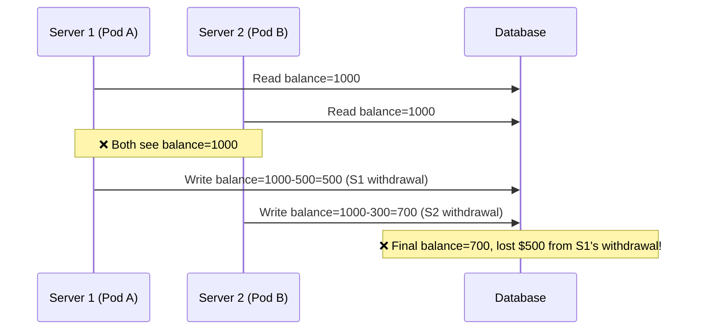
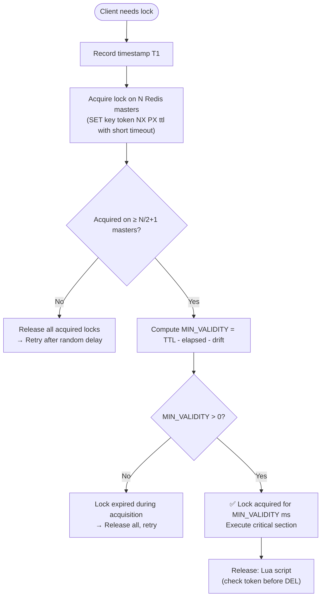

---
title: "Distributed Locks in Go — Redlock Math, etcd & Split-Brain"
slug: "06-distributed-locks-concurrency"
date: "2026-06-18T11:30:00+07:00"
lastmod: 2026-07-03T15:41:55+07:00
draft: false
author: "Tanh"
description: "Redlock MIN_VALIDITY math, clock drift analysis, redsync implementation in Go, etcd lease locks, and Redis vs etcd decision matrix."
tags: ["distributed lock", "redis", "redlock", "golang", "etcd", "concurrency", "system design"]
categories: ["System Design", "Backend Engineering"]
ShowToc: true
TocOpen: true
series: ["system-design"]
mermaid: true
cover:
  image: "/images/posts/ecommerce-microservices-blueprint-cover.png"
  alt: "System Design Masterclass in Golang: architecture patterns for high-traffic distributed systems"
  relative: false
---

> **Prerequisite:** Part 6 of the [System Design Masterclass](/series/system-design/). Read [Part 5: Kafka & Event-Driven](/series/system-design/05-async-message-queues-kafka-go/) to understand event sourcing patterns before tackling lock coordination.

**Answer-first:** Distributed locks solve the mutual exclusion problem across independent servers — ensuring only one server can modify a shared resource at a time. Redis Redlock provides high-performance locking using majority quorum across multiple master nodes; etcd provides stronger guarantees via Raft consensus at the cost of higher latency.

---

## Why Do Race Conditions Occur in Distributed Systems?

**Answer-first:** Race conditions occur across server processes when multiple servers independently read and then write shared state without coordination. A single-process mutex doesn't help — you need a lock mechanism visible across all processes.

### Anatomy of a Distributed Race Condition



Neither server knew the other was running the same transaction simultaneously. A distributed lock prevents this: only one server enters the critical section at a time.

---

## Redlock Safety Math — Calculating Validity Time

**Answer-first:** Redlock calculates a `validity_time` to determine whether the acquired lock is still safe to use — subtracting acquisition time and clock drift from the TTL. A negative validity time means the lock has already expired during acquisition and must be released immediately.

### The Redlock Validity Formula

$$\text{MIN\_VALIDITY} = \text{TTL} - (\text{AcquisitionTime} + \text{ClockDrift} + \text{DriftSafetyFactor})$$

Where:
- **TTL:** Requested lock duration (e.g., 10,000ms).
- **AcquisitionTime:** Actual elapsed time to acquire locks across majority nodes.
- **ClockDrift:** Estimated NTP-based skew between servers (~1–2ms/s → ~200ms for large clusters).
- **DriftSafetyFactor:** Safety buffer = 1–2% of TTL.

**Example calculation:**
- TTL = 10,000ms
- AcquisitionTime = 120ms (3 nodes × 40ms each)
- ClockDrift = 50ms
- DriftSafetyFactor = 100ms (1% of TTL)
- **MIN_VALIDITY = 10,000 − (120 + 50 + 100) = 9,730ms** ← Lock is safe for 9.73 seconds

### Redlock Algorithm — Step by Step



---

## Implementing Redlock with go-redsync

**Answer-first:** `go-redsync/redsync` is the canonical Go Redlock implementation. It handles majority quorum, retry with jitter, and safe unlock via Lua script (prevents unlocking another client's lock).

```go
package lock

import (
    "context"
    "fmt"
    "time"

    "github.com/go-redsync/redsync/v4"
    "github.com/go-redsync/redsync/v4/redis/goredis/v9"
    goredislib "github.com/redis/go-redis/v9"
)

type DistributedLockManager struct {
    rs *redsync.Redsync
}

// NewDistributedLockManager initializes Redlock against N Redis master addresses
// Production: minimum 3 master nodes (N=3 → need 2 for quorum)
func NewDistributedLockManager(masterAddrs []string) *DistributedLockManager {
    var pools []redsync.Pool
    for _, addr := range masterAddrs {
        client := goredislib.NewClient(&goredislib.Options{
            Addr:         addr,
            DialTimeout:  50 * time.Millisecond,
            ReadTimeout:  50 * time.Millisecond,
            WriteTimeout: 50 * time.Millisecond,
        })
        pools = append(pools, goredis.NewPool(client))
    }
    return &DistributedLockManager{rs: redsync.New(pools...)}
}

// ExecuteWithLock acquires lock → executes fn → releases lock
func (dlm *DistributedLockManager) ExecuteWithLock(
    ctx context.Context,
    resourceName string,
    ttl time.Duration,
    fn func(ctx context.Context) error,
) error {
    mutex := dlm.rs.NewMutex(
        fmt.Sprintf("lock:%s", resourceName),
        redsync.WithExpiry(ttl),
        redsync.WithTries(5),
        redsync.WithRetryDelay(100*time.Millisecond),
    )

    if err := mutex.LockContext(ctx); err != nil {
        return fmt.Errorf("failed to acquire distributed lock for %q: %w", resourceName, err)
    }
    defer func() {
        // Unlock uses Lua script: only DEL if value == our token
        // Prevents unlocking a lock acquired by another client after our TTL expired
        if ok, err := mutex.UnlockContext(ctx); !ok || err != nil {
            fmt.Printf("WARNING: unlock issue for %q: ok=%v err=%v\n", resourceName, ok, err)
        }
    }()

    return fn(ctx)
}
```

> [!WARNING]
> **Safe unlock is mandatory.** Never use `DEL key` directly. If your lock TTL expires (e.g., due to a GC pause) and another client acquires the lock, a direct `DEL` would unlock *their* lock, not yours. The Lua script `if GET(key) == myToken then DEL(key) end` prevents this. `redsync` handles this internally.

---

## Redis Redlock vs etcd — Decision Matrix

**Answer-first:** Redis Redlock is AP-style — high performance (~1–5ms), but has clock drift edge cases. etcd is CP-style via Raft consensus — linearizable, automatic lease renewal, but higher latency (~5–20ms) and requires a dedicated etcd cluster.

| Property | Redis Redlock | etcd (Raft) | ZooKeeper |
|---|---|---|---|
| **Consistency Model** | AP — clock drift edge cases | **CP — linearizable** | CP — ZAB protocol |
| **Lock Guarantee** | Majority quorum (probabilistic) | **Strong (Raft committed)** | Strong (ZAB committed) |
| **Latency** | **~1–5ms** | ~5–20ms | ~10–30ms |
| **Throughput** | **Very high** | Medium | Medium |
| **Lease Renewal** | Manual (extend TTL) | **Automatic (KeepAlive)** | Session-based |
| **Split-Brain Risk** | Possible (clock drift + GC pause) | **None (Raft prevents)** | None |
| **Operational Cost** | Low (reuse existing Redis) | Medium (dedicated cluster) | High |
| **Best Use Case** | Short-lived (<30s) high-throughput locks | Long-lived critical locks | Legacy Java ecosystem |

### etcd Lease-Based Lock in Go

```go
package lock

import (
    "context"
    "fmt"
    "time"

    clientv3 "go.etcd.io/etcd/client/v3"
    "go.etcd.io/etcd/client/v3/concurrency"
)

type EtcdLockManager struct {
    client *clientv3.Client
}

func NewEtcdLockManager(endpoints []string) (*EtcdLockManager, error) {
    client, err := clientv3.New(clientv3.Config{
        Endpoints:   endpoints,
        DialTimeout: 5 * time.Second,
    })
    if err != nil {
        return nil, fmt.Errorf("etcd connect: %w", err)
    }
    return &EtcdLockManager{client: client}, nil
}

// ExecuteWithLock — etcd lease-based distributed lock
// If the process crashes, the lease expires automatically → lock released
func (e *EtcdLockManager) ExecuteWithLock(
    ctx context.Context,
    key string,
    ttl time.Duration,
    fn func(ctx context.Context) error,
) error {
    // Session automatically renews lease via KeepAlive goroutine
    session, err := concurrency.NewSession(e.client,
        concurrency.WithTTL(int(ttl.Seconds())),
        concurrency.WithContext(ctx),
    )
    if err != nil {
        return fmt.Errorf("etcd session: %w", err)
    }
    defer session.Close()

    mutex := concurrency.NewMutex(session, fmt.Sprintf("/locks/%s", key))

    if err := mutex.Lock(ctx); err != nil {
        return fmt.Errorf("etcd lock acquire: %w", err)
    }
    defer mutex.Unlock(ctx)

    return fn(ctx)
}
```

> [!NOTE]
> **etcd MVCC internals:** etcd stores keys as composite `(major_revision, sub_revision, type)` tuples in BoltDB (B+Tree). Every write creates a new revision — no in-place modification. The `Watch` API subscribes to revision changes, enabling zero-polling event-driven coordination.

---

## How to Prevent Split-Brain with Distributed Locks?

**Answer-first:** Split-brain occurs when a network partition causes two groups of servers to simultaneously believe they hold the lock. The prevention mechanism differs between Redis and etcd.

**With Redis Redlock:**
- Require locks on majority (N/2 + 1) nodes — any minority partition cannot form quorum.
- **But:** A GC pause longer than the lock TTL can cause the original holder to believe it still has the lock while a second client has already acquired it. Mitigate with **fencing tokens** — a monotonically increasing version number checked at the resource side.

**With etcd (Raft):**
- Raft guarantees only one leader exists. The leader must receive ACKs from majority before committing.
- If the leader is partitioned, it steps down after election timeout.
- etcd lease revision numbers are globally monotonically increasing — use these as fencing tokens.

> 🔥 **[Production Pattern]: [PayPay's campaign lock use case](/posts/paypay-architecture-scaling/)**
> **Problem:** Flash campaign: give ¥500 to first 10,000 users. Multiple server pods process concurrent requests.
> **Race:** Without lock: two pods both read `count=9,999`, both increment → final count > 10,000.
> **Solution:** Redlock on `campaign:lucky-campaign-2024`. TTL = 500ms.
> **Result:** Only one pod executes the check+increment at a time. Counter accurate at exactly 10,000.
> **Trade-off:** Write throughput capped at ~2 operations/second for this resource. Acceptable since campaign inventory writes are rare.
> *(Source: PayPay Tech Blog, 2022)*

---

## FAQ



Use **Redlock** when: you already have a Redis cluster, locks are short-lived (<30s), and you can tolerate the clock drift edge case with compensating mechanisms (idempotency key, fencing token). Use **etcd** when: lock correctness is paramount (financial settlement, database migration coordination), locks may be long-lived, or you need automatic lease renewal if the holder is slow.



Split-brain occurs when two server groups simultaneously believe they hold the same distributed lock — typically caused by network partition. With Redis: enforce majority quorum and use fencing tokens. With etcd: Raft protocol prevents it by design — only one leader can commit, and a partitioned leader steps down automatically.



The Lua script pattern:
```lua
if redis.call("get", KEYS[1]) == ARGV[1] then
    return redis.call("del", KEYS[1])
else
    return 0
end
```
This atomically checks if the lock value matches your client's unique token before deleting. Without this check, you might delete a lock owned by another client (after your TTL expired).

---

> [!TIP]
> **Locks vs Idempotency — when to use which:** Distributed locks prevent concurrent execution of a critical section. Idempotency keys prevent duplicate side effects from retried requests. For payment flows, you need **both**: a lock ensures only one payment process runs at a time, while an idempotency key ensures that a client retry after a timeout doesn't double-charge. See [Part 7: Idempotent API Design](/series/system-design/07-idempotency-api-design-go/).

🔗 **Next:** [Part 7: Idempotent API Design in Go](/series/system-design/07-idempotency-api-design-go/) — Idempotency Key, Redis SetNX middleware, HTTP response recorder, and the Stripe API pattern.

