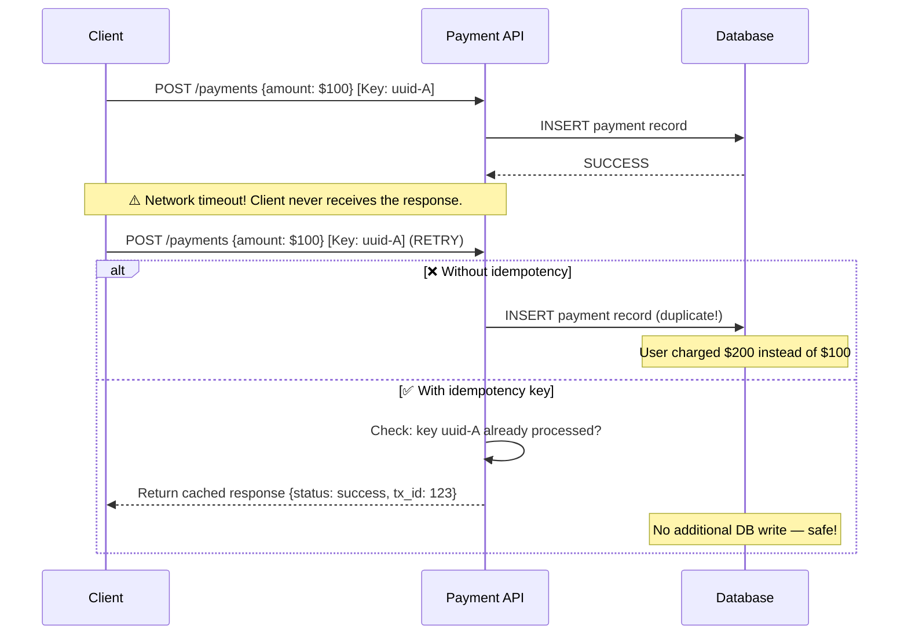

**Answer-first:** API idempotency ensures that retrying an identical request (same Idempotency-Key) never produces additional side effects beyond the first execution. This is foundational for payment APIs where network timeouts force client retries, and a duplicate execution would mean a double charge.

> **Prerequisite:** Part 7 of the [System Design Masterclass](/series/system-design/). Read [Part 6: Distributed Locks](/series/system-design/06-distributed-locks-concurrency/) — concurrent duplicate request blocking relies on the same mutual exclusion primitives.

### What You'll Learn That AI Won't Tell You
- **Payload Reuse Vulnerability:** How Stripe prevents malicious request payload tampering on existing keys using SHA-256 request body hashes in Redis.
- **SetNX Lock Lifetime Math:** Why setting a lock TTL without a auto-extension renewal thread leads to double-charge execution gaps.
- **Response Record Memory Leak:** The memory consumption strategy of caching full HTTP headers and response body data under high-throughput request rates.

---

## What Is an Idempotency Key?

**Key Concept:** An Idempotency Key is a unique token — typically UUID v4 — generated by the client and attached as an `Idempotency-Key` HTTP header. The server uses this key to detect duplicate requests: if the key has been seen before, return the cached response from the first execution without re-executing the handler.

### Why Idempotency Is Non-Negotiable for Payment APIs



**Scale context:** Alipay Double 11 processes 583,000 transactions/second at peak. Network retries are inevitable at this scale — idempotency prevents double charges. Stripe, Adyen, PayPal all require `Idempotency-Key` for all mutating endpoints.

---

## Stripe-Style Idempotency Architecture

**Stripe Implementation Pattern:** Stripe stores idempotency key metadata in Redis (hot path, TTL 24 hours) with a JSON payload containing the status, HTTP response code, headers, and body. A payload hash detects key reuse with a different request body. PostgreSQL provides a durable fallback when Redis is unavailable.

### Metadata Structure

```json
{
  "idempotency_key": "550e8400-e29b-41d4-a716-446655440000",
  "payload_hash": "sha256_of_request_body_bytes",
  "status": "completed",
  "response_code": 201,
  "response_headers": {
    "Content-Type": ["application/json"],
    "X-Transaction-Id": ["tx_987654"]
  },
  "response_body": "{\"transaction_id\":\"tx_987654\",\"status\":\"success\"}",
  "created_at": "2026-06-18T09:00:00Z",
  "expires_at": "2026-06-19T09:00:00Z"
}
```

### Database Fallback Schema

```sql
CREATE TABLE idempotency_keys (
    idemp_key        VARCHAR(255) NOT NULL,
    payload_hash     CHAR(64)     NOT NULL,         -- SHA256 of request body
    status           VARCHAR(50)  NOT NULL,          -- 'in-progress', 'completed', 'failed'
    response_code    INT,
    response_headers JSONB,
    response_body    TEXT,
    created_at       TIMESTAMPTZ  NOT NULL DEFAULT NOW(),
    expires_at       TIMESTAMPTZ  NOT NULL,

    PRIMARY KEY (idemp_key)
);

-- Partial index: only active keys (reduces index size for large tables)
CREATE UNIQUE INDEX idx_idemp_active ON idempotency_keys (idemp_key)
    WHERE expires_at > NOW();
```

---

## Full HTTP Middleware Implementation in Go

**Middleware Strategy:** The idempotency middleware intercepts all requests with an `Idempotency-Key` header. It uses Redis `SetNX` to atomically claim the key (preventing concurrent duplicates), wraps the response writer to capture the output, then saves the full HTTP response to Redis for future replay.

```go
package middleware

import (
    "bytes"
    "context"
    "crypto/sha256"
    "encoding/hex"
    "encoding/json"
    "fmt"
    "io"
    "net/http"
    "time"

    "github.com/redis/go-redis/v9"
)

// IdempotencyRecord stored in Redis as JSON
type IdempotencyRecord struct {
    Status       string              `json:"status"`       // "in-progress" | "completed"
    ResponseCode int                 `json:"response_code"`
    Headers      map[string][]string `json:"headers"`
    Body         string              `json:"body"`
    PayloadHash  string              `json:"payload_hash"`
}

// responseRecorder wraps http.ResponseWriter to capture the response
type responseRecorder struct {
    http.ResponseWriter
    code int
    body *bytes.Buffer
}

func newResponseRecorder(w http.ResponseWriter) *responseRecorder {
    return &responseRecorder{ResponseWriter: w, code: http.StatusOK, body: new(bytes.Buffer)}
}

func (r *responseRecorder) WriteHeader(statusCode int) {
    r.code = statusCode
    r.ResponseWriter.WriteHeader(statusCode)
}

func (r *responseRecorder) Write(b []byte) (int, error) {
    r.body.Write(b)
    return r.ResponseWriter.Write(b)
}

// IdempotencyMiddleware enforces idempotency via Redis SetNX
type IdempotencyMiddleware struct {
    rdb    *redis.Client
    keyTTL time.Duration
}

func NewIdempotencyMiddleware(rdb *redis.Client, keyTTL time.Duration) *IdempotencyMiddleware {
    return &IdempotencyMiddleware{rdb: rdb, keyTTL: keyTTL}
}

func (im *IdempotencyMiddleware) Handle(next http.Handler) http.Handler {
    return http.HandlerFunc(func(w http.ResponseWriter, r *http.Request) {
        idempKey := r.Header.Get("Idempotency-Key")
        if idempKey == "" {
            next.ServeHTTP(w, r) // No key → pass through
            return
        }

        ctx := r.Context()
        redisKey := fmt.Sprintf("idemp:%s", idempKey)

        // Compute payload hash to detect key reuse with different body
        body, _ := io.ReadAll(r.Body)
        r.Body = io.NopCloser(bytes.NewBuffer(body))
        hash := sha256.Sum256(body)
        payloadHash := hex.EncodeToString(hash[:])

        // Step 1: Check if key already exists
        existingData, err := im.rdb.Get(ctx, redisKey).Result()
        if err == nil {
            var existing IdempotencyRecord
            if json.Unmarshal([]byte(existingData), &existing) == nil {
                // Reject key reuse with different payload
                if existing.PayloadHash != "" && existing.PayloadHash != payloadHash {
                    http.Error(w,
                        `{"error":"idempotency_key_reuse","message":"Key used with a different request body"}`,
                        http.StatusUnprocessableEntity)
                    return
                }

                if existing.Status == "in-progress" {
                    // Another goroutine/pod is processing this key right now
                    http.Error(w,
                        `{"error":"request_in_progress","message":"Duplicate request is already being processed"}`,
                        http.StatusConflict)
                    return
                }

                // Already completed — replay the cached response
                for name, vals := range existing.Headers {
                    for _, val := range vals {
                        w.Header().Add(name, val)
                    }
                }
                w.Header().Set("X-Idempotent-Replayed", "true")
                w.WriteHeader(existing.ResponseCode)
                w.Write([]byte(existing.Body))
                return
            }
        }

        // Step 2: Atomically claim the key with SetNX (SET if Not eXists)
        // Only ONE goroutine/pod can succeed this — others get false
        inProgress := IdempotencyRecord{Status: "in-progress", PayloadHash: payloadHash}
        inProgressJSON, _ := json.Marshal(inProgress)

        set, setErr := im.rdb.SetNX(ctx, redisKey, inProgressJSON, im.keyTTL).Result()
        if setErr != nil || !set {
            http.Error(w,
                `{"error":"conflict","message":"Request already in progress"}`,
                http.StatusConflict)
            return
        }

        // Step 3: Execute the actual handler, capturing its response
        recorder := newResponseRecorder(w)
        next.ServeHTTP(recorder, r)

        // Step 4: Save the completed response to Redis
        finalRecord := IdempotencyRecord{
            Status:       "completed",
            ResponseCode: recorder.code,
            Headers:      map[string][]string(w.Header()),
            Body:         recorder.body.String(),
            PayloadHash:  payloadHash,
        }
        finalJSON, _ := json.Marshal(finalRecord)
        im.rdb.Set(ctx, redisKey, finalJSON, im.keyTTL)
    })
}
```

---

## How Does SetNX Prevent Microsecond Race Conditions?

**Concurrency Strategy:** `Redis SetNX` is an atomic operation at the Redis command level — even if two goroutines from different pods call it at the same microsecond, Redis serializes all commands in a single-threaded event loop. Exactly one caller receives `true` (set); all others receive `false` (not set).

### Concurrent Race Test

```go
package middleware

import (
    "net/http"
    "net/http/httptest"
    "sync"
    "sync/atomic"
    "testing"
    "time"
)

func TestIdempotencyMutualExclusion(t *testing.T) {
    var executionCount atomic.Int64

    handler := http.HandlerFunc(func(w http.ResponseWriter, r *http.Request) {
        executionCount.Add(1)
        w.WriteHeader(http.StatusCreated)
        w.Write([]byte(`{"transaction_id":"tx_001","status":"success"}`))
    })

    rdb := setupTestRedis() // use miniredis in tests
    mw := NewIdempotencyMiddleware(rdb, 24*time.Hour)
    wrapped := mw.Handle(handler)

    const concurrency = 100
    var wg sync.WaitGroup
    wg.Add(concurrency)

    codes := make([]int, concurrency)
    for i := 0; i < concurrency; i++ {
        go func(index int) {
            defer wg.Done()
            req := httptest.NewRequest("POST", "/payments",
                strings.NewReader(`{"amount":100}`))
            req.Header.Set("Idempotency-Key", "same-uuid-for-all") // Same key!
            req.Header.Set("Content-Type", "application/json")

            rec := httptest.NewRecorder()
            wrapped.ServeHTTP(rec, req)
            codes[index] = rec.Code
        }(i)
    }
    wg.Wait()

    // Handler must execute exactly ONCE despite 100 concurrent requests
    if count := executionCount.Load(); count != 1 {
        t.Errorf("Expected 1 execution, got %d", count)
    }

    created, conflict := 0, 0
    for _, code := range codes {
        switch code {
        case http.StatusCreated:
            created++
        case http.StatusConflict:
            conflict++
        }
    }
    t.Logf("Results: %d Created, %d Conflict (out of %d concurrent requests)",
        created, conflict, concurrency)
    // Expected: 1 Created, 99 Conflict
}
```

---

## Retry with Exponential Backoff and Jitter

**Retry Policy:** Clients must implement exponential backoff with jitter to avoid retry storms — all clients retrying at the same time after an outage. Jitter randomizes the retry delay, spreading traffic over time.

$$T_i = \min\left(T_{\text{max}},\; T_{\text{base}} \times 2^{\text{attempt}} + \text{Uniform}(0, J)\right)$$

```go
package retry

import (
    "fmt"
    "math"
    "math/rand"
    "time"
)

type ExponentialBackoff struct {
    BaseDelay  time.Duration
    MaxDelay   time.Duration
    JitterCap  time.Duration
    MaxRetries int
}

func (b *ExponentialBackoff) NextDelay(attempt int) (time.Duration, bool) {
    if attempt >= b.MaxRetries {
        return 0, false
    }
    exp := math.Pow(2, float64(attempt))
    delay := time.Duration(float64(b.BaseDelay)*exp) +
        time.Duration(rand.Int63n(int64(b.JitterCap)))
    if delay > b.MaxDelay {
        delay = b.MaxDelay
    }
    return delay, true
}

// RetryWithIdempotency retries fn with the SAME idempotency key on each attempt
func RetryWithIdempotency(
    key string,
    backoff ExponentialBackoff,
    fn func(idempKey string) (int, error),
) error {
    for attempt := 0; attempt < backoff.MaxRetries; attempt++ {
        statusCode, err := fn(key) // Same key on every retry — safe

        if err == nil && statusCode < 500 {
            return nil // Success or client error (4xx) — don't retry
        }

        delay, more := backoff.NextDelay(attempt)
        if !more {
            return fmt.Errorf("exhausted %d retries", attempt+1)
        }
        time.Sleep(delay)
    }
    return nil
}
```

---

## Case Study: Alipay Double 11 Payment Safety

> 🔥 **[Production Pattern]: [Alipay biz_no idempotency at scale](/posts/alipay-double-11-architecture-tps/)**
> **Scale:** 583,000 transactions/second at Double 11 2019 peak.
> **Problem:** Network retries at this scale create millions of duplicate payment attempts per hour.
> **Architecture:** Every payment carries a unique `biz_no` (business number) — equivalent to Idempotency Key. Backend stores `biz_no → result` in OceanBase with a UNIQUE constraint.
> **Two-tier idempotency:** (1) Redis hot path — check in < 1ms; (2) OceanBase fallback — unique constraint ensures any Redis miss is caught by the DB-level duplicate detection.
> **Result:** Zero duplicate charges across all Double 11 events.
> *(Source: Alibaba Cloud Architecture Blog)*

---

## FAQ



A client-generated UUID (or similar unique token) sent as the `Idempotency-Key` HTTP header. The server uses it to identify duplicate requests. If a key has been processed: return the cached response. If new: process and cache. TTL is typically 24 hours.



Stripe stores key metadata (status, response code, headers, body, payload hash) in Redis with 24-hour TTL. `status: in-progress` blocks concurrent duplicates. `payload_hash` detects key reuse with a different request body (returns HTTP 422). PostgreSQL unique constraint provides durability if Redis is unavailable.



Redis `SetNX` is atomic at the command level — Redis serializes all commands in its single-threaded event loop. Only one caller wins the SetNX race and receives `true`; all others receive `false` and return HTTP 409 Conflict. After the winner completes and writes `status: completed`, all future retries receive the cached response.


---

## Navigation & Next Steps

[← Previous Part]()
[Next Part →]()

🔗 **Next Step:** Continue to [Part 8: Saga Pattern & Distributed Transactions in Go]()

Need help implementing this architecture in your organization? [Contact us](/contact/) or [hire our technical consulting team](/hire/) to review your system design and codebase.
