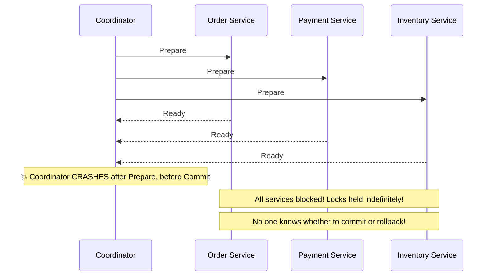
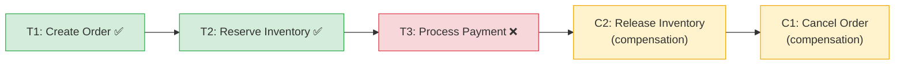

**Answer-first:** The Saga Pattern coordinates distributed transactions across microservices by decomposing a large transaction into a sequence of local transactions. If any step fails, the system automatically executes **compensating transactions** in reverse order to undo completed steps. Each local transaction must be idempotent.

> **Prerequisite:** Part 8 of the [System Design Masterclass](/series/system-design/). Read [Part 7: Idempotent API Design](/series/system-design/07-idempotency-api-design-go/) first — compensating transactions in Saga must be idempotent.

### What You'll Learn That AI Won't Tell You
- **Temporal Workflow Determinism:** How Temporal's event sourcing workflow engine replays Go code, and why random functions or time sleeps crash workers.
- **Debezium EventRouter Tuning:** The exact JSON configuration keys needed to customize Kafka routing keys and prevent partition ordering issues.
- **Pivot State Analysis:** Identifying the "point of no return" in a distributed saga where compensations are no longer allowed.

---

## What Are the Problems with 2PC in Microservices?

**Key Concept:** Two-Phase Commit (2PC) is a blocking protocol with a coordinator single point of failure. If the coordinator crashes between the Prepare and Commit phases, all participants are blocked indefinitely with locks held — a catastrophic failure mode in microservices. These are the same [core banking distributed transaction challenges](/posts/deconstructing-microfinance-core-banking-architecture/) seen in legacy systems.

### 2PC Failure Scenario



**Additional problems:**
- **Blocking:** All participants wait for coordinator — unavailability propagates.
- **Single point of failure:** The coordinator is the system's Achilles heel.
- **Cross-team incompatibility:** Services owned by different teams with different DBs cannot share a 2PC coordinator.

---

## Saga Orchestration vs Choreography

**Pattern Comparison:** Orchestration uses a central coordinator (Temporal workflow engine) that explicitly calls each service step in sequence — easier to debug, full state visibility. Choreography uses event reactions — each service emits events that trigger the next service — more decoupled but much harder to trace when failures occur.

### Saga Flow Diagram



**Saga properties:**
- **ACD without I:** Atomic (via compensations) + Consistent + Durable. No Isolation — intermediate states are visible to other transactions.
- **Eventual consistency:** The system converges to a consistent state after all compensations complete.
- **Compensations must be idempotent:** If a compensation itself fails and is retried, it must produce the same result.

---

## Temporal Go SDK — Full Orchestration Implementation

**Temporal Implementation:** Temporal's `workflow.Saga` provides automatic LIFO (Last In, First Out) compensation execution — the last successful step is compensated first, then the second-to-last, and so on. This matches business logic: you must refund payment before releasing inventory, then cancel the order.

```go
package saga

import (
    "fmt"
    "time"

    "go.temporal.io/sdk/temporal"
    "go.temporal.io/sdk/workflow"
)

type OrderSagaInput struct {
    OrderID  string
    UserID   string
    Items    []OrderItem
    Amount   float64
    Currency string
}

type OrderItem struct {
    ProductID string
    Quantity  int
}

// OrderSagaWorkflow orchestrates the full order fulfillment saga
func OrderSagaWorkflow(ctx workflow.Context, input OrderSagaInput) error {
    activityOpts := workflow.ActivityOptions{
        StartToCloseTimeout: 30 * time.Second,
        RetryPolicy: &temporal.RetryPolicy{
            MaximumAttempts:    5,
            InitialInterval:    time.Second,
            MaximumInterval:    30 * time.Second,
            BackoffCoefficient: 2.0,
            // Do NOT retry on business errors — only on transient failures
            NonRetryableErrorTypes: []string{"PAYMENT_DECLINED", "INVENTORY_PERMANENTLY_UNAVAILABLE"},
        },
    }
    ctx = workflow.WithActivityOptions(ctx, activityOpts)

    var saga workflow.Saga
    saga.SetParallelCompensation(false) // Sequential compensation (LIFO order)

    // ─── Step 1: Create Order ─────────────────────────────────────────────
    var orderResult CreateOrderResult
    if err := workflow.ExecuteActivity(ctx, CreateOrderActivity, input).Get(ctx, &orderResult); err != nil {
        return fmt.Errorf("create order: %w", err)
    }
    // Register compensation IMMEDIATELY after each successful step
    saga.AddCompensation(CancelOrderActivity, orderResult.OrderID)

    // ─── Step 2: Reserve Inventory ────────────────────────────────────────
    var reserveResult ReserveInventoryResult
    if err := workflow.ExecuteActivity(ctx, ReserveInventoryActivity, orderResult.OrderID, input.Items).Get(ctx, &reserveResult); err != nil {
        saga.Compensate(ctx) // Triggers: CancelOrderActivity
        return fmt.Errorf("reserve inventory: %w", err)
    }
    saga.AddCompensation(ReleaseInventoryActivity, reserveResult.ReservationID)

    // ─── Step 3: Process Payment ──────────────────────────────────────────
    var paymentResult ProcessPaymentResult
    if err := workflow.ExecuteActivity(ctx, ProcessPaymentActivity, orderResult.OrderID, input.Amount).Get(ctx, &paymentResult); err != nil {
        saga.Compensate(ctx) // Triggers LIFO: ReleaseInventoryActivity → CancelOrderActivity
        return fmt.Errorf("payment: %w", err)
    }
    saga.AddCompensation(RefundPaymentActivity, paymentResult.TransactionID)

    // ─── Step 4: Notify Fulfillment ───────────────────────────────────────
    if err := workflow.ExecuteActivity(ctx, NotifyFulfillmentActivity, orderResult.OrderID).Get(ctx, nil); err != nil {
        saga.Compensate(ctx) // Triggers LIFO: RefundPaymentActivity → ReleaseInventory → CancelOrder
        return fmt.Errorf("fulfillment notification: %w", err)
    }

    workflow.GetLogger(ctx).Info("Order saga completed", "orderID", orderResult.OrderID)
    return nil
}

// ─── Activity stubs (must be registered on a Temporal Worker) ─────────────

type CreateOrderResult struct{ OrderID string }
type ReserveInventoryResult struct{ ReservationID string }
type ProcessPaymentResult struct{ TransactionID string }

func CreateOrderActivity(input OrderSagaInput) (CreateOrderResult, error) {
    // INSERT INTO orders ... ON CONFLICT DO NOTHING (idempotent)
    return CreateOrderResult{OrderID: "order-uuid"}, nil
}

func CancelOrderActivity(orderID string) error {
    // UPDATE orders SET status='cancelled' WHERE id=orderID (idempotent)
    return nil
}

func ReserveInventoryActivity(orderID string, items []OrderItem) (ReserveInventoryResult, error) {
    return ReserveInventoryResult{ReservationID: fmt.Sprintf("res-%s", orderID)}, nil
}

func ReleaseInventoryActivity(reservationID string) error {
    // UPDATE inventory_reservations SET status='released' WHERE id=reservationID (idempotent)
    return nil
}

func ProcessPaymentActivity(orderID string, amount float64) (ProcessPaymentResult, error) {
    return ProcessPaymentResult{TransactionID: fmt.Sprintf("tx-%s", orderID)}, nil
}

func RefundPaymentActivity(transactionID string) error {
    // POST /v1/refunds {transaction_id: transactionID} (idempotent via idempotency key)
    return nil
}

func NotifyFulfillmentActivity(orderID string) error {
    return nil
}
```

> [!IMPORTANT]
> **Compensation order = LIFO.** Temporal's `saga.Compensate()` runs compensations in the reverse order of registration. Step 3 compensation runs before Step 2, then Step 1. This is correct business logic: refund payment before releasing inventory, then cancel the order.

---

## Transactional Outbox Pattern — Guaranteed Event Delivery

**Architecture Pattern:** The Transactional Outbox Pattern guarantees that Kafka events are published **atomically with the DB write** — if the write commits, the event will eventually be published. If the service crashes after committing but before publishing, the CDC connector (Debezium) reads the committed outbox row from the WAL and publishes it on recovery.

### Why You Need It

**Problem without Outbox:**
1. DB transaction commits (order created).
2. Service crashes before calling `kafka.Produce(event)`.
3. Order exists in DB but downstream services never receive the event.
4. Inventory, notifications, analytics are all out of sync — no way to recover.

**Solution with Outbox:**
1. DB transaction commits both the order row AND an outbox event row atomically.
2. Debezium reads the committed outbox row from PostgreSQL WAL.
3. Debezium publishes the event to Kafka.
4. If Debezium crashes, it resumes from its last WAL position on restart — no event lost.

```sql
-- Outbox table
CREATE TABLE outbox_table (
    id             UUID         NOT NULL DEFAULT gen_random_uuid(),
    aggregate_type VARCHAR(100) NOT NULL,  -- e.g., 'order', 'payment'
    aggregate_id   VARCHAR(255) NOT NULL,  -- e.g., order UUID
    event_type     VARCHAR(100) NOT NULL,  -- e.g., 'ORDER_CREATED'
    payload        JSONB        NOT NULL,
    created_at     TIMESTAMPTZ  NOT NULL DEFAULT NOW(),
    PRIMARY KEY (id)
);
```

```go
// Application code — atomic write: order + outbox event in one transaction
func (s *OrderService) CreateOrder(ctx context.Context, userID string, amount float64) (string, error) {
    tx, err := s.db.BeginTx(ctx, nil)
    if err != nil {
        return "", err
    }
    defer tx.Rollback()

    // 1. Insert business record
    var orderID string
    err = tx.QueryRowContext(ctx,
        `INSERT INTO orders (user_id, amount, status) VALUES ($1, $2, 'pending') RETURNING id`,
        userID, amount,
    ).Scan(&orderID)
    if err != nil {
        return "", err
    }

    // 2. Insert outbox event — SAME TRANSACTION
    payload, _ := json.Marshal(map[string]interface{}{
        "order_id": orderID, "user_id": userID, "amount": amount,
    })
    _, err = tx.ExecContext(ctx,
        `INSERT INTO outbox_table (aggregate_type, aggregate_id, event_type, payload)
         VALUES ('order', $1, 'ORDER_CREATED', $2)`,
        orderID, payload,
    )
    if err != nil {
        return "", err
    }

    // 3. Both records committed atomically — Debezium will pick up the outbox row
    return orderID, tx.Commit()
}
```

---

## Debezium PostgreSQL Outbox EventRouter — Production Config

```json
{
  "name": "postgres-outbox-connector",
  "config": {
    "connector.class": "io.debezium.connector.postgresql.PostgresConnector",
    "database.hostname": "postgres-db.internal",
    "database.port": "5432",
    "database.user": "debezium",
    "database.password": "${file:/secrets/debezium.properties:db.password}",
    "database.dbname": "orders_db",
    "database.server.name": "orders-dbserver",
    "plugin.name": "pgoutput",
    "slot.name": "debezium_outbox_slot",
    "table.include.list": "public.outbox_table",
    "tombstones.on.delete": "false",
    "transforms": "outbox",
    "transforms.outbox.type": "io.debezium.transforms.outbox.EventRouter",
    "transforms.outbox.table.field.event.id": "id",
    "transforms.outbox.table.field.event.key": "aggregate_id",
    "transforms.outbox.table.field.event.payload": "payload",
    "transforms.outbox.route.by.field": "aggregate_type",
    "transforms.outbox.route.topic.replacement": "events.${routedByValue}",
    "transforms.outbox.table.expand.json.payload": "true",
    "key.converter": "org.apache.kafka.connect.storage.StringConverter",
    "value.converter": "org.apache.kafka.connect.json.JsonConverter",
    "value.converter.schemas.enable": "false"
  }
}
```

> [!NOTE]
> `route.topic.replacement`: `aggregate_type = 'order'` → topic `events.order`. `aggregate_type = 'payment'` → topic `events.payment`. Auto-routing without extra Kafka Streams logic.
>
> **PostgreSQL WAL config** (postgresql.conf):
> ```
> wal_level = logical
> max_wal_senders = 4
> max_replication_slots = 4
> ```

---

## FAQ



**Orchestration** (Temporal): Central coordinator knows the entire flow. All state is stored in the workflow history. Easy to debug — Temporal UI shows every step's state. Full compensation visibility. Best for complex business-critical flows (order fulfillment, financial transfers).

**Choreography**: Each service emits events; others react to them. No central coordinator or SPOF. More decoupled but debugging failures requires tracing events across multiple Kafka topics. Best for simple fan-out with no compensation needed.



Compensations must be: (1) **Idempotent** — running multiple times produces the same result. Use `ON CONFLICT DO NOTHING` or status checks before updating. (2) **Semantically correct** — not a SQL ROLLBACK but a business-level reversal (cancel order, release inventory, refund payment). (3) **Eventually complete** — Temporal's retry policy ensures compensations will eventually succeed despite transient failures.



Use Outbox when you need the guarantee: "if the DB transaction commits, the Kafka event WILL be published." Don't use it if: best-effort event publishing is acceptable, or if the CDC pipeline latency (typically 100–500ms) is too high for your use case (use synchronous event publishing instead, accepting the risk of message loss on crash).


---

## Navigation & Next Steps

[← Previous Part]()
[Next Part →]()

🔗 **Next Step:** Continue to [Part 9: Consistent Hashing — Virtual Nodes & CRC32 Ring in Go]()

Need help implementing this architecture in your organization? [Contact us](/contact/) or [hire our technical consulting team](/hire/) to review your system design and codebase.
