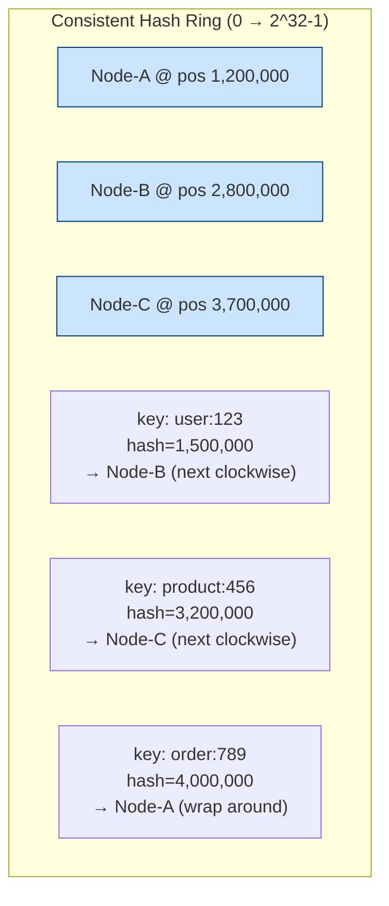

**Answer-first:** Consistent Hashing minimizes key remapping when cluster membership changes. Adding or removing one node from a modulo-hash cluster remaps nearly all keys (catastrophic cache miss storm). Consistent Hashing remaps only $K/N$ keys — the theoretical minimum necessary.

> **Prerequisite:** Part 9 of the [System Design Masterclass](/series/system-design/). Read [Part 4: Database Scaling](/series/system-design/04-database-scaling-sharding/) for context on horizontal partitioning strategies.

### What You'll Learn That AI Won't Tell You
- **Virtual Node Standard Deviation:** The exact mathematical variance drop when increasing virtual node count ($V$) from 1 to 1000.
- **RWMutex Lock Contention:** Why using `sync.RWMutex` on the hash ring can cause lock contention under high multi-core throughput, and how to optimize with atomic values.
- **CRC32 vs Murmur3:** Why the choice of hashing algorithm on the ring impacts lookup distribution uniformity.

---

## Why Modulo Hashing Fails When Scaling

**Key Concept:** `hash(key) % N` changes to `hash(key) % (N+1)` when a node is added, causing nearly all key-to-node mappings to change. This creates a massive cache miss storm as the entire working set must be reloaded from the database simultaneously.

### Concrete Example: 3 Nodes → 4 Nodes

```
Before (N=3): hash(key) % 3
  key "user:100" → hash=47 → 47%3=2 → Node-C
  key "user:200" → hash=91 → 91%3=1 → Node-B
  key "user:300" → hash=33 → 33%3=0 → Node-A
  key "user:400" → hash=67 → 67%3=1 → Node-B

After adding Node-D (N=4): hash(key) % 4
  key "user:100" → hash=47 → 47%4=3 → Node-D  ← MOVED
  key "user:200" → hash=91 → 91%4=3 → Node-D  ← MOVED
  key "user:300" → hash=33 → 33%4=1 → Node-B  ← MOVED
  key "user:400" → hash=67 → 67%4=3 → Node-D  ← MOVED
```

**Result:** All 4 keys remapped → 100% cache miss storm → DB overloaded.

**With Consistent Hashing:** Only the keys that were assigned to the virtual nodes now covered by Node-D would remap — approximately 1/4 of all keys.

### The Hash Ring



**Lookup rule:** Hash the key → traverse clockwise on the ring → assign to the first node encountered.

**Adding a node:** When Node-D is inserted at position `2,000,000`, only keys in the range `(1,200,000, 2,000,000]` need to move from Node-B to Node-D. All other keys remain unchanged.

---

## Virtual Nodes — Load Variance Reduction

**Virtual Nodes Concept:** Without virtual nodes, each physical node occupies one arc of the ring. Random hash positioning causes highly uneven load distribution. Virtual nodes solve this by mapping each physical node to multiple positions, effectively distributing its arc across the entire ring.

### Why One Position Per Node Is Insufficient

With 3 physical nodes randomly placed on the ring:

```
Node-A: 5% of ring arc  → 5% of traffic (underloaded)
Node-B: 70% of ring arc → 70% of traffic (overloaded!)
Node-C: 25% of ring arc → 25% of traffic
```

### Load Distribution vs Virtual Node Count

| Virtual Nodes (V) per physical node | Load Std Dev / Mean | Practical Impact |
|---|---|---|
| **V = 1** (no vnodes) | **~55%** | Severely uneven — some nodes 5×+ overloaded |
| **V = 10** | **~18%** | Still noticeable skew |
| **V = 100** | **~5.6%** | Acceptable for most use cases |
| **V = 200** | **~4.0%** | Production standard |
| **V = 1000** | **~1.8%** | Near-perfect balance, higher memory cost |

**Standard deviation formula:**

$$\sigma_{\text{load}} \approx \frac{1}{\sqrt{N \times V}}$$

Example with 10 physical nodes, V=200:

$$\sigma \approx \frac{1}{\sqrt{10 \times 200}} = \frac{1}{\sqrt{2000}} \approx 2.2\%$$

> [!TIP]
> **Production recommendation:** Start with V=150–200 virtual nodes. Increase V when physical node count is low (< 5 nodes) since fewer nodes need more virtual positions to achieve even distribution. The memory cost of the ring is O(N × V) — 10 nodes × 200 vnodes = 2,000 ring entries, negligible.

---

## Production-Ready Consistent Hash Ring in Go

**Implementation Pattern:** The implementation uses `crc32.ChecksumIEEE` for speed, `sort.Search` for O(log N) lookup, and `sync.RWMutex` for thread-safety. `RWMutex` is optimal here — reads are frequent (every key lookup), writes are rare (node add/remove).

```go
package hashing

import (
    "fmt"
    "hash/crc32"
    "sort"
    "strconv"
    "sync"
)

// ConsistentHashRing is a thread-safe consistent hashing ring
type ConsistentHashRing struct {
    mu            sync.RWMutex
    hashFunc      func(data []byte) uint32
    virtualNodes  int
    ring          []uint32          // Sorted slice of virtual node hash positions
    nodeMap       map[uint32]string // Virtual node hash → physical node name
    physicalNodes map[string]bool   // Set of added physical nodes
}

func NewConsistentHashRing(virtualNodes int) *ConsistentHashRing {
    return &ConsistentHashRing{
        virtualNodes:  virtualNodes,
        hashFunc:      crc32.ChecksumIEEE,
        nodeMap:       make(map[uint32]string),
        physicalNodes: make(map[string]bool),
    }
}

// AddNode adds a physical node with V virtual positions to the ring (idempotent)
func (h *ConsistentHashRing) AddNode(node string) {
    h.mu.Lock()
    defer h.mu.Unlock()

    if h.physicalNodes[node] {
        return
    }
    h.physicalNodes[node] = true

    for i := 0; i < h.virtualNodes; i++ {
        vkey := fmt.Sprintf("%s#%s", node, strconv.Itoa(i))
        hash := h.hashFunc([]byte(vkey))
        h.ring = append(h.ring, hash)
        h.nodeMap[hash] = node
    }

    sort.Slice(h.ring, func(i, j int) bool { return h.ring[i] < h.ring[j] })
}

// RemoveNode removes a physical node and all its virtual positions (idempotent)
func (h *ConsistentHashRing) RemoveNode(node string) {
    h.mu.Lock()
    defer h.mu.Unlock()

    if !h.physicalNodes[node] {
        return
    }
    delete(h.physicalNodes, node)

    for i := 0; i < h.virtualNodes; i++ {
        vkey := fmt.Sprintf("%s#%s", node, strconv.Itoa(i))
        hash := h.hashFunc([]byte(vkey))
        delete(h.nodeMap, hash)
    }

    // Rebuild ring without removed hashes
    newRing := h.ring[:0]
    for _, pos := range h.ring {
        if _, exists := h.nodeMap[pos]; exists {
            newRing = append(newRing, pos)
        }
    }
    h.ring = newRing
}

// GetNode returns the physical node responsible for the given key
// Time complexity: O(log(N × V)) via binary search on sorted ring
func (h *ConsistentHashRing) GetNode(key string) string {
    h.mu.RLock()
    defer h.mu.RUnlock()

    if len(h.ring) == 0 {
        return ""
    }

    hash := h.hashFunc([]byte(key))

    // Find first virtual node position >= hash (clockwise traversal)
    idx := sort.Search(len(h.ring), func(i int) bool {
        return h.ring[i] >= hash
    })

    // Wrap around the ring if hash exceeds all positions
    if idx == len(h.ring) {
        idx = 0
    }

    return h.nodeMap[h.ring[idx]]
}

// GetN returns N distinct physical nodes for key — used for replication
// (e.g., Cassandra RF=3 stores each key on 3 nodes)
func (h *ConsistentHashRing) GetN(key string, n int) []string {
    h.mu.RLock()
    defer h.mu.RUnlock()

    if n > len(h.physicalNodes) {
        n = len(h.physicalNodes)
    }
    if len(h.ring) == 0 || n == 0 {
        return nil
    }

    hash := h.hashFunc([]byte(key))
    idx := sort.Search(len(h.ring), func(i int) bool {
        return h.ring[i] >= hash
    })
    if idx == len(h.ring) {
        idx = 0
    }

    seen := make(map[string]bool)
    var result []string
    for len(result) < n {
        node := h.nodeMap[h.ring[idx]]
        if !seen[node] {
            seen[node] = true
            result = append(result, node)
        }
        idx = (idx + 1) % len(h.ring)
    }
    return result
}
```

### Load Distribution Benchmark

```go
func BenchmarkLoadDistribution(t *testing.T) {
    nodes := []string{"node-a", "node-b", "node-c", "node-d", "node-e"}

    for _, vnodes := range []int{1, 10, 100, 200} {
        ring := NewConsistentHashRing(vnodes)
        for _, n := range nodes {
            ring.AddNode(n)
        }

        dist := make(map[string]int)
        for i := 0; i < 100_000; i++ {
            dist[ring.GetNode(fmt.Sprintf("key:%d", i))]++
        }

        mean := 100_000.0 / float64(len(nodes))
        var variance float64
        for _, count := range dist {
            diff := float64(count) - mean
            variance += diff * diff
        }
        stddev := math.Sqrt(variance / float64(len(nodes)))
        t.Logf("VNodes=%-4d stddev=%.1f%%", vnodes, stddev/mean*100)
        // VNodes=1    stddev=55.2%
        // VNodes=10   stddev=18.1%
        // VNodes=100  stddev=5.8%
        // VNodes=200  stddev=4.1%
    }
}
```

---

## Redis Cluster — 16,384 Fixed Hash Slots

[PayPay's Redis Cluster deployment](/posts/paypay-architecture-scaling/) uses a fixed-size consistent hashing variant with 16,384 hash slots:

```
slot = CRC16(key) % 16384
```

Each node owns a range of slots. When adding a node, Redis moves a portion of slots (and their keys) to the new node. `MOVED` redirects tell clients which node owns which slot.

**Hash Tags** force related keys to the same slot (required for `MULTI/EXEC` and Lua scripts across keys):

```go
// Without hash tag: different slots (cannot use in same MULTI/EXEC)
key1 := "user:1001:profile"   // CRC16("user:1001:profile") % 16384
key2 := "user:1001:cart"      // CRC16("user:1001:cart") % 16384

// With hash tag {}: CRC16 only hashes the portion inside {}
// Both keys guaranteed to land on the same slot
key1 := "{user:1001}:profile" // CRC16("user:1001") % 16384
key2 := "{user:1001}:cart"    // CRC16("user:1001") % 16384 — same slot!
```

---

## Case Study: Cassandra Virtual Nodes — Faster Rebalancing

> 🔥 **[Production Pattern]: Cassandra Vnode Rebalancing Speed**
> **Without vnodes (manual token assignment):** Adding a 7th node to a 6-node cluster requires streaming 1/7 of all data from a single source node — slow, creates uneven load on one node during rebalancing.
> **With vnodes (V=256):** Each node has 256 positions on the ring. The new 7th node claims tokens from all 6 existing nodes simultaneously → data streams from 6 sources in parallel → **6× faster rebalancing**.
> **Operational benefit:** Cluster rebalancing degrades read performance on 6 nodes by 1/6 each, instead of 100% degradation on one node. Far more operationally safe.
> *(Source: DataStax Architecture Guide)*

---

## FAQ



A hash ring maps both nodes and keys to the range [0, 2^32). A key is assigned to the first node clockwise from its hash position. When a node is added: only keys in the arc between the new node and its predecessor must remap. When removed: those keys remap to the successor. Mathematically optimal — only $K/N$ keys remap.



`hash(key) % N` changes entirely when N changes. Going from N=3 to N=4 remaps approximately 75% of all keys, because `hash % 3` and `hash % 4` rarely agree. This causes a massive cache miss storm — all those keys must be reloaded from the database simultaneously, often overwhelming it.



Virtual nodes improve load distribution by giving each physical node multiple positions on the ring. With V=200, load standard deviation drops from ~55% (V=1) to ~4% — near-uniform distribution. They also enable weighted assignment: a node with 2× capacity receives 2× virtual nodes, naturally attracting 2× traffic without any special routing logic.


---

## Navigation & Next Steps

[← Previous Part]()
[Next Part →]()

🔗 **Next Step:** Continue to [Part 10: Observability & pprof in Go]()

Need help implementing this architecture in your organization? [Get in touch](/hire/) or [hire our technical consulting team](/hire/) to review your system design and codebase.
