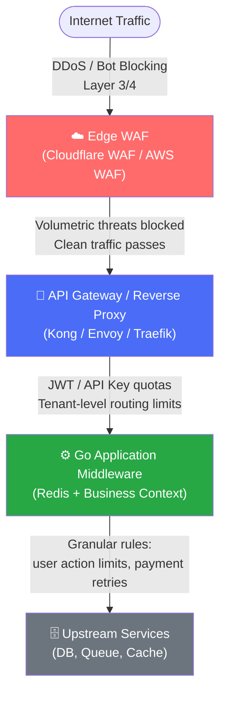

---
title: "Go API Rate Limiting: Token Bucket & Redis Lua"
slug: "11-security-api-rate-limiting"
date: "2026-06-18T14:00:00+07:00"
lastmod: 2026-07-03T15:41:55+07:00
draft: false
author: "Tanh"
description: "Advanced API rate limiting in Go: Token Bucket vs Leaky Bucket, distributed sliding window with Redis Lua, IP spoofing prevention."
tags: ["rate limiting", "security", "golang", "redis", "lua", "envoy", "system design"]
categories: ["System Design", "Backend Engineering"]
ShowToc: true
TocOpen: true
series: ["system-design"]
mermaid: true
cover:
  image: "/images/posts/ecommerce-microservices-blueprint-cover.png"
  alt: "System Design Masterclass in Golang: architecture patterns for high-traffic distributed systems"
  relative: false
---

> **Prerequisite:** This is Part 11 of the [System Design Masterclass](/series/system-design/). Previous parts built the core components — this part covers securing APIs and managing client traffic spikes at scale.

**Answer-first:** API rate limiting defends backend services by restricting request volume. Security requires a layered defense: Web Application Firewalls (WAF) block edge-level volumetric spikes, API Gateways manage L7 credentials and quotas, and application middleware enforces fine-grained business limits. Client identification must rely on validated, secure IP parsing (using the PROXY protocol or rightmost `X-Forwarded-For` checks).

---

## Layered Rate Limiting Architecture & IP Spoofing Prevention

**Answer-first:** Secure rate limiting requires a tiered approach, deploying quick-reject rules at the edge WAF, routing quotas at the L7 gateway, and business-level limits in application middleware. To prevent client IP spoofing, proxies must strip client-supplied `X-Forwarded-For` headers, trust only verified internal proxy IPs, or use the PROXY protocol at the TCP layer.

### Layered Defense Options

Distributed architectures should not rely on a single choke point. The workload must be split across three distinct tiers:

| Defense Tier | Primary Responsibility | Common Technologies | Key Trade-offs |
|---|---|---|---|
| **Edge WAF** | Volumetric protection, DDoS mitigation, bot blocking, IP reputation checks | Cloudflare, AWS WAF, Akamai | Simple, fast rejection; lacks application-level metadata. |
| **API Gateway (L7)** | Client API keys quota mapping, global tenant limiting, routing | Kong, Envoy, Traefik | Decent routing metadata; high latency impact if centralized. |
| **Application Middleware** | Granular user actions (e.g., limit profile edits, payment retries) | Go middleware + Redis | Full database access and context; expensive CPU/network overhead. |



### Preventing X-Forwarded-For (XFF) Spoofing

If your application rate limiter reads the `X-Forwarded-For` header to identify users, a malicious client can simply send:

```http
GET /api/checkout HTTP/1.1
Host: api.vesviet.com
X-Forwarded-For: 8.8.8.8
```

If the reverse proxy appends to this header without sanitization, the server receives `X-Forwarded-For: 8.8.8.8, <client_real_ip>`. Trusting the leftmost IP (8.8.8.8) allows the client to spoof any IP and bypass rate limits.

#### Prevention Strategies:
1. **Header Stripping:** The edge reverse proxy must drop client-supplied `X-Forwarded-For` headers before injecting the real TCP connection source IP.
2. **Rightmost IP Extraction:** If multiple load balancers exist, configure the application to parse only the rightmost entry added by your trusted internal proxy (e.g., `remote_ip = header_values[len(header_values) - num_trusted_proxies]`).
3. **PROXY Protocol:** Avoid HTTP parsing entirely for IP identification. The PROXY protocol prepends a simple TCP header block conveying client connection metadata before the TLS handshake.

---

## In-Memory Rate Limiting: Token Bucket vs. Leaky Bucket

**Answer-first:** Token Bucket allows bursts by accumulating tokens over time up to a set capacity limit. Leaky Bucket enforces a smooth, constant output rate by introducing forced delay gaps between calls. In high-concurrency Go services, global locks on rate limiters cause high mutex contention; sharding limiters or using atomic CAS mitigates lock queues.

### Algorithm Comparison

| Feature | Token Bucket (`x/time/rate`) | Leaky Bucket (`uber-go/ratelimit`) |
|---|---|---|
| **Traffic Shape** | Accepts sudden bursts up to capacity | Smooths output traffic to a constant rate |
| **State Tracked** | Current token count, last update timestamp | Expected time of next allowed request |
| **Memory Footprint** | $O(1)$ per key | $O(1)$ per key |
| **Primary Use Case** | User-facing API endpoints tolerating fast loads | Throttling outbound calls to fragile third-party APIs |

### Mutex Contention under Load

The default implementation of `golang.org/x/time/rate` locks a global `sync.Mutex` on every check:

```go
func (lim *Limiter) AllowN(now time.Time, n int) bool {
    lim.mu.Lock()
    defer lim.mu.Unlock()
    return lim.reserveN(now, n, 0).ok
}
```

Under high concurrency (hundreds of thousands of requests per second), CPU profiling reveals that Go threads spend significant time waiting in `sync.runtime_Semacquire` due to lock contention on this mutex.

#### Sharding Limiter Pattern
To mitigate this, split a single limiter map into multiple independent buckets (shards) based on a hash of the client identifier:

```go
package limiter

import (
	"hash/fnv"
	"sync"
	"time"
	"golang.org/x/time/rate"
)

type ShardedLimiter struct {
	shards []*limiterShard
	size   uint32
}

type limiterShard struct {
	mu       sync.RWMutex
	limiters map[string]*rate.Limiter
}

func NewShardedLimiter(shardCount int) *ShardedLimiter {
	shards := make([]*limiterShard, shardCount)
	for i := 0; i < shardCount; i++ {
		shards[i] = &limiterShard{
			limiters: make(map[string]*rate.Limiter),
		}
	}
	return &ShardedLimiter{shards: shards, size: uint32(shardCount)}
}

func (sl *ShardedLimiter) getShard(key string) *limiterShard {
	h := fnv.New32a()
	h.Write([]byte(key))
	idx := h.Sum32() % sl.size
	return sl.shards[idx]
}

func (sl *ShardedLimiter) Allow(key string, r rate.Limit, b int) bool {
	shard := sl.getShard(key)
	
	shard.mu.RLock()
	lim, exists := shard.limiters[key]
	shard.mu.RUnlock()

	if !exists {
		shard.mu.Lock()
		// Double check lock check
		lim, exists = shard.limiters[key]
		if !exists {
			lim = rate.NewLimiter(r, b)
			shard.limiters[key] = lim
		}
		shard.mu.Unlock()
	}

	return lim.Allow()
}
```

### Leaky Bucket Implementations: Queue vs. Time-Gap

1. **Queue-Based:** Uses a buffered channel to hold tasks. A worker consumer pulls from the channel at fixed interval ticks (`time.Ticker`). If the queue fills up, new requests fail immediately. 
   *Trade-off:* High allocation overhead. Allocating channels and items queue scales linearly with traffic capacity.
2. **Time-Gap (uber-go/ratelimit):** Tracks only the expected execution timestamp of the *next* request. If a request arrives early, the limiter calculates the time gap and forces the current thread to sleep:
   *Trade-off:* Avoids queue allocation ($O(1)$ memory). Threads block natively via scheduler sleep, which consumes minimal CPU overhead.

---

## Distributed Rate Limiting with Redis & Lua

**Answer-first:** Distributed rate limiting synchronizes quotas across horizontal app nodes using a central data store. By implementing the Sliding Window Log/Counter using a Redis Sorted Set (ZSET), we track exact transaction timestamps. Race conditions are eliminated by executing the check-and-write inside an atomic Redis Lua script.

```
                  +-----------------------------------+
                  |        Go Application Node        |
                  +-----------------------------------+
                       |                         |
                       | EvalSHA / Run Script    | (Single Round Trip)
                       v                         v
       +-------------------------------------------------+
       |                  Redis Server                   |
       |  Lua Execution:                                 |
       |  1. ZREMRANGEBYSCORE: Remove items > window     |
       |  2. ZCARD: Count logs inside current window     |
       |  3. ZADD + PEXPIRE: Log request if under limit  |
       +-------------------------------------------------+
```

### Redis Cluster Hash Tags Slot Constraints

In a Redis Cluster environment, keys are divided across 16,384 slots. Transactions (`MULTI/EXEC`) or Lua scripts attempting to write or read multiple keys will fail with a `CROSSSLOT` error if those keys resolve to different nodes.

#### The Slot Hash Tag Solution
To execute multi-key commands, wrap the common partitioning identifier inside curly braces `{}`. Redis will only hash the string inside the curly braces to determine the slot.

* **Without Hash Tag:** `rate:127.0.0.1:log` and `rate:127.0.0.1:metadata` hash differently, resulting in slot distribution failures.
* **With Hash Tag:** `{rate:127.0.0.1}:log` and `{rate:127.0.0.1}:metadata` both hash the string `rate:127.0.0.1`, guaranteeing they land on the same slot and node.

### Production-Grade Redis Lua Sliding Window Script

```lua
-- KEYS[1]: Limit Key, e.g., "{rate:user_1029}:log"
-- ARGV[1]: Current UNIX millisecond timestamp
-- ARGV[2]: Sliding window duration in milliseconds (e.g., 60000 for 1 minute)
-- ARGV[3]: Max allowed requests inside the window
-- ARGV[4]: Unique Request ID (UUID or random bytes) to identify the transaction log

local key = KEYS[1]
local now = tonumber(ARGV[1])
local window = tonumber(ARGV[2])
local limit = tonumber(ARGV[3])
local request_id = ARGV[4]

-- Step 1: Remove all timestamps older than the start of the current sliding window
redis.call('ZREMRANGEBYSCORE', key, 0, now - window)

-- Step 2: Fetch the remaining count of requests in the current window
local count = redis.call('ZCARD', key)

-- Step 3: Check if request is allowed
if count < limit then
    -- Record this request with score = current time, member = unique request_id
    redis.call('ZADD', key, now, request_id)
    -- Extend key TTL to prevent stale records from wasting memory
    redis.call('PEXPIRE', key, window)
    return {1, count + 1} -- Returns {Allowed=1, CurrentCount}
else
    return {0, count}     -- Returns {Allowed=0, CurrentCount}
end
```

### Complete Go Distributed Rate Limiting Middleware

This middleware implements the Lua script execution using the official `go-redis/v9` library, parsing and returning standard HTTP rate limit headers:

```go
package middleware

import (
	"context"
	"crypto/rand"
	"encoding/hex"
	"net/http"
	"strconv"
	"time"
	"github.com/redis/go-redis/v9"
)

var slidingWindowScript = redis.NewScript(`
	local key = KEYS[1]
	local now = tonumber(ARGV[1])
	local window = tonumber(ARGV[2])
	local limit = tonumber(ARGV[3])
	local request_id = ARGV[4]
	redis.call('ZREMRANGEBYSCORE', key, 0, now - window)
	local count = redis.call('ZCARD', key)
	if count < limit then
		redis.call('ZADD', key, now, request_id)
		redis.call('PEXPIRE', key, window)
		return {1, count + 1}
	else
		return {0, count}
	end
`)

type RedisRateLimiter struct {
	rdb    *redis.Client
	limit  int
	window time.Duration
}

func NewRedisRateLimiter(rdb *redis.Client, limit int, window time.Duration) *RedisRateLimiter {
	return &RedisRateLimiter{
		rdb:    rdb,
		limit:  limit,
		window: window,
	}
}

func (rl *RedisRateLimiter) Middleware(next http.Handler) http.Handler {
	return http.HandlerFunc(func(w http.ResponseWriter, r *http.Request) {
		ctx := r.Context()
		
		// Secure IP identification (prevent spoofing by using verified RemoteAddr or L7 set header)
		ip := r.RemoteAddr
		key := "{rate:" + ip + "}:log"
		
		now := time.Now().UnixNano() / int64(time.Millisecond)
		windowMs := rl.window.Milliseconds()
		
		// Generate random identifier to make elements in ZSET unique
		randBytes := make([]byte, 8)
		if _, err := rand.Read(randBytes); err != nil {
			http.Error(w, "Internal system error", http.StatusInternalServerError)
			return
		}
		reqID := hex.EncodeToString(randBytes)

		// Execute Lua script atomically on Redis node
		res, err := slidingWindowScript.Run(ctx, rl.rdb, []string{key}, now, windowMs, rl.limit, reqID).Result()
		if err != nil {
			http.Error(w, "Rate limiting service unavailable", http.StatusServiceUnavailable)
			return
		}

		results := res.([]interface{})
		allowed := results[0].(int64)
		count := results[1].(int64)

		// Set standard RFC headers
		w.Header().Set("X-RateLimit-Limit", strconv.Itoa(rl.limit))
		w.Header().Set("X-RateLimit-Remaining", strconv.FormatInt(int64(rl.limit)-count, 10))

		if allowed == 0 {
			w.Header().Set("Retry-After", strconv.FormatInt(rl.window.Milliseconds()/1000, 10))
			http.Error(w, "Too Many Requests", http.StatusTooManyRequests)
			return
		}

		next.ServeHTTP(w, r)
	})
}
```

---

## Case Study: Shopee Flash Sale Queue Throttling

> 🔥 **[Production Pattern]: Shopee's Request Shielding**
> During extreme flash sales, peak write traffic to inventory database shards can exceed capacity. Shopee handles this by combining Redis Lua script checking with message queueing:
> 1. **Immediate Shielding:** Pre-check inventory in Redis. If Redis indicates a product is sold out, local in-memory filters (`sync.Map` caches) on application nodes are flipped to reject all subsequent requests before querying Redis.
> 2. **Queue buffering:** If inventory exists, requests are pushed to a buffered **Kafka queue**. 
> 3. **Asynchronous Drain:** Consumer workers pull orders at a safe write speed, ensuring the relational transactional databases are never overwhelmed.
> *(Source: Shopee Tech Blog)*

---

## FAQ



Do not read `X-Forwarded-For` without validating proxies. Clean client headers at the edge reverse proxy, or rely on the PROXY protocol at the transport layer to propagate validated TCP connection source IP metadata.



* **In-Memory (`x/time/rate`):** High throughput, minimal latency overhead. Use for process-specific limits or when horizontal node isolation is acceptable.
* **Redis:** Coordinates limits across multiple nodes, ensuring global quotas. Necessary for pricing/tier-based user thresholds.



Envoy delegates rate limit decisions to an external service using a gRPC filter (`envoy.filters.http.ratelimit`). The gRPC server implements Lyft's `RateLimitService`, running configurations against a central Redis cluster to decide whether a request should be rate-limited.

---

🔗 **Next:** [Part 12: Communication Protocols — gRPC vs REST vs GraphQL in Go Microservices](/series/system-design/12-communication-protocols-microservices/)

