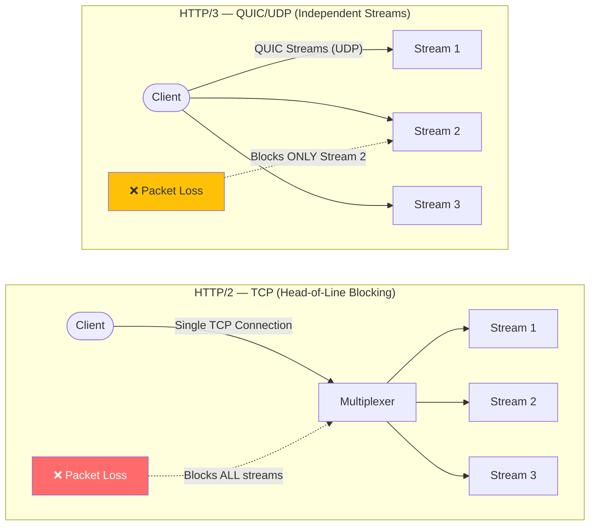

**Answer-first:** gRPC is optimized for internal microservices using binary Protobuf serialization over multiplexed HTTP/2 or HTTP/3 streams. REST uses standard JSON over HTTP/1.1 or HTTP/2, serving as the default for public APIs. GraphQL operates as an aggregator at the API gateway or Backend-for-Frontend (BFF) layer, allowing clients to query specific properties, but requires complexity limits and DataLoader batching to prevent server degradation.

> **Prerequisite:** This is Part 12 of the [System Design Masterclass](/series/system-design/). Previous parts built the reliability patterns — this part covers comparing communication protocols and data formats for microservice communication.

### What You'll Learn That AI Won't Tell You
- **Protobuf Memory Allocations:** Benchmarking struct reflection versus compile-time Protobuf serialization memory footprints in Go.
- **ConnectRPC net/http Integration:** How to mount ConnectRPC handlers directly onto Go's standard multiplexer without using intermediate gateway proxies.
- **N+1 Query Resolution:** Implementing the DataLoader batching pattern in Go to prevent sequential database queries.

---

## Overview of Communication Protocols

**Key Concept:** gRPC, REST, and GraphQL operate on different layers of serialization, schema safety, and client-server coordination. gRPC enforces strict API contract schemas at compile time; REST provides loose, flexible JSON responses over standard HTTP semantics; GraphQL relies on schema-based graph models, allowing clients to fetch customized fields in a single query round trip.

### Protocol Comparison

| Feature | gRPC | REST | GraphQL |
|---|---|---|---|
| **Data Format** | Protocol Buffers (Binary) | JSON, XML, HTML | JSON |
| **Transport** | HTTP/2, HTTP/3 | HTTP/1.1, HTTP/2, HTTP/3 | HTTP/1.1, HTTP/2 |
| **Contract Type** | Strict IDL (proto3 file) | OpenAPI Spec / Swagger (Optional) | Strongly Typed GraphQL Schema |
| **Streaming** | Bidirectional, Client, Server | Server-Sent Events (SSE), WebSockets | Subscriptions (via WebSockets) |
| **Over-fetching** | Solved via specific RPC models | Common unless multiple endpoints exist | Natively solved by client field selectors |
| **Primary Use Case** | Low-latency internal microservices | Public APIs, web integrations | Frontend/Mobile aggregations (BFF) |

---

## Performance Comparison: gRPC vs REST vs GraphQL

**Performance Comparison:** gRPC outperforms REST and GraphQL by utilizing pre-compiled Protobuf binary wire formats instead of JSON string reflection. In Go benchmarks, Protobuf achieves up to 10M operations/sec (10x faster than JSON reflection), reducing CPU overhead, memory allocation, and payload size by up to 80%. Multiplexed HTTP/2 and UDP-based HTTP/3 transports eliminate network-level queue bottlenecks.

### Serialization Benchmarks in Go

```go
// Run using: go test -bench=. -benchmem
```

| Format | Marshal Speed (ops/s) | Unmarshal Speed (ops/s) | Bytes Allocated / Op | Payload Size |
|---|---|---|---|---|
| **JSON (`encoding/json`)** | ~1.2M | ~0.8M | ~256 B | ~180 bytes |
| **Protobuf (`google.golang.org/protobuf`)** | **~10.0M** | **~8.5M** | **~32 B** | **~42 bytes** |

JSON serialization in Go relies heavily on runtime reflection (`reflect` package) to inspect struct tags and parse strings, creating heavy CPU consumption. Protobuf utilizes pre-generated serializer files to write binary stream layouts directly to target buffers.

### Protobuf Wire Format Encoding Internals

Protobuf structures data as a continuous stream of key-value fields. Keys represent tag-wire metadata, computed as:

$$\text{Tag-Wire Value} = (\text{field\_number} \ll 3) \mid \text{wire\_type}$$

#### Varints (Wire Type 0)
Protobuf stores integers dynamically using Variable-length quantity integers (Varints). The most significant bit (MSB) of each byte serves as a *continuation bit*. If set to `1`, another byte follows. This allows small integers to write into a single byte instead of taking 4 or 8 bytes:

* The number `3` is encoded in binary as `0000 0011`. Since the MSB is `0`, it fits in 1 byte.
* The number `300` is encoded as two bytes: `1010 1100 0000 0010`. The first byte has MSB = `1`, indicating continuation.

```
Varint representation for 300:
10101100 00000010
^        ^
MSB=1    MSB=0 (Terminal byte)
```

#### Length-delimited (Wire Type 2)
Used for strings, byte arrays, and sub-messages. It starts with the tag-wire key, followed by a varint specifying the payload length, followed by raw data bytes.

### Defining a Protobuf Schema — The `.proto` IDL

Before writing any Go code, gRPC requires a service contract defined in a `.proto` file. This IDL (Interface Definition Language) file is compiled into type-safe Go code by `protoc`:

```protobuf
// ping/v1/ping.proto
syntax = "proto3";

package ping.v1;

option go_package = "example/gen/ping/v1;pingv1";

// Service definition — maps to Go interface
service PingService {
  rpc Ping(PingRequest) returns (PingResponse) {}
  rpc StreamPing(PingRequest) returns (stream PingResponse) {} // Server-side streaming
}

// Message definitions
message PingRequest {
  string message = 1; // Field number 1, wire type 2 (length-delimited)
}

message PingResponse {
  string message = 1;
  int64  timestamp_ms = 2; // Unix milliseconds
}
```

Compile to Go:
```bash
protoc --go_out=. --go_opt=paths=source_relative \
       --go-grpc_out=. --go-grpc_opt=paths=source_relative \
       ping/v1/ping.proto
```

This generates `ping.pb.go` (message types) and `ping_grpc.pb.go` (service interface + client stub).

#### Schema Evolution — Backward-Compatible Changes

Protobuf's key advantage over JSON is safe schema evolution without breaking existing clients:

| Change | Safe? | Rule |
|---|:---:|---|
| Add a new field with a new number | ✅ | Old clients ignore unknown fields; new fields default to zero value |
| Rename a field | ✅ | Wire format uses field number, not name — rename is safe |
| Remove a field | ✅ (with care) | Mark as `reserved` to prevent reuse of that field number |
| Change a field's type | ❌ | Wire type mismatch causes decode errors — never reuse field numbers |
| Change a field number | ❌ | Breaking change — all clients must update simultaneously |

```protobuf
// v2 of the schema — backward compatible
message PingRequest {
  string message   = 1;              // Unchanged
  string client_id = 3;              // New field — old clients ignore this
  reserved 2;                        // Field 2 was removed; reserved prevents reuse
  reserved "deprecated_field_name";  // Also reserve the name
}
```

> [!IMPORTANT]
> **Golden Rule:** Never reuse a field number. Old clients cache the wire type for each number. Reusing a number with a different type causes silent data corruption — not a crash, which makes it harder to detect.

---

### Transport Layer: HTTP/2 vs HTTP/3



1. **HTTP/2 Multiplexing:** Enables bidirectional request-response streams over a single shared TCP connection, removing browser connection queue bottlenecks. HPACK compresses HTTP headers, and Keepalive signals maintain healthy network channels.
2. **HTTP/3 UDP/QUIC (Solving Head-of-Line Blocking):** If a packet is lost in HTTP/2, TCP stalls the entire connection (all streams block) while waiting for retransmission. HTTP/3 runs on **QUIC (UDP)**, which maps streams independently. A lost packet only stalls its corresponding stream, allowing other streams to continue processing in parallel.

---

## GraphQL Gateway & ConnectRPC in Go

**Vulnerability Pattern:** GraphQL aggregations are vulnerable to nested recursion DDoS attacks and N+1 resolver queries. Gateways must implement query complexity limits and DataLoader batch caching. ConnectRPC in Go provides a modern alternative to standard gRPC and gRPC-Web, running directly on standard `net/http` handlers without requiring external Envoy proxy configurations.

### GraphQL Query Complexity Control

A malicious client can overload a GraphQL resolver database by querying deeply nested recursive structures:

```graphql
query DDoS {
  users(limit: 100) {
    posts(limit: 100) {
      comments {
        author {
          posts {
            comments {
              id
            }
          }
        }
      }
    }
  }
}
```

To prevent this, the gateway parses the Query AST (Abstract Syntax Tree) to calculate the complexity cost before execution:

$$\text{Field Cost} = \text{Base Cost} \times \prod (\text{Parent Multipliers})$$

For example, if `comments` has a base cost of `1` and is nested under `posts (limit 100)` and `users (limit 100)`, its evaluated cost is $1 \times 100 \times 100 = 10,000$. If the computed tree exceeds a threshold (e.g. limit `500`), the gateway immediately rejects the request.

#### Resolving N+1 with DataLoader
If a resolver queries the database for each parent's children individually, fetching 100 users results in 100 separate database queries. The **DataLoader** pattern batches these requests: it waits for a tick (e.g. 5ms), groups all target user IDs, and executes a single SQL query (`SELECT * FROM posts WHERE user_id IN (...)`), caching the results for the lifecycle of the request.

### ConnectRPC: Direct Browser-to-Backend gRPC

Standard gRPC requires HTTP/2 trailers for status and error codes, which browsers cannot parse. The standard workaround is deploying an **Envoy Proxy** to translate `gRPC-Web` payloads.

**ConnectRPC** solves this by running natively on standard Go `net/http` handlers. It supports:
1. **gRPC Protocol:** Standard HTTP/2 protocol.
2. **gRPC-Web Protocol:** Wraps HTTP trailers in the HTTP body, working out-of-the-box over HTTP/1.1 browsers.
3. **Connect Protocol:** A simple POST JSON protocol mapping errors to standard HTTP status codes, queryable via simple `curl`.

#### Go Code: ConnectRPC Server Setup

```go
package main

import (
	"context"
	"log"
	"net/http"
	"golang.org/x/net/http2"
	"golang.org/x/net/http2/h2c"
	"connectrpc.com/connect"
	
	// Pre-generated protoc-gen-go and protoc-gen-connect-go stubs
	pingv1 "example/gen/ping/v1"
	"example/gen/ping/v1/pingv1connect"
)

type PingServer struct{}

func (s *PingServer) Ping(
	ctx context.Context,
	req *connect.Request[pingv1.PingRequest],
) (*connect.Response[pingv1.PingResponse], error) {
	log.Printf("Received message: %s", req.Msg.Message)
	return connect.NewResponse(&pingv1.PingResponse{
		Message: "Pong: " + req.Msg.Message,
	}), nil
}

func main() {
	server := &PingServer{}
	path, handler := pingv1connect.NewPingServiceHandler(server)
	
	mux := http.NewServeMux()
	mux.Handle(path, handler)

	log.Println("Serving ConnectRPC on :8080...")
	
	// h2c allows HTTP/2 cleartext (no TLS) for local internal microservices
	err := http.ListenAndServe(
		"localhost:8080",
		h2c.NewHandler(mux, &http2.Server{}),
	)
	if err != nil {
		log.Fatalf("Server failed: %v", err)
	}
}
```

### In-Memory gRPC Integration Testing using `bufconn`

To test keepalives and server hooks without binding to physical host network ports, use an in-memory connection listener (`bufconn`):

```go
package integration

import (
	"context"
	"net"
	"testing"
	"time"
	"google.golang.org/grpc"
	"google.golang.org/grpc/credentials/insecure"
	"google.golang.org/grpc/keepalive"
	"google.golang.org/grpc/test/bufconn"
	
	pb "example/gen/ping/v1"
)

type mockPingServer struct {
	pb.UnimplementedPingServiceServer
}

func (s *mockPingServer) Ping(ctx context.Context, in *pb.PingRequest) (*pb.PingResponse, error) {
	return &pb.PingResponse{Message: "pong"}, nil
}

func TestgRPCKeepaliveIdleTimeout(t *testing.T) {
	const bufSize = 1024 * 1024
	lis := bufconn.Listen(bufSize)
	
	// Server parameter: Close connection if idle for 200ms
	s := grpc.NewServer(
		grpc.KeepaliveParams(keepalive.ServerParameters{
			MaxConnectionIdle: 200 * time.Millisecond,
		}),
	)
	pb.RegisterPingServiceServer(s, &mockPingServer{})
	
	go func() {
		if err := s.Serve(lis); err != nil && err != grpc.ErrServerStopped {
			log.Printf("Server serve error: %v", err)
		}
	}()
	defer s.Stop()

	ctx := context.Background()
	conn, err := grpc.DialContext(ctx, "bufnet",
		grpc.WithContextDialer(func(context.Context, string) (net.Conn, error) {
			return lis.Dial()
		}),
		grpc.WithTransportCredentials(insecure.NewCredentials()),
	)
	if err != nil {
		t.Fatalf("Failed to dial: %v", err)
	}
	defer conn.Close()

	client := pb.NewPingServiceClient(conn)
	
	// Trigger first request
	_, err = client.Ping(ctx, &pb.PingRequest{Message: "ping"})
	if err != nil {
		t.Fatalf("First Ping call failed: %v", err)
	}

	// Sleep past the server connection idle timeout (200ms)
	time.Sleep(300 * time.Millisecond)

	// Second request: Should fail because connection has been closed due to idle timeout
	_, err = client.Ping(ctx, &pb.PingRequest{Message: "ping"})
	if err == nil {
		t.Error("Expected connection to be closed by server keepalive timeout, but call succeeded")
	}
}
```

---

## Case Study: PayPay's DDD & gRPC Migration

> 🔥 **[Production Pattern]: PayPay Microservices Optimization**
> When PayPay scaled to support 7.8 billion annual transactions, they migrated their internal communications from REST/JSON to a DDD-driven gRPC/Protobuf model. 
> 1. **Serialization savings:** The JSON-to-Protobuf migration reduced aggregate CPU utilization across internal microservices by ~35%.
> 2. **Network efficiency:** Persistent multiplexed TCP connections resolved socket exhaustion spikes on active node containers.
> 3. **Consistent database layer:** By pairing gRPC contracts with a **TiDB** (distributed transactional SQL) backend, PayPay maintained linearizable consistency across payment transactions without deploying manual sharding code layers.
> *(Source: PayPay Engineering Tech Summit)*

---

## FAQ



The N+1 problem occurs when a resolver queries child fields sequentially for each parent item (resulting in 1 query for parents, and N queries for children). Fix this in Go using the **DataLoader** pattern to batch child IDs into a single database fetch (`SELECT IN`) and cache the results for the request duration.



gRPC uses persistent HTTP/2 TCP connections. Standard L4 load balancers route the connection to a single backend container once, meaning all subsequent multiplexed requests over that connection stay pinned to that container. Deploy an L7 proxy (e.g. Envoy) to terminate the HTTP/2 connection and balance requests individually using latency-aware routing (e.g. peak EWMA).



ConnectRPC runs directly on standard Go `net/http` handlers and does not require HTTP/2 trailers or specialized reverse proxies like Envoy. It supports standard gRPC, base64-encoded gRPC-Web, and a simple POST JSON Connect protocol concurrently on a single handler port.

---

## Series Summary — System Design Masterclass (Golang)

You've completed all 12 parts of the masterclass. Here's the complete knowledge map you've built:

| Part | Topic | Core Concept |
|---|---|---|
| [1](/series/system-design/01-introduction-system-design-golang/) | System Design Thinking | CAP/PACELC proofs, clean port/adapter architecture |
| [2](/series/system-design/02-load-balancing-api-gateway-go/) | Load Balancing | L4 NAT vs DSR, API Gateway middleware |
| [3](/series/system-design/03-caching-strategies-redis-golang/) | Caching | Write-Through/Behind, Singleflight, XFetch |
| [4](/series/system-design/04-database-scaling-sharding/) | Database Scaling | B-Tree vs LSM, TiDB 2PC, connection pool |
| [5](/series/system-design/05-async-message-queues-kafka-go/) | Event-Driven | Kafka sendfile, worker pools, exactly-once |
| [6](/series/system-design/06-distributed-locks-concurrency/) | Distributed Locks | Redlock drift validation, etcd leases, Raft |
| [7](/series/system-design/07-idempotency-api-design-go/) | Idempotent APIs | SetNX response record middleware, Stripe pattern |
| [8](/series/system-design/08-saga-pattern-distributed-transactions-go/) | Distributed Transactions | Temporal Saga, compensating actions, Outbox |
| [9](/series/system-design/09-consistent-hashing-sharding/) | Consistent Hashing | Hash rings, virtual nodes, Redis slot mapping |
| [10](/series/system-design/10-observability-pprof-golang/) | Observability | pprof profiling grid, 5-step heap diff, GODEBUG |
| **11** | **API Security** | **Layered defense, XFF spoofing, Redis Lua sliding window** |
| **12** | **Communication** | **Protobuf wire format, HTTP/3 QUIC, GraphQL complexity, ConnectRPC** |

🔗 **Series Hub:** [System Design Masterclass (Golang)](/series/system-design/) — Return to the index for prerequisites, case study links, and consultation details.

---

## Navigation & Next Steps

[← Previous Part]()

🔗 **Series Hub:** Continue to [System Design Masterclass (Golang)](/series/system-design/)

Need help implementing this architecture in your organization? [Get in touch](/hire/) or [hire our technical consulting team](/hire/) to review your system design and codebase.
