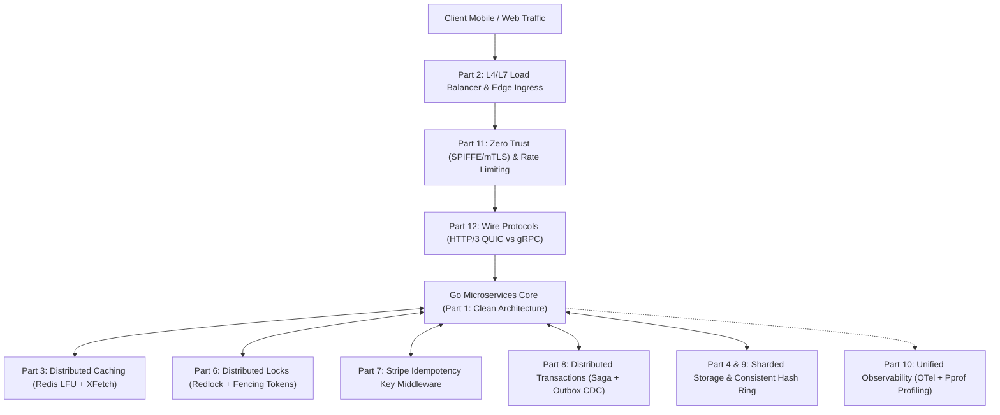

> **Answer-first:** Optimal distributed system design requires continuously balancing latency, throughput, consistency, and operational availability under severe network partitions and hardware failures. This twelve-chapter masterclass series delivers mathematical theorem proofs, production architecture blueprints, quantitative benchmark tables, and compilable Go 1.24+ implementations for senior engineers building petabyte-scale, fault-tolerant cloud-native distributed microservices across global enterprise regions.

> 🇻🇳 **

**

---

## 🏛️ System Design Architecture Topology (2027 SOTA)

This architectural topology integrates directly into our flagship enterprise case studies, including the [21-Microservice E-Commerce System Architecture](/posts/architecting-21-service-ecommerce-golang-ddd/), [Alipay Double 11 Extreme TPS Architecture](/posts/alipay-double-11-architecture-tps/), [Production Go Microservices Architecture](/posts/go-microservices/), and the sitewide [Curated Engineering Reading Map](/reading-map/).

---

## 📚 12-Chapter Curriculum Matrix

### Tier 1: Single-Service Core & Storage Fundamentals
*Master the foundational architecture patterns for optimizing individual microservices and storage tiers.*

1. **[Part 1: System Design Thinking & Architecture Trade-offs in Go](/series/system-design/01-introduction-system-design-golang/)**
   - Formal Gilbert & Lynch CAP proof, PACELC database classification matrix, composite availability mathematics.
   - Clean Architecture with Dependency Inversion in Go 1.24+: Port/Adapter pattern with interface-driven unit testing.

2. **[Part 2: Load Balancing L4/L7 & Ingress Gateway Architecture in Go](/series/system-design/02-load-balancing-api-gateway-go/)**
   - Layer 4 Direct Server Return (DSR) vs Layer 7 reverse proxy routing, HAProxy + Linux kernel sysctl tuning.
   - Token Bucket rate-limiting middleware in Go with per-client token buckets and circuit breaking.

3. **[Part 3: Distributed Caching Strategies & Redis Cache Stampede Mitigation in Go](/series/system-design/03-caching-strategies-redis-golang/)**
   - Write-Through vs Write-Behind vs Cache-Aside trade-off matrix with latency and data loss analysis.
   - XFetch probabilistic early expiration algorithm, `golang.org/x/sync/singleflight` deduplication, and two-tier LRU/LFU caching.

4. **[Part 4: Database Scaling, Sharding & Connection Pool Optimization in Go](/series/system-design/04-database-scaling-sharding/)**
   - B-Tree vs LSM-Tree storage engine internals, Range vs Hash vs Directory sharding strategies.
   - Distributed 2PC in TiDB Percolator, PostgreSQL connection overhead mitigation, and `database/sql` connection pool tuning.

5. **[Part 5: Asynchronous Messaging, Kafka KRaft & Event-Driven Systems in Go](/series/system-design/05-async-message-queues-kafka-go/)**
   - Kafka KRaft zero-copy `sendfile()` internals, sparse index lookup mechanisms, Kafka vs RabbitMQ decision matrix.
   - Bounded Worker Pools with channel backpressure and partition-aware strictly ordered event consumption.

---

### Tier 2: Advanced Distributed Coordination & Data Integrity
*Solve multi-service distributed consistency and synchronization hazards across autonomous clusters.*

6. **[Part 6: Distributed Locks, Mutex Invariants & Concurrency in Go](/series/system-design/06-distributed-locks-concurrency/)**
   - Redis Redlock algorithm analysis, Martin Kleppmann's safety critique, and monotonic Fencing Tokens.
   - Etcd Raft leases with keepalive heartbeats, PostgreSQL advisory locks (`pg_advisory_xact_lock`), and CPU false sharing avoidance.

7. **[Part 7: Idempotency Key Architecture & Financial API Design in Go](/series/system-design/07-idempotency-api-design-go/)**
   - Stripe-standard idempotency key protocol, RFC 9110 HTTP method invariants, and finite state machine lifecycle (`PENDING`, `COMPLETED`, `FAILED`).
   - SHA-256 canonical payload fingerprinting to prevent parameter tampering, and dual-tier Redis/Postgres storage.

8. **[Part 8: Saga Pattern & Distributed Transactions in Go](/series/system-design/08-saga-pattern-distributed-transactions-go/)**
   - Why Two-Phase Commit (2PC) collapses in cloud microservices; Orchestration vs Choreography trade-off matrix.
   - Transactional Outbox pattern with Debezium CDC, compensating transactions, and Go Saga Orchestrators with full-jitter retry backoff.

9. **[Part 9: Consistent Hashing & Dynamic Sharding in Go](/series/system-design/09-consistent-hashing-sharding/)**
   - Why naive modulo hashing causes catastrophic 80% cache stampedes during node scaling.
   - Karger hash rings, virtual node variance analysis ($\sigma = 1/\sqrt{V}$), Google Maglev $O(1)$ lookup tables, and Google Bounded-Load hashing.

---

### Tier 3: Enterprise Telemetry, Zero Trust Security & Low-Level Protocols
*Hardening production infrastructure against volumetric attacks, latency regressions, and wire-level bottlenecks.*

10. **[Part 10: Observability, Continuous Profiling & Pprof in Go](/series/system-design/10-observability-pprof-golang/)**
    - OpenTelemetry 1.35+ OTLP distributed tracing with W3C `traceparent` context propagation and tail-based sampling.
    - Prometheus metric Exemplars linking histograms directly to trace IDs; Continuous Profiling with Pyroscope; Go 1.24+ runtime flight recorders.

11. **[Part 11: Security, Zero Trust & API Rate Limiting in Go](/series/system-design/11-security-api-rate-limiting/)**
    - Zero Trust architecture (NIST SP 800-207), SPIFFE/SPIRE mutual TLS with in-memory certificate rotation.
    - Why PASETO v4 replaces JWT (preventing algorithm agility vulnerabilities), atomic Redis Lua sliding window rate limiters, and Cilium eBPF/XDP network policies.

12. **[Part 12: High-Performance Transport Protocols & Serialization in Go](/series/system-design/12-communication-protocols-microservices/)**
    - Transport protocol evolution: HTTP/1.1 vs HTTP/2 multiplexing vs HTTP/3 QUIC (0-RTT, independent loss recovery, connection migration).
    - Serialization benchmarks: JSON vs Protocol Buffers v3 vs FlatBuffers zero-copy (14ns deserialization); real-time WebSockets vs SSE vs WebTransport.

---

## ❓ Frequently Asked Questions


This masterclass is curated specifically for Senior Backend Engineers, Tech Leads, and Distributed Systems Architects. We bypass superficial conceptual overviews and focus on production engineering: mathematical invariants, formal theorem proofs, quantitative benchmark tables, real-world post-mortem autopsies, and compilable Go 1.24+ source code.



All implementation patterns, benchmarks, and concurrency primitives are authored in modern Go (Go 1.24+), leveraging the latest runtime advancements including `slog` structured logging, `math/rand/v2`, `trace.FlightRecorder`, and atomic memory alignment.



Every chapter includes self-contained Go packages and schema migrations. You can clone the source repository, run `go test -race -bench=. ./...`, and spin up local infrastructure topologies using Docker Compose profiles for PostgreSQL 17+, Redis Cluster 7.4+, Apache Kafka 3.9+, and Etcd 3.5+.

