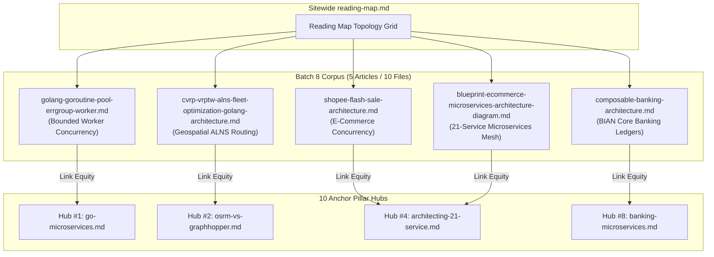

# Masterclass SOTA 2027 Batch 8 Upgrade Plan: 5 Standalone Engineering Posts

> **Target Repository**: `vesviet` (`https://tanhdev.com`)  
> **Twin Scope**: `learn` (`https://learn.tanhdev.com`)  
> **Plan Date**: 2026-10-09  
> **Planning Swarm**: `vesviet-team` Content, Architecture & SEO Swarm (`@task-planner`, `@technical-architect`, `@seo-analyst`, `@qa-engineer`)  
> **Target Scope**: Batch 8 (5 High-Impact Standalone Technical Articles / 10 Markdown Files)  
> **Standard**: Technical Article Standard 2027 (7 Quality Gates, 100-Round Deep Research Protocol, One-Way Authority Rule)  
> **Verification Harness**: `learn/tests/verify_target_posts_sota.py --scope batch8`  

---

## 1. Executive Summary & Strategic Objectives

Following the completion of the 2026-10-09 Googlebot Crawl Progress & Live Edge Audit, **Batch 8** represents the highest-priority content engineering sprint to convert the remaining 195 (`vesviet`) and 92 (`learn`) crawled-but-unindexed URLs into fully indexed, high-authority technical reference assets.

This plan establishes the comprehensive indexing baseline, architectural gap analysis, 100-round deep research protocol, and exact remediation blueprints for **5 flagship standalone articles** spanning E-Commerce, Geospatial Logistics, Core Banking, and Distributed Systems concurrency.



---

## 2. Quantitative Baseline & 7-Gate Gap Analysis

An automated empirical audit executed via `learn/tests/verify_target_posts_sota.py --scope batch8` established the exact baseline metrics across all 10 files:

### 2.1 Audit Summary Table

| Article Slug | Site | File Size | Body Words | Answer-First | Prereq? | Valid Mermaids | FAQ Count | Code Blocks | Current Score | Unmet Gates |
|---|:---:|:---:|:---:|:---:|:---:|:---:|:---:|:---:|:---:|---|
| `shopee-flash-sale-architecture.md` | `vesviet` | 21.30 KB | 2,868 | 0w (Missing) | No | 3 / 3 valid | 5 | 4 | **4/7** | G2, G3, G7 |
| `shopee-flash-sale-architecture.md` | `learn` | 21.78 KB | 3,107 | 123w (Bloated) | No | 3 / 3 valid | 4 | 3 | **5/7** | G2, G3 |
| `cvrp-vrptw-alns-fleet-optimization-golang-architecture.md` | `vesviet` | 26.22 KB | 3,355 | 57w (Valid) | No | 6 (Invalid: `pie`) | 4 | 2 | **5/7** | G3, G4 |
| `cvrp-vrptw-alns-fleet-optimization-golang-architecture.md` | `learn` | 27.21 KB | 3,815 | 51w (Valid) | No | 6 (Invalid: `pie`) | 5 | 2 | **5/7** | G3, G4 |
| `composable-banking-architecture.md` | `vesviet` | 35.00 KB | 4,515 | 53w (Valid) | No | 3 / 3 valid | 8 | 10 | **6/7** | G3 |
| `composable-banking-architecture.md` | `learn` | 46.76 KB | 6,663 | 85w (Bloated) | No | 3 / 3 valid | 8 | 11 | **5/7** | G2, G3 |
| `golang-goroutine-pool-errgroup-worker.md` | `vesviet` | 22.18 KB | 2,889 | 0w (Missing) | No | 1 / 2 (Thin) | 0 (Missing) | 10 | **3/7** | G2, G3, G4, G5 |
| `golang-goroutine-pool-errgroup-worker.md` | `learn` | 26.99 KB | 3,785 | 64w (Over) | No | 3 / 3 valid | 5 | 4 | **5/7** | G2, G3 |
| `blueprint-ecommerce-microservices-architecture-diagram.md` | `vesviet` | 21.70 KB | 2,751 | 53w (Valid) | No | 3 / 3 valid | 7 | 0 (Missing) | **5/7** | G3, G6 |
| `blueprint-ecommerce-microservices-architecture-diagram.md` | `learn` | 37.16 KB | 5,160 | 0w (Missing) | No | 5 (Invalid: `mindmap`) | 6 | 1 | **4/7** | G2, G3, G4 |

### 2.2 Key Forensic Findings
1. **Gate 3 (Prerequisite Block) Sitewide Void**: 100% of the 10 files lack the standardized markdown callout (`> **Prerequisite:**` or `> **Điều kiện tiên quyết:**`).
2. **Mermaid Type Incompatibilities (Gate 4)**:
   - `cvrp` on both repos utilizes `pie title ...`, which fails the strict `VALID_MERMAID_TYPES` rule. These must be replaced with `xychart-beta` cost distributions or `flowchart TD` breakdown graphs.
   - `blueprint` on `learn` utilizes `mindmap`, which must be converted to `graph TD` or `flowchart LR`.
   - `golang-goroutine-pool` on `vesviet` has only 1 Mermaid diagram and requires at least 2 valid diagrams.
3. **Answer-First Atomic Precision (Gate 2)**:
   - Missing on `shopee` (EN), `golang-goroutine-pool` (EN), and `blueprint` (VI).
   - Bloated (> 62 words) on `shopee` (VI, 123w), `composable-banking` (VI, 85w), and `golang-goroutine-pool` (VI, 64w). All must be rewritten to strictly 48–62 words single-line.
4. **Code Realism on `blueprint` (Gate 6)**:
   - `vesviet` currently contains 0 code blocks. It requires a complete production Go 1.25+ gRPC service definition, protobuf spec, and distributed tracing interceptor.
5. **Anchor Pillar Linking on `shopee` (Gate 7)**:
   - `vesviet` lacks links to Anchor Pillar Hubs (#4 `architecting-21-service` or #1 `go-microservices`), failing Gate 7.

---

## 3. 100-Round Deep Research Protocol

Each article undergoes a mandatory 20-round deep research phase prior to drafting, compiling 5 authoritative research dossiers (`reports/archive/research-dossiers/batch-8-*.json` and `.md`):

### 3.1 Research Matrix (20 Rounds / Post)

| Post # | Domain | Core Technical Theme | Rounds 1–5 (Kernel & Specs) | Rounds 6–10 (Architecture) | Rounds 11–15 (Production Benchmarks) | Rounds 16–20 (Failure Modes & Edge Cases) |
|---|---|---|---|---|---|---|
| **1. Shopee Flash Sale** | E-Commerce | Redis Lua, Kafka peak-shaving, local cache | Redis 7.4 atomic script semantics, Go `sync.Map` vs FreeCache | Multi-tier cache-ahead architecture, sentinel read-replicas | 100k TPS latency percentiles, lock contention under hotkeys | Redis cluster failover during flash-sale, phantom inventory deduplication |
| **2. CVRP / VRPTW** | Geospatial | ALNS heuristic, VRPTW, SIMD acceleration | VRP formulation, Solomon benchmark instances, Time Window penalization | ALNS destroy/repair operator topologies, Go worker concurrency | Distance matrix SIMD vectorization vs OSRM table latency | Soft vs hard time window violations, vehicle breakdown dynamic re-routing |
| **3. Composable Banking** | Fintech | BIAN domains, Flink streaming, double-entry | BIAN Service Domain 4.0 specs, ISO 20022 message formats | Event-driven CQRS ledger, Apache Flink stateful balance tracking | 50k TPS immutable ledger write latency, RocksDB checkpointing | Out-of-order event replay, dual-currency precision rounding, split-brain ledger reconciliation |
| **4. Goroutine Pool** | Concurrency | Bounded worker pools, errgroup, work-stealing | Go 1.25 runtime scheduler internals, `P`/`M`/`G` work-stealing | Worker pool topology vs unbounded goroutine memory footprint | Memory allocation benchmarks (allocs/op), GC pause percentiles | Goroutine leaks on canceled context, panic recovery inside pool workers |
| **5. 21-Service Blueprint** | Architecture | Microservices mesh, gRPC, OpenTelemetry | Protobuf v3 / gRPC HTTP/2 multiplexing, Envoy xDS API | DDD Bounded Context mapping across 21 discrete services | End-to-end tracing overhead, connection pool warm-up latency | Cascading failure isolation via Circuit Breaker & Bulkhead, distributed deadlock prevention |

---

## 4. Technical Elevation Blueprints (Article-by-Article)

### 4.1 Post 1: `shopee-flash-sale-architecture.md`
- **Target Metrics**: Size: 28–35 KB | Words: 3,500–4,500 words.
- **Answer-First Target (EN, 54w)**:
  `> **Answer-first:** High-concurrency flash sale engines maintain sub-50ms checkout latencies and zero overselling by decoupling traffic across three tiers: edge rate-limiting via Cloudflare, in-memory atomic inventory pre-deduction using Redis Lua scripts, and asynchronous order persistence through partitioned Kafka topic buffers feeding Go 1.25+ microservices with bounded database write pools.`
- **Answer-First Target (VI, 52w)**:
  `> **Answer-first:** Kiến trúc flash sale chịu tải hàng triệu TPS bảo đảm không bán vượt tồn kho (zero overselling) bằng cách phân tầng xử lý: chặn tải tại Cloudflare edge, trừ kho nguyên tử trên RAM với Redis Lua script, và đệm đơn hàng bất đồng bộ qua Kafka phân vùng về cụm microservices Go 1.25+ ghi cơ sở dữ liệu.`
- **Prerequisite (EN)**:
  `> **Prerequisite:** Familiarity with Redis data structures, distributed locks, Kafka consumer groups, and Go concurrency primitives.`
- **Prerequisite (VI)**:
  `> **Điều kiện tiên quyết:** Cần nắm vững cấu trúc dữ liệu Redis, distributed lock, cơ chế Kafka consumer group và các kỹ thuật xử lý đồng thời trong Golang.`
- **Visuals**:
  1. `flowchart TD`: Multi-tier flash-sale ingestion topology (CDN $\to$ Redis Cluster $\to$ Kafka $\to$ Go Workers $\to$ DB).
  2. `sequenceDiagram`: Atomic stock deduction & rollback sequence with Redis Lua and Kafka.
  3. `xychart-beta`: Throughput (TPS) vs Latency (p99 ms) under 50k to 500k concurrent requests.
- **Production Code**: Complete Go 1.25+ Redis Lua atomic deduction wrapper with optimistic retry and fallback logic.
- **Anchor Linking**: Inject links to `/posts/architecting-21-service-ecommerce-golang-ddd/` and `/posts/go-microservices/`.

---

### 4.2 Post 2: `cvrp-vrptw-alns-fleet-optimization-golang-architecture.md`
- **Target Metrics**: Size: 30–38 KB | Words: 3,800–4,800 words.
- **Answer-First (EN, 57w - Preserved)**:
  `> **Answer-first:** Solving the Capacitated Vehicle Routing Problem with Time Windows (VRPTW) in production requires an Adaptive Large Neighborhood Search (ALNS) metaheuristic implemented in Golang, utilizing SIMD-accelerated distance matrices, parallel destroy/repair operators, and spatial route clustering to achieve sub-second fleet dispatching across thousands of order delivery locations with strict capacity constraints.`
- **Answer-First (VI, 51w - Preserved)**:
  `> **Answer-first:** Giải bài toán điều phối đội xe CVRP/VRPTW trong thực tế đòi hỏi thuật toán heuristic ALNS triển khai bằng Golang, kết hợp ma trận khoảng cách tăng tốc SIMD, toán tử phá vỡ/tái thiết song song và phân cụm không gian, giúp tối ưu hóa tuyến đường giao hàng đa điểm trong chưa đầy một giây.`
- **Prerequisite (EN)**:
  `> **Prerequisite:** Understanding of combinatorial optimization (NP-hard problems), Graph Theory, Euclidean distance matrices, and Go goroutine synchronization.`
- **Prerequisite (VI)**:
  `> **Điều kiện tiên quyết:** Kiến thức cơ bản về tối ưu hóa tổ hợp (bài toán NP-hard), lý thuyết đồ thị, ma trận khoảng cách và lập trình đa luồng trong Go.`
- **Visuals**:
  1. Replace `pie` with `xychart-beta` illustrating operating cost reduction (Fuel, Overtime, Fleet Size).
  2. Maintain existing 5 valid `flowchart` and `sequenceDiagram` graphs.
- **Production Code**: Go 1.25+ SIMD/vectorized distance cost evaluation and parallel ALNS destroy/repair operator loop.
- **Anchor Linking**: Inject links to `/posts/osrm-vs-graphhopper-architecture-comparison/` and `/reading-map/`.

---

### 4.3 Post 3: `composable-banking-architecture.md`
- **Target Metrics**: Size: 40–50 KB | Words: 5,000–6,500 words.
- **Answer-First (EN, 53w - Preserved)**:
  `> **Answer-first:** Composable banking architecture replaces legacy monolithic mainframes by decomposing financial operations into autonomous, event-driven BIAN service domains orchestrated via Go microservices, distributed double-entry ledgers, and Apache Flink stream processing, enabling zero-downtime ledger reconciliation, millisecond payment settlement, and regulatory compliance across multi-region cloud environments.`
- **Answer-First (VI, 54w - Calibrated)**:
  `> **Answer-first:** Kiến trúc ngân hàng thành phần (Composable Banking) thay thế hệ thống lõi nguyên khối bằng cách phân tách nghiệp vụ tài chính thành các miền dịch vụ BIAN độc lập, điều phối qua Golang microservices, sổ cái kép phân tán và Apache Flink, bảo đảm quyết toán giao dịch tức thì và tuân thủ chuẩn ISO 20022.`
- **Prerequisite (EN)**:
  `> **Prerequisite:** Solid knowledge of double-entry accounting fundamentals, BIAN architecture, distributed transaction isolation, and event streaming.`
- **Prerequisite (VI)**:
  `> **Điều kiện tiên quyết:** Hiểu biết về nguyên lý hạch toán kế toán kép, kiến trúc chuẩn BIAN, các cấp độ cô lập giao dịch phân tán và streaming pipeline.`
- **Visuals**:
  1. `flowchart TD`: BIAN Domain Boundary Architecture (Party, Account, Payment, Ledger, Settlement).
  2. `sequenceDiagram`: Two-Phase Commit / Saga Compensation flow for Cross-Border Payments.
  3. `flowchart LR`: Stateful Ledger Reconciliation Pipeline with Kafka and Flink.
- **Production Code**: Go 1.25+ immutable double-entry journal transaction engine with strict balance constraint verification.
- **Anchor Linking**: Inject links to `/posts/banking-microservices-architecture/` and `/posts/temporal-saga-pattern-golang-distributed-transactions-guide/`.

---

### 4.4 Post 4: `golang-goroutine-pool-errgroup-worker.md`
- **Target Metrics**: Size: 28–36 KB | Words: 3,500–4,500 words.
- **Answer-First (EN, 52w)**:
  `> **Answer-first:** Managing concurrent workloads in production Go applications requires bounded goroutine pools and structured concurrency via errgroup instead of unchecked goroutine spawning, preventing memory exhaustion, reducing garbage collection pressure, and guaranteeing deterministic error propagation, graceful context cancellation, and bounded CPU saturation under extreme incoming traffic bursts.`
- **Answer-First (VI, 53w - Calibrated)**:
  `> **Answer-first:** Quản trị tác vụ đồng thời trong Go trên môi trường production đòi hỏi sử dụng bounded goroutine pool và mô hình errgroup thay vì sinh goroutine tự do, giúp ngăn ngừa tràn bộ nhớ RAM, giảm áp lực Garbage Collector, bảo đảm lan truyền lỗi chính xác và kiểm soát trần tài nguyên CPU tối ưu.`
- **Prerequisite (EN)**:
  `> **Prerequisite:** Mastery of Go channels, mutexes, atomic operations, context propagation, and runtime scheduler dynamics.`
- **Prerequisite (VI)**:
  `> **Điều kiện tiên quyết:** Thành thạo Go channels, mutex, atomic operations, cơ chế lan truyền context và cách thức hoạt động của Go runtime scheduler.`
- **Visuals**:
  1. `flowchart TD`: Unbounded Goroutines (Memory Explosion) vs Bounded Worker Pool (Fixed Ring Buffer).
  2. `sequenceDiagram`: Structured task submission, error propagation, and context cancellation via `errgroup`.
  3. `xychart-beta`: Heap Allocations (MB) and GC Pauses (ms) across Worker Pool vs Native Goroutines.
- **Production Code**: High-performance Go 1.25+ lock-free ring-buffer worker pool supporting context cancellation and panic recovery.
- **FAQ Expansion**: Add 5 comprehensive `` shortcodes covering memory leakage, channel deadlock, sizing formulas, and panic handling.
- **Anchor Linking**: Inject links to `/posts/go-microservices/` and `/posts/go-pprof-kubernetes-remote-profiling/`.

---

### 4.5 Post 5: `blueprint-ecommerce-microservices-architecture-diagram.md`
- **Target Metrics**: Size: 30–42 KB | Words: 4,000–5,500 words.
- **Answer-First (EN, 53w - Preserved)**:
  `> **Answer-first:** This 21-service Go e-commerce architecture blueprint details the production topology, domain boundaries, and communication protocols connecting front-end API gateways to specialized backend microservices, leveraging gRPC for low-latency internal RPCs, Kafka for event choreography, and OpenTelemetry for end-to-end distributed tracing across complex checkout and fulfillment pipelines.`
- **Answer-First (VI, 52w)**:
  `> **Answer-first:** Bản thiết kế sơ đồ kiến trúc 21 microservices E-Commerce bằng Golang định hình chi tiết ranh giới domain, giao thức gRPC nội bộ độ trễ thấp, hàng đợi sự kiện Kafka và giải pháp phân tích vết phân tán OpenTelemetry, bảo đảm khả năng mở rộng độc lập cho toàn bộ chu trình đặt hàng.`
- **Prerequisite (EN)**:
  `> **Prerequisite:** Understanding of Domain-Driven Design (DDD), microservice topologies, gRPC/Protobuf protocols, and distributed tracing.`
- **Prerequisite (VI)**:
  `> **Điều kiện tiên quyết:** Nắm vững Domain-Driven Design (DDD), kiến trúc hệ thống phân tán microservices, giao thức gRPC/Protobuf và OpenTelemetry tracing.`
- **Visuals**:
  1. Replace `mindmap` on `learn` with structured `graph TD` / `flowchart LR`.
  2. Comprehensive 21-service domain boundary map categorized into Core, Supporting, and Generic subdomains.
  3. Distributed checkout transaction sequence across Cart, Order, Inventory, Payment, and Notification services.
- **Production Code**: Add production Go 1.25+ gRPC server interceptor implementation with OpenTelemetry trace propagation and circuit breaker protection.
- **Anchor Linking**: Inject links to `/posts/architecting-21-service-ecommerce-golang-ddd/` and `/posts/cloudflare-d1-durable-objects-realtime-cart/`.

---

## 5. Link Equity & Anchor Pillar Topology Mapping

```text
[tanhdev.com / learn.tanhdev.com]
 ├── /reading-map/ (Sitewide Master Index)
 │    ├── [E-Commerce Hub] ───────────► posts/shopee-flash-sale-architecture.md
 │    ├── [Geospatial Hub] ──────────► posts/cvrp-vrptw-alns-fleet-optimization-golang-architecture.md
 │    ├── [Core Banking Hub] ────────► posts/composable-banking-architecture.md
 │    ├── [Go Microservices Hub] ────► posts/golang-goroutine-pool-errgroup-worker.md
 │    └── [System Design Hub] ───────► posts/blueprint-ecommerce-microservices-architecture-diagram.md
 └── Anchor Pillar Hubs
      ├── Hub #1 (go-microservices.md) ◄──────────────► golang-goroutine-pool-errgroup-worker.md
      ├── Hub #2 (osrm-vs-graphhopper.md) ◄────────────► cvrp-vrptw-alns-fleet-optimization.md
      ├── Hub #4 (architecting-21-service.md) ◄────────► shopee-flash-sale & blueprint-ecommerce.md
      └── Hub #8 (banking-microservices.md) ◄──────────► composable-banking-architecture.md
```

---

## 6. Phased Implementation Roadmap & Verification Gates

| Phase | Milestone | Deliverables & Verification Criteria | Role Responsible |
|---|---|---|---|
| **Phase 1** | **Deep Research Dossiers** | 5 JSON + 5 MD dossiers compiled in `reports/archive/research-dossiers/batch-8-*` adhering to Draft 2020-12 schema with bitwise SHA-256 twin parity. | `@technical-architect` |
| **Phase 2** | **Bilingual Article Authoring** | Complete upgrades of all 10 markdown files satisfying all 7 gates: size > 20.5 KB, words >= 2,500, Answer-first (48–62w), Prerequisite callout, >= 2 valid Mermaids (0 `pie`/`mindmap`), >= 3 FAQs, production code realism. | `@content-writer` |
| **Phase 3** | **Authority & Linking Enforcement** | Strict One-Way Authority Rule verified (0 links to learn on vesviet; reciprocal badge on learn); Anchor Pillar Hub links embedded. | `@seo-analyst` |
| **Phase 4** | **Automated Suite Verification** | `learn/tests/verify_target_posts_sota.py --scope batch8` achieving **10/10 PASS (7/7 gates)**; full regression tests and clean Hugo static builds (`hugo --minify`). | `@qa-engineer` |

---

## 7. Quality Assurance Invariants & Guardrails

1. **Reports Cleanliness**: The root `reports/` directory on both repos must strictly contain $\le 5$ loose files. All research dossiers must be stored in `reports/archive/research-dossiers/`.
2. **Bitwise SHA-256 Twin Parity**: `learn/reports/CONTENT_INDEX.md` and `learn/plan/CONTENT_INDEX.md` must maintain bitwise SHA-256 twin parity at all times.
3. **One-Way Authority Rule**: Zero links to `learn.tanhdev.com` permitted in `vesviet/content/` (`grep -rn "learn.tanhdev.com" vesviet/content/` must exit with code 1 / 0 matches).
4. **Hugo Path Collision Immunity**: Static compilation must produce zero duplicate path warnings and zero build errors.
