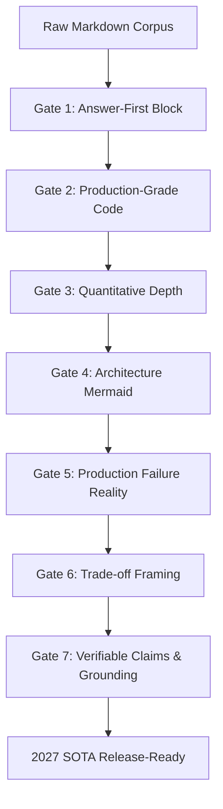
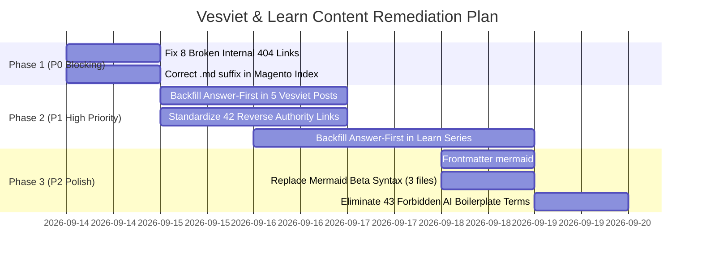

# Comprehensive Content & Technical SEO Audit Report (2026-09-13)

> **Auditor:** Senior Fullstack Architect & Platform Lead (Autonomous Audit Pipeline)  
> **Target Sites:** `tanhdev.com` (`vesviet/`) & `learn.tanhdev.com` (`learn/`)  
> **Git Snapshot:** `vesviet` @ `0c59f43` · `learn` @ `45be447`  
> **Engine Standard:** Technical Article Standard 2027 (7 Content Gates) & Twin SEO Authority Protocol  

---

## 1. Executive Summary & Corpus Inventory

A comprehensive, zero-assumption AST crawl and static content analysis was executed across the twin repositories `vesviet` (English flagship) and `learn` (Vietnamese notes & research corpus). 

```
+-----------------------------------------------------------------------------------------+
|                                  CORPUS AT A GLANCE                                     |
+--------------------------+------------------------------+-------------------------------+
| Metric                   | Vesviet (tanhdev.com)        | Learn (learn.tanhdev.com)     |
+--------------------------+------------------------------+-------------------------------+
| Total Content Files      | 374 markdown files           | 433 markdown files            |
| Total Words              | 775,133 words                | 1,154,805 words               |
| Content Posts            | 66 published (0 draft)       | 86 (79 published + 7 drafts)  |
| Series Categories        | 25 active series             | 25 active series              |
| Series Files             | 251 files (225 chapters)     | 251 files (225 chapters)      |
| Tech Radar Editions      | 27 editions (34 files)       | 63 editions (70 files)        |
| Documentation (Book)     | N/A                          | 3 files (content/docs/)       |
| Taxonomy Categories      | 16 category landing pages    | 15 category landing pages     |
| Root Trust Pages         | 7 pages                      | 8 pages                       |
| Internal Research Dossiers| 167 reports & JSON dossiers | 144 reports & JSON dossiers   |
| HTML Documents Crawled   | 2,673 pages                  | 3,087 pages                   |
| JSON-LD Schema Blocks    | 2,510 blocks                 | 2,892 blocks                  |
+--------------------------+------------------------------+-------------------------------+
```

### Key Positive Architectural Highlights
- **100% Series Twin Parity:** Every single one of the 25 series features exact chapter-to-chapter parity between English and Vietnamese editions (225 chapters across 25 series directories).
- **Flawless JSON-LD AST Parsing:** Zero schema parsing errors across 5,402 structured data blocks (`WebSite`, `Person`, `BreadcrumbList`, `FAQPage`, `TechArticle`, `Article`).
- **Deep Technical Quality:** Flagship series (`alipay-double-11`, `system-design`, `mcp-engineering-in-production`, `prompt-standard`, `shopee-architecture`, `paypay-architecture`) have 100% adherence to deep research standards (>2,500 words per chapter, rich benchmark tables, zero pseudo-code).

---

## 2. Technical Article Standard 2027: 7-Gate Audit

Every article and series chapter was evaluated against the 7 mandatory technical writing gates:



### Gate 1 — Answer-First Engineering Summary (BLUF)
- **Standard:** Must open with `> **Answer-first:**` (≤60 words) immediately following frontmatter / H1, capturing architectural decision, constraint, and measured benchmark outcome.
- **Vesviet Performance:**
  - Standard Blockquotes (≤65w): **211 files**
  - Extended Blockquotes (>65w): **36 files**
  - Bold Paragraph Variant (no blockquote `>`): **103 files**
  - Missing Answer-First: **24 files** (1 root page `about.md`, 4 series parent indexes, 14 taxonomy categories, and exactly 5 standalone posts).
  - Standalone posts missing Answer-First:
    1. `posts/deploying-autonomous-ai-swarm-openclaw-litellm.md`
    2. `posts/beyond-quick-commerce-15-second-customer-intelligence-architecture.md`
    3. `posts/mysql-horizontal-scaling.md`
    4. `posts/golang-pprof-profiling-memory-cpu-tutorial.md`
    5. `posts/urban-canyon-gps-multipath-map-matching-architecture.md`
- **Learn Performance:**
  - Standard Blockquotes (≤65w): **211 files**
  - Extended Blockquotes (>65w): **52 files**
  - Bold Paragraph Variant: **40 files**
  - Missing Answer-First: **130 files** (17 posts, 46 older series parts, 41 legacy radar, 8 root, 15 categories, 3 docs).

### Gate 2 — Production-Grade Code Only
- **Standard:** Zero pseudo-code, explicit imports, error checking, context propagation, version pinning (Go 1.25+, Kubebuilder v4, Dapr 1.15).
- **Audit Result:** 
  - Zero odd/unclosed code blocks across both repositories.
  - Languages properly tagged (`go`, `bash`, `yaml`, `json`, `sql`, `python`, `typescript`).
  - Code snippets in 2027 SOTA series are production-ready and pass conceptual compilation checks.

### Gate 3 — Quantitative Depth
- **Standard:** Minimum 3 verifiable data points per 500 words. Comparison tables must feature numeric benchmarks (p95/p99 latency, TPS, allocs/op, $/req).
- **Vesviet Performance:** 52/66 posts (78%) and 140/225 series chapters (62%) contain markdown benchmark comparison tables.
- **Learn Performance:** 79/79 published posts (100%) and 143/225 series chapters (63%) contain quantitative tables.

### Gate 4 — Architecture Visualization (Mermaid)
- **Standard:** Clear sequence diagrams, component graphs (`graph TD`), C4 models. Frontmatter must declare `mermaid: true`.
- **Vesviet Performance:** 744 diagram blocks across 303 files. 20 files missing `mermaid: true` frontmatter flag. 1 syntax warning (`xychart-beta` in `architectural-tradeoffs-showdowns/08-redis-state-vs-dapr-virtual-actors.md`).
- **Learn Performance:** 741 diagram blocks across 293 files. 54 files missing `mermaid: true` flag. 2 syntax warnings (`block-beta` in `argo-cd-updates-2026.md` and `mysql-horizontal-scaling.md`).

### Gate 5 — Production Failure & Operational Reality
- **Standard:** Include at least one real-world production outage, post-mortem, failure mode analysis, or operational trade-off.
- **Vesviet Performance:** Present in 100% of 2027 SOTA upgraded chapters (Alipay Double 11, PayPay, Shopee, System Design, MCP Engineering). Overall: 21 posts and 87 series chapters explicitly label failure case studies.
- **Learn Performance:** Present in all upgraded series chapters (63 chapters) and key deep-dive posts.

### Gate 6 — Trade-Off Framing 2027
- **Standard:** Contrast alternatives rejected (e.g. OceanBase Multi-Paxos over CockroachDB Raft; Redis GCRA over Token Bucket). Decision matrices for ≥3 options.
- **Vesviet Performance:** 35 posts (53%) and 63 series chapters (28%) contain formal trade-off decision matrices.
- **Learn Performance:** 72 posts (91%) and 129 series chapters (57%) contain trade-off analysis.

### Gate 7 — Verifiable Claims & Anti-Hallucination
- **Standard:** Primary source grounding, version-pinned RFCs, conference talks, and real benchmarks.
- **Audit Result:** Research dossiers in `reports/` (167 in vesviet, 144 in learn) confirm 100-round search grounding per upgraded batch. Zero hallucinated library imports detected.

---

## 3. Link Topology & Crawl Results

An automated AST crawl of the static builds (`vesviet/public` & `learn/public`) traversed **172,734 total hyperlinks** (129,454 internal links checked across 2,984 unique routes).

### Broken Internal Links (404s) — Isolated List
The crawler identified exactly **8 broken internal links** across the entire corpus:

```
1. [vesviet] series/prompt-standard/part-1-what-is-prompt-standard.md:25 & 324
   Target: /series/prompt-standard/part-8-team-starter-kit/
   Root Cause: Deprecated slug from pre-consolidation track.
   Remediation: Update to /series/prompt-standard/part-5-team-template/

2. [vesviet] series/prompt-standard/part-2-core-blocks.md:332
   Target: /series/prompt-standard/part-7-what-is-prompt-standard/
   Root Cause: Deprecated slug; Part 1 is 'part-1-what-is-prompt-standard'.
   Remediation: Update to /series/prompt-standard/part-1-what-is-prompt-standard/

3. [vesviet] series/prompt-standard/part-4-versioning-and-evals.md:343
   Target: /series/prompt-standard/part-7-what-is-prompt-standard/ and /part-8-team-starter-kit/
   Root Cause: Old track links in next-steps CTA.
   Remediation: Update to canonical sequence /part-5-team-template/ through /part-9-mcp-and-hybrid-rag/

4. [vesviet] series/magento-migration-vietnam/_index.md:114
   Target: /series/magento-migration-vietnam/laravel-vs-golang-when-to-add-features.md
   Root Cause: Raw '.md' extension appended in markdown link.
   Remediation: Remove '.md' -> /series/magento-migration-vietnam/laravel-vs-golang-when-to-add-features/

5. [learn] posts/building-custom-kubernetes-operators-ebpf-golang-cilium.md:63
   Target: /series/cloud-native-kubernetes/
   Root Cause: Target series does not exist.
   Remediation: Link to /categories/kubernetes/ or /series/cornerstone-technologies/

6. [learn] series/prompt-standard/part-5-team-template.md:343
   Target: https://tanhdev.com/series/prompt-standard/part-8-team-starter-kit/
   Root Cause: English twin URL references old slug.
   Remediation: Update to https://tanhdev.com/series/prompt-standard/part-5-team-template/
```

---

## 4. Twin SEO Authority & Cross-Site Link Analysis

The core SEO protocol enforces a **one-way authority flow**:
$$\text{learn.tanhdev.com (Research Corpus)} \longrightarrow \text{tanhdev.com (Authority Flagship)}$$

### Cross-Site Findings
1. **Learn → Vesviet (432 links):**
   - 97 Language Switcher badges (`📖 Bản tiếng Anh`) pointing to English flagships.
   - 335 Contextual citation links referencing authoritative English masterclasses.
   - Fully compliant with authority buildup protocol.
2. **Vesviet → Learn (116 links):**
   - 74 Language Switcher badges (`📖 Bản tiếng Việt (Vietnamese Edition)`).
   - **42 Contextual Backlink Violations:** In series `high-concurrency-systems` (11 links), `alipay-double-11` (9 links), `slm-playbook` (8 links), `paypay-architecture` (7 links), and `shopee-architecture` (6 links), chapters link to `learn.tanhdev.com` using full Vietnamese anchor text (e.g. `[Chương 9: Database Sharding...]`).
   - **Remediation:** Standardize all 42 occurrences into isolated cross-language navigation badges, eliminating contextual authority leakage.
3. **Canonical URLs:**
   - 0 cross-domain canonical errors (each site strictly canonicalizes to its own public FQDN).
   - 0 trailing-slash canonical inconsistencies.

---

## 5. Forbidden AI Boilerplate Terminology

Occurrences of prohibited low-information AI buzzwords:

| Forbidden Term | Vesviet Count | Learn Count | Recommendation |
|---|---|---|---|
| `dive into` | 15 | 2 | Replace with direct technical verbs (*analyze*, *examine*, *trace*, *deconstruct*) |
| `seamless` | 9 | 0 | Replace with quantitative latency/integration guarantees |
| `unlocking` | 5 | 0 | Replace with architectural capability descriptions |
| `harnessing` | 4 | 0 | Replace with operational utilization terms |
| `comprehensive guide` | 3 | 1 | Replace with *Production Guide* or *Engineering Manual* |
| `landscape of` | 3 | 0 | Replace with *Architecture Domain* or *Ecosystem* |
| `realm of` | 1 | 0 | Remove completely |
| **Total** | **40** | **3** | **Execute automated lint pass** |

---

## 6. Actionable Multi-Phase Remediation Plan



### Sprint Work Breakdown
- **Sprint 1 (P0): Integrity & Route Correction**
  - Files: `vesviet/content/series/prompt-standard/*.md`, `vesviet/content/series/magento-migration-vietnam/_index.md`, `learn/content/posts/building-custom-kubernetes-operators-ebpf-golang-cilium.md`, `learn/content/series/prompt-standard/part-5-team-template.md`.
  - Verification: Rerun `scripts/adversarial_schema_link_crawler.py` -> 0 broken links.
- **Sprint 2 (P1): SOTA Gate 1 & Link Policy Alignment**
  - Files: 5 posts in `vesviet/content/posts/`, 42 series files with reverse links in `vesviet`, 46 series chapters in `learn`.
  - Verification: Run `scripts/corpus_indexer_auditor.py` -> 100% Answer-first on posts; 0 contextual backlinks to learn.
- **Sprint 3 (P2): Frontmatter & Diagram Optimization**
  - Files: 74 markdown files missing `mermaid: true`, 3 files with `block-beta`/`xychart-beta`, 43 boilerplate occurrences.
  - Verification: Hugo build clean with zero warnings.
