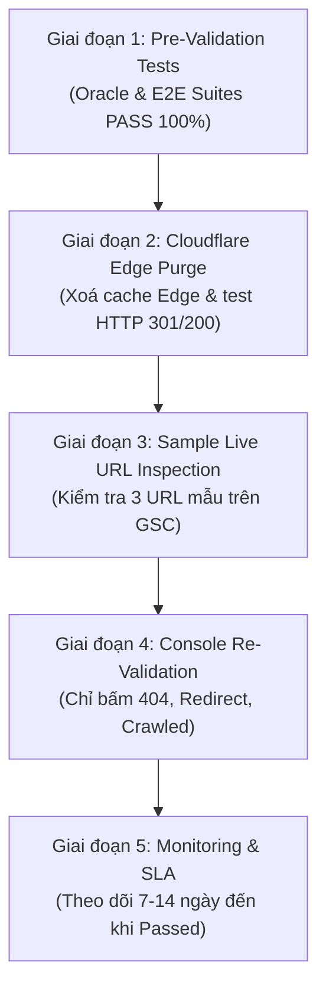

# Google Search Console (GSC) Re-Validation Standard Operating Procedure (SOP)

> **Ecosystem**: Twin Hugo Knowledge Bases (`https://tanhdev.com` & `https://learn.tanhdev.com`)  
> **Authoring Swarm**: `vesviet-team` Technical SEO, Routing & Architecture Swarm (`@seo-analyst`, `@solution-architect`, `@qa-engineer`)  
> **Effective Date**: 2026-09-24  
> **Document Version**: 2.0.0 (Standard 2026–2027)  
> **Status**: Official Engineering SOP & Operational Runbook  

---

## 1. Bản Chất Kỹ Thuật Của Cơ Chế GSC Validation

### 1.1 Vòng Lặp Xác Thực (Validation Lifecycle) của Googlebot
Khi người quản trị (Webmaster) bấm nút **"Validate Fix"** trong Google Search Console:
1. GSC chuyển trạng thái vấn đề từ `Failed` hoặc `N/A` sang `Validation: Started`.
2. Googlebot lập lịch quét mẫu (sample recrawl) trên tập hợp các URL bị đánh dấu trước đó.
3. **Tiêu chí đánh giá của Googlebot**:
   - Nếu lỗi khai báo **đã biến mất hoàn toàn** trên các URL mẫu $\to$ Trạng thái chuyển thành `Validation: Passed`.
   - Nếu Googlebot quét lại và **vẫn gặp trạng thái tương tự** (ví dụ vẫn thấy `noindex`, vẫn bị `robots.txt` chặn, hoặc vẫn trả về `404`) $\to$ Trạng thái lập tức bị đánh dấu là **`Validation: Failed`**.

### 1.2 Phân Biệt: False Failure Alarms vs. Actionable Defects

Cực kỳ quan trọng: Trong 5 nhóm bị `Validation: Failed` hiện tại của hệ thống, có sự khác biệt bản chất:

```
┌────────────────────────────────────────────────────────────────────────────────────────┐
│                   PHÂN LOẠI DATA "VALIDATION: FAILED"                                   │
├──────────────────────────────────────────┬─────────────────────────────────────────────┤
│ 1. FALSE FAILURES (BẢO VỆ CHỦ ĐỘNG)      │ 2. ACTIONABLE DEFECTS (LỖI KỸ THUẬT THỰC SỰ)│
├──────────────────────────────────────────┼─────────────────────────────────────────────┤
│ • Excluded by 'noindex' tag (267 + 83)   │ • Not found / 404 (148 + 50)                │
│ • Blocked by robots.txt (25 + 7)         │ • Page with redirect (101 + 31)             │
│                                          │ • Crawled - currently not indexed (226 + 91)│
├──────────────────────────────────────────┼─────────────────────────────────────────────┤
│ Nguyên nhân: Do Webmaster bấm Validate   │ Nguyên nhân: Cần xử lý kỹ thuật trên đĩa,   │
│ cho các trang HỆ THỐNG CỐ TÌNH CHẶN.     │ cấu hình _redirects, robots.txt và link.    │
│ HÀNH ĐỘNG: TUYỆT ĐỐI KHÔNG BẤM LẠI!      │ HÀNH ĐỘNG: FIX TRIỆT ĐỂ VÀ BẤM RE-VALIDATE! │
└──────────────────────────────────────────┴─────────────────────────────────────────────┘
```

---

## 2. Ma Trận Quyết Định Re-Validation (Decision Matrix)

| # | Danh mục GSC | Tình trạng hiện tại | Đánh giá bản chất | Có được bấm "Validate Fix"? | Hậu quả nếu bấm sai | Hành động kỹ thuật bắt buộc |
|---|---|:---:|---|:---:|---|---|
| **1** | **Excluded by ‘noindex’ tag** | `Failed` (267 trang `vesviet`, 83 trang `learn`) | **Chủ động bảo vệ (Intentional)**: Chặn index tag rác (`/tags/*`) để tránh loãng PageRank. | ⛔ **TUYỆT ĐỐI KHÔNG** | Googlebot quét lại thấy `noindex` vẫn còn $\to$ Báo `Failed` vĩnh viễn, tốn crawl budget vô ích. | Duy trì `<meta name="robots" content="noindex, follow">` trên tag pages. Đảm bảo 100% bài viết kỹ thuật KHÔNG có noindex. |
| **2** | **Blocked by robots.txt** | `Failed` (25 trang `vesviet`, 7 trang `learn`) | **Chủ động bảo vệ (Intentional)**: Chặn `/api/`, `/*/index.xml$`, `/portfolio/` để bảo vệ tài nguyên. | ⛔ **TUYỆT ĐỐI KHÔNG** | Googlebot thấy rule Disallow vẫn còn $\to$ Tiếp tục báo `Failed`. | Duy trì luật trong `robots.txt`. Không bấm xác thực. |
| **3** | **Not found (404)** | `Failed` (148 trang `vesviet`, 50 trang `learn`) | **Lỗi kỹ thuật có thể fix (Actionable)**: Do các link cũ chưa được ánh xạ 301 khi Googlebot quét. |  **BẮT BUỘC BẤM** (Sau khi deploy) | Chuyển lỗi 404 thành `Page with redirect` hoặc phục hồi index nếu trang đã sống lại. | Ánh xạ 100% URL vào `_redirects` thành static 1-hop 301 hoặc khôi phục mã 200 OK. |
| **4** | **Page with redirect** | `Failed` (`vesviet`: 101) / `Started` (`learn`: 31) | **Cần chuẩn hoá (Actionable)**: Từng bị lỗi do alias chiếm quyền chương (hijacking). Đã giảm còn 101. |  **ĐƯỢC PHÉP BẤM** (Sau khi verify) | Googlebot xác nhận toàn bộ redirect là 1-hop 301 sạch sẽ, không có loop/chain. | Loại bỏ toàn bộ alias trùng slug; xác nhận `sitemap.xml` không chứa URL redirect. |
| **5** | **Crawled - currently not indexed** | `Failed` (226 trang `vesviet`, 91 trang `learn`) | **Thiếu equity (Actionable)**: Bài viết mới crawl nhưng thuật toán Google chưa đánh giá đủ authority. |  **ĐƯỢC PHÉP BẤM** (Sau khi bơm link) | Đưa bài viết từ hàng đợi crawl vào hàng đợi lập chỉ mục (SERP Indexing). | Bơm internal link equity từ `reading-map.md`, 10 Anchor Pillar Hubs và dọn dẹp sitemap. |

---

## 3. Quy Trình Chuẩn (SOP) 5 Giai Đoạn Thực Hiện Re-Validation



### Giai đoạn 1: Pre-Validation Verification (Kiểm Thử Cục Bộ)
Trước khi chạm vào Google Search Console, bắt buộc phải chạy và đạt 100% các suite kiểm thử tự động:

1. **Kiểm tra kho `vesviet` (`tanhdev.com`)**:
   ```bash
   python vesviet/tests/test_redirects_oracle.py
   ```
   - **Tiêu chí bắt buộc**:
     - `Zero Self-Loops (A -> A)`: 0 self-loops.
     - `Zero Redirect Chains (A -> B -> C)`: 0 chains.
     - `tanhdev.com 404 Coverage`: 100% resolved (qua 301 rules hoặc active 200 OK).
     - `Sitemap Cleanliness`: 0 redirect leaks, 0 noindex leaks.
     - Kết quả tối thiểu: **23 PASSED, 0 FAILED**.

2. **Kiểm tra kho `learn` (`learn.tanhdev.com`)**:
   ```bash
   python learn/tests/verify_gsc_remediation.py
   ```
   - **Tiêu chí bắt buộc**:
     - Tier 1: 100% 404 URL được cover bởi `_redirects` (163 rules).
     - Tier 2: Hugo build sạch không lỗi (`Duplicate target paths`).
     - Tier 3: Robots.txt disallow chính xác các API mock & taxonomy XML feeds.
     - Tier 4: Inventory parity & snapshot date đồng bộ.
     - Tier 5: 100% bài viết chưa index nhận được internal link equity.
     - Kết quả tối thiểu: **41 PASSED, 0 FAILED**.

---

### Giai đoạn 2: Edge & CDN Synchronization (Đồng Bộ Cloudflare Pages)
Googlebot không kiểm tra mã nguồn trên máy cục bộ; nó gửi request đến Edge CDN (Cloudflare). Do đó:
1. **Deploy bản build mới nhất lên Cloudflare Pages**:
   - Xác nhận file `_redirects` và `robots.txt` đã được đẩy lên production.
2. **Thực hiện Purge Cache trên Cloudflare**:
   - Truy cập **Cloudflare Dashboard** $\to$ Chọn domain `tanhdev.com` và `learn.tanhdev.com`.
   - Vào mục **Caching** $\to$ **Configuration** $\to$ Chọn **Purge Everything** (hoặc Custom Purge các URL 404).
3. **Smoke-test HTTP response headers từ terminal**:
   ```bash
   curl -I https://tanhdev.com/posts/graphhopper-distance-matrix-routing/
   ```
   - Xác nhận nhận về: `HTTP/2 301` và header `Location: /posts/osrm-vs-graphhopper-architecture-comparison/`.

---

### Giai đoạn 3: Sample Live URL Inspection (Kiểm Tra Mẫu Trên GSC)
Trước khi bấm xác thực hàng loạt, hãy kiểm tra thực tế bằng công cụ **URL Inspection**:
1. Chọn 3 URL mẫu từng báo lỗi 404 (ví dụ một URL WordPress cũ, một radar cũ, một taxonomy cũ).
2. Dán vào ô tìm kiếm trên cùng của GSC $\to$ Bấm Enter.
3. Bấm nút **"Test Live URL" (Kiểm tra URL trực tiếp)** ở góc phải.
4. Xác nhận kết quả:
   - Googlebot trả về: `Page is not indexed: Page with redirect` (nếu đã 301 chuẩn) $\to$ **Đạt**.
   - Hoặc `URL is on Google` (nếu trang đã khôi phục mã 200) $\to$ **Đạt**.

---

### Giai đoạn 4: Thao Tác Bấm Re-Validation Trên GSC (Runbook)

Truy cập Google Search Console cho từng Property (`tanhdev.com` và `learn.tanhdev.com`):

#### 1. Xử lý danh mục `Not found (404)`:
- Điều hướng: **Indexing** $\to$ **Pages** $\to$ Bấm vào dòng **Not found (404)**.
- Kiểm tra danh sách URL ví dụ.
- Bấm nút xanh: **"Start New Validation" (Bắt đầu xác thực mới)** (hoặc *See Details* $\to$ *Validate Fix*).
- GSC sẽ hiển thị: *"Validation started"*.

#### 2. Xử lý danh mục `Page with redirect`:
- Điều hướng: **Indexing** $\to$ **Pages** $\to$ Bấm vào dòng **Page with redirect**.
- Bấm **"Start New Validation"**.
- (Lưu ý: Đối với `learn.tanhdev.com`, trạng thái đang là `Started`, không cần bấm lại nếu đang trong quá trình).

#### 3. Xử lý danh mục `Crawled - currently not indexed`:
- Điều hướng: **Indexing** $\to$ **Pages** $\to$ Bấm vào dòng **Crawled - currently not indexed**.
- Bấm **"Start New Validation"** để yêu cầu Googlebot đánh giá lại link equity từ `reading-map.md`.

#### 4. Đối với `Excluded by 'noindex' tag` & `Blocked by robots.txt`:
- **QUY TẮC SẮT**: **KHÔNG ĐƯỢC BẤM NÚT NÀY**.
- Để nguyên trạng thái. Google sẽ tự động duy trì việc loại trừ hợp lệ này trong báo cáo phủ sóng.

---

### Giai đoạn 5: Post-Validation Monitoring & SLA

- **Cửa sổ theo dõi**: 7 đến 14 ngày làm việc.
- **Tiến trình thông thường**:
  - *Ngày 1 – 3*: GSC gửi email *"Google is validating your Page indexing issue fixes"*.
  - *Ngày 4 – 7*: Googlebot tăng tần suất crawl các URL trong danh sách validation.
  - *Ngày 8 – 14*: GSC cập nhật trạng thái sang **Passed**, hoặc giảm số lượng trang lỗi về 0.
- **Tiêu chuẩn nghiệm thu (Acceptance Target)**:
  - Danh mục `Not found (404)` giảm về tiệm cận 0 (chuyển dịch toàn bộ sang `Page with redirect`).
  - Danh mục `Crawled - currently not indexed` chuyển dịch tích cực sang `Indexed` (+20 đến +50 trang trong 30 ngày).
