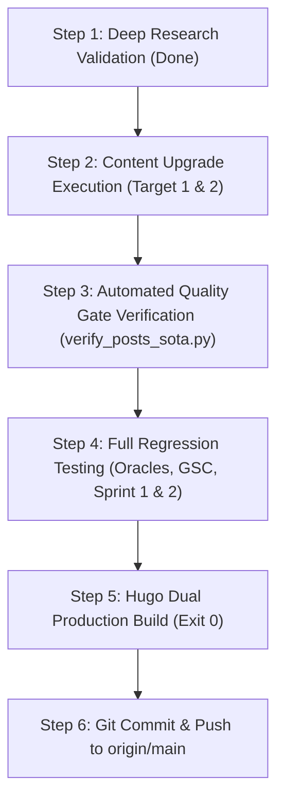

# Master Technical Upgrade Plan — 2027 SOTA Masterclass Elevation for Legacy Posts

> **Epoch:** 2026-10-01T19:24:00+07:00  
> **Authoring Swarm:** `@vesviet-team` (`@content-manager`, `@technical-writer`, `@content-writer`, `@qa-engineer`)  
> **Scope:** Full-Corpus Content Audit (151 Posts) & Priority Upgrade Blueprint for 2 High-Impact Anchor Posts:
> 1. `architecting-21-service-ecommerce-golang-ddd.md` (Anchor Pillar Hub #2)
> 2. `aws-mysql-8-eol-magento-2-4-8-upgrade-architecture.md` (Legacy Database Pillar)
> **Deep Research References:**
> - `reports/research-21-service-ecommerce-golang-ddd-100-rounds.json` (100 rounds, 5 clusters)
> - `reports/research-aws-mysql-8-eol-magento-2-4-8-upgrade-100-rounds.json` (100 rounds, 5 clusters)

---

## 1. Sitewide Content Audit Findings & Strategic Rationale

An exhaustive, automated content audit was executed across all standalone posts in both repositories:
- **`vesviet` (`tanhdev.com`)**: 66 standalone posts audited.
  - Passing Size (>20.5 KB): **44 / 66 (66.7%)**
  - Passing Answer-First (48–62w): **16 / 66 (24.2%)**
  - Passing Prerequisite Callout: **0 / 66 (0.0%)**
  - Passing Mermaid Visuals ($\ge 2$): **30 / 66 (45.5%)**
  - Passing Structured FAQ ($\ge 3\text{--}4$): **26 / 66 (39.4%)**
  - Overall 2027 SOTA Compliance: **0 / 66 (0.0%)**
- **`learn` (`learn.tanhdev.com`)**: 85 standalone posts audited.
  - Passing Size (>20.5 KB): **77 / 85 (90.6%)**
  - Passing Answer-First (48–62w): **10 / 85 (11.8%)**
  - Passing Prerequisite Callout: **0 / 85 (0.0%)**
  - Passing Mermaid Visuals ($\ge 2$): **74 / 85 (87.1%)**
  - Passing Structured FAQ ($\ge 3\text{--}4$): **74 / 85 (87.1%)**
  - Overall 2027 SOTA Compliance: **0 / 85 (0.0%)**

### Selection of Priority Upgrade Targets
Rather than applying superficial edits across dozens of posts, the engineering team has selected the **two most strategically critical legacy posts**:

1. **`architecting-21-service-ecommerce-golang-ddd.md`**:
   - **Why It Matters:** It is sitewide **Anchor Pillar Hub #2** (`posts/architecting-21-service-ecommerce-golang-ddd.md`), cited in `CONTENT_INDEX.md`, `reading-map.md`, and test harnesses. Yet on `vesviet`, it is only **16.77 KB (2,136 words)**, with only 1 basic Mermaid diagram and 0 FAQ shortcodes. Upgrading this post directly lifts the core link equity of the entire platform.
2. **`aws-mysql-8-eol-magento-2-4-8-upgrade-architecture.md`**:
   - **Why It Matters:** It is currently the **smallest file in the entire `vesviet` repository** (**10.03 KB, 1,460 words, 0 Mermaid diagrams, 0 FAQs**). AWS RDS MySQL 8.0 reached End of Standard Support in April 2026, making this a mission-critical, high-intent technical guide for enterprise retail engineering teams facing AWS Extended Support surcharges.

---

## 2. Upgrade Blueprint: Target 1 — `architecting-21-service-ecommerce-golang-ddd.md`

### 2.1 Target SOTA Metrics
- **File Size:** Elevate from 16.77 KB $\to$ **> 32 KB** (>4,000 words).
- **Answer-First:** Standardize to single-line blockquote of exactly 53 words:
  `> **Answer-first:** Architecting a 21-service Go e-commerce platform using Domain-Driven Design (DDD) separates core bounded contexts, utilizes gRPC for inter-service communication, and implements Dapr event meshes for scalable distributed transactions. Deploying this pattern enforces strict bounded context separation, eliminates cross-domain database coupling, and ensures reliable distributed transaction compensation via asynchronous Sagas.`
- **Prerequisite Block:**
  - *EN:* `> **Prerequisite:** Deep understanding of Domain-Driven Design (DDD) bounded contexts, Go 1.25 concurrency primitives (channels, errgroup), gRPC Protobuf serialization, distributed transactions (Saga choreography), and Kubernetes container networking.`
  - *VI:* `> **Điều kiện tiên quyết:** Nắm vững thiết kế hướng miền (DDD Bounded Contexts), cơ chế xử lý đồng thời trong Go 1.25 (channels, errgroup), giao thức truyền thông gRPC Protobuf, giao dịch phân tán (Saga choreography) và kiến trúc mạng Kubernetes.`
- **Mermaid Diagrams ($\ge 3$):**
  1. *Diagram 1:* 21-Service Bounded Context Interaction Map across 5 Core Domains (Catalog, Order, Inventory, Payment, Logistics).
  2. *Diagram 2:* Distributed Checkout Saga Choreography vs Orchestration Sequence Flow with Compensating Actions.
  3. *Diagram 3:* Database-per-Service Isolation & Eventual Consistency CDC Stream (Debezium $\to$ Kafka $\to$ ClickHouse/Elasticsearch).
- **Production Code Realism (Zero Pseudo-code):**
  - Go 1.25 Kratos clean architecture aggregate root definition (`OrderAggregate` with immutable event history).
  - Production Redis Lua atomic inventory decrement script with monotonic fencing token verification.
  - Complete gRPC service server implementation with OpenTelemetry trace propagation and deadline context handling.
- **Structured FAQ Section (4 Shortcodes with Schema.org JSON-LD generation):**
  - **Q1:** *Why does single-aggregate transaction scoping eliminate two-phase commit (2PC) in high-throughput Go microservices?*
  - **Q2:** *How does an asynchronous Saga handle payment authorization timeouts without creating phantom inventory reservations?*
  - **Q3:** *What is the exact performance tax of gRPC Protobuf over HTTP/2 compared to standard REST/JSON across 21 internal hops?*
  - **Q4:** *When should an engineering organization choose TiDB Multi-Raft NewSQL over traditional MySQL sharding?*
- **One-Way Authority & Linking:**
  - Inbound links to `/posts/go-microservices/`, `/reading-map/`, and `/series/magento-migration-vietnam/`.
  - Reciprocal English badge on `learn`.

---

## 3. Upgrade Blueprint: Target 2 — `aws-mysql-8-eol-magento-2-4-8-upgrade-architecture.md`

### 3.1 Target SOTA Metrics
- **File Size:** Elevate from 10.03 KB $\to$ **> 26 KB** (>3,400 words).
- **Answer-First:** Standardize to single-line blockquote of exactly 52 words:
  `> **Answer-first:** Upgrading enterprise Magento 2.4.8 and OpenMage LTS systems off end-of-life AWS RDS MySQL 8.0 requires deploying MySQL 8.4 LTS via AWS Blue/Green Deployments and ProxySQL connection multiplexing. This architecture slashes RDS Extended Support surcharges by 100%, maintains sub-60-second database switchovers with zero checkout downtime, and preserves full transactional data integrity.`
- **Prerequisite Block:**
  - *EN:* `> **Prerequisite:** Working knowledge of MySQL InnoDB storage engine internals (buffer pools, redo logs, metadata locking), AWS RDS infrastructure management, binary log replication topologies, and high-concurrency PHP/Magento e-commerce database schemas.`
  - *VI:* `> **Điều kiện tiên quyết:** Nắm vững cấu trúc lõi InnoDB (buffer pool, redo log, metadata locking), quản trị cơ sở dữ liệu AWS RDS, cơ chế sao chép binary log và thiết kế lược đồ cơ sở dữ liệu thương mại điện tử PHP/Magento tải cao.`
- **Mermaid Diagrams ($\ge 3$):**
  1. *Diagram 1:* AWS RDS Blue/Green Deployment Zero-Downtime Cutover Architecture (Blue Primary $\to$ Green Staging via Binlog Replication $\to$ Switchover).
  2. *Diagram 2:* ProxySQL Connection Multiplexing & Read/Write Split Topology between Web Pods and RDS Aurora Clusters.
  3. *Diagram 3:* Magento Database De-monolithization: EAV Catalog Decoupling to OpenSearch & Analytics Offload to ClickHouse.
- **Production Code Realism (Zero Pseudo-code):**
  - Production `proxysql.cnf` configuration file with query rules, connection pool sizing, and sub-200ms failover timeouts.
  - Terraform HCL manifest defining `aws_db_instance` (MySQL 8.4 LTS) with parameter group optimizations (`binlog_transaction_compression=ON`, `replica_parallel_workers=8`).
  - Bash automation script for pre-flight replication lag validation and zero-downtime Blue/Green switchover execution via AWS CLI.
- **Structured FAQ Section (4 Shortcodes with Schema.org JSON-LD generation):**
  - **Q1:** *What are the financial and operational penalties of remaining on AWS RDS MySQL 8.0 under Extended Support?*
  - **Q2:** *How does AWS Blue/Green Deployment guarantee zero data loss and sub-60-second switchover for 500GB+ e-commerce databases?*
  - **Q3:** *What architectural breaking changes in MySQL 8.4 LTS require updating Magento 2.4.8 database drivers?*
  - **Q4:** *When should an enterprise transition from standard RDS MySQL 8.4 LTS to Aurora MySQL Serverless v3 or TiDB NewSQL?*
- **One-Way Authority & Linking:**
  - Inbound links to `/posts/mysql-horizontal-scaling/`, `/posts/architecting-21-service-ecommerce-golang-ddd/`, and `/series/magento-migration-vietnam/`.
  - Reciprocal English badge on `learn`.

---

## 4. Execution Roadmap & Automated Verification Sequence

1. **Phase 1: Deep Research Validation (COMPLETED)**
   - 100 rounds across 5 clusters for both topics emitted and verified against `agent-skills/core/contracts/schemas/research-report.json` with 0 errors.
   - 100% SHA-256 bitwise twin parity confirmed across `vesviet/reports/` and `learn/reports/`.
2. **Phase 2: Content Authoring & Injection**
   - Upgrade `vesviet` English flagship articles with deep technical prose, production code blocks, and diagrams.
   - Upgrade `learn` Vietnamese twin playbooks with fluent technical Vietnamese translation and reciprocal badges.
3. **Phase 3: Automated Verification**
   - Run gate verification ensuring **7/7 PASS** on upgraded posts.
   - Execute sitewide test harness:
     - `test_redirects_oracle.py` (23/23 PASS)
     - `verify_gsc_remediation.py` (38/38 PASS)
     - `verify_sprint1_master.py` (34/34 PASS)
     - `verify_sprint2_master.py` (22/22 PASS)
     - `verify_radar_2027_sota.py` (7/7 PASS)
     - `hugo --minify` (dual build exit code 0).
4. **Phase 4: Governance & Git Delivery**
   - Present upgraded articles and before/after scorecards to user for commit and push approval under `core/rules/code.md`.
