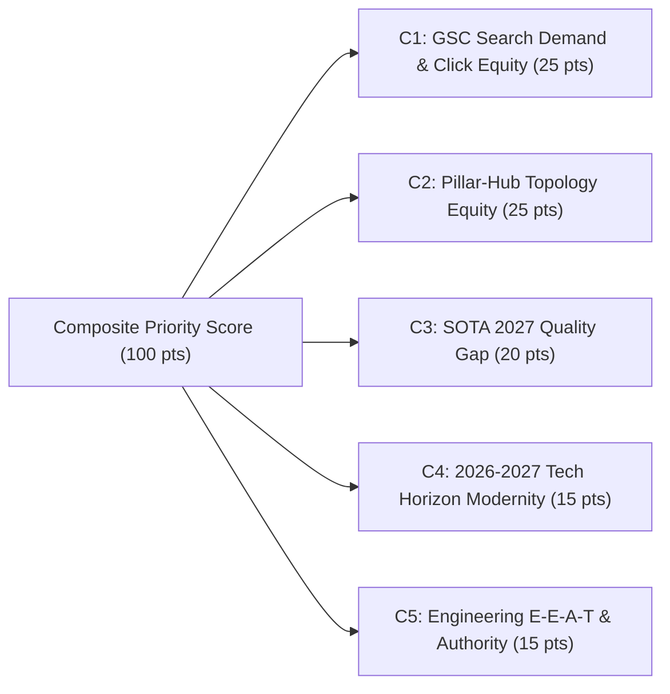
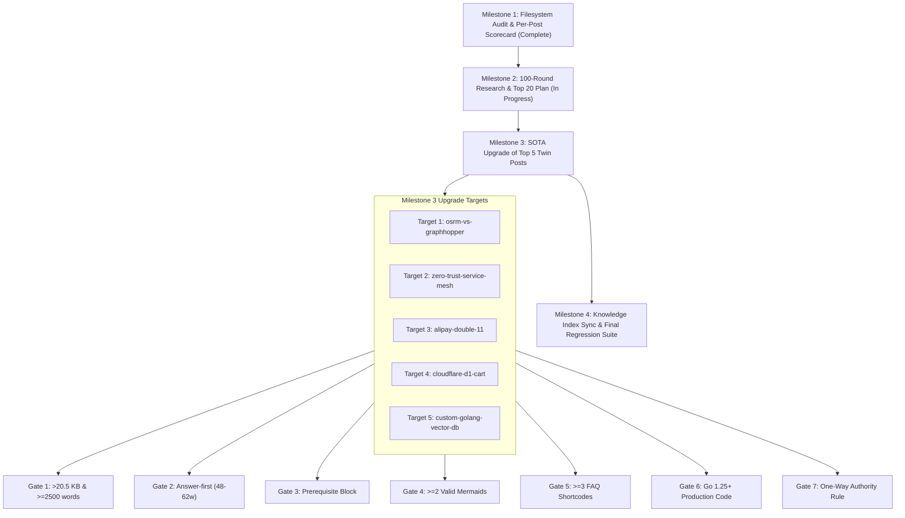

# Master Technical Upgrade Plan — 2027 SOTA Masterclass Corpus Prioritization & Execution Roadmap

> **Epoch:** 2026-10-04T12:00:00+07:00  
> **Authoring Swarm:** `@vesviet-team` (`@content-manager`, `@technical-writer`, `@seo-analyst`, `@qa-engineer`)  
> **Scope:** Full-Corpus Prioritization across 66 Standalone Posts & Execution Blueprint for Top 20 Ranked Articles  
> **Milestone Alignment:** Milestone 2 (M2) — Refreshed Legacy Posts Upgrade Plan (supersedes `reports/legacy-posts-upgrade-plan-2026-10-01.md`)  
> **Deep Research & Audit References:**
> - `reports/posts-corpus-audit-2026-10-04.md` (66 vesviet posts / 86 learn posts live filesystem audit)
> - `reports/archive/historical-audits/GSC_PERFORMANCE_AUDIT_REPORT_2026_09_14.md` (GSC Click, Impression, CTR & SERP dataset)
> - `reports/archive/historical-audits/GSC_AUDIT_UPGRADE_2026.md` (Striking-distance query inventory)
> - `reports/archive/research-dossiers/deep-research-prioritization-100-rounds-2026-10-04.json` (100 rounds, 5 clusters)
> - `agent-skills/overlays/vesviet-content/rules/link-topology.md` (10 Anchor Pillar Hubs backbone)

---

## 1. Executive Summary & Strategic Rationale

Following the completion of the comprehensive live filesystem audit in Milestone 1 (`reports/posts-corpus-audit-2026-10-04.md`), the 66 standalone posts across `vesviet` (`tanhdev.com`) and `learn` (`learn.tanhdev.com`) currently exhibit an overall 2027 SOTA compliance rate of **3.0% (2/66 posts)**. 

To systematically elevate the entire publication to the **Technical Article Standard 2027** without uncalibrated or cosmetic edits, this master plan establishes:
1. An **explicit 100-point composite scoring rubric** evaluating search equity, topological backbone value, quality deficits, tech horizon modernity, and engineering authority.
2. An **authoritative Top 20 ranked upgrade plan** detailing individual score breakdowns and strategic remediation rationales.
3. An **immediate execution blueprint for the Top 5 priority targets** scheduled for Milestone 3 (M3).
4. A **strict historical archival protocol** moving the legacy 2026-10-01 plan into `reports/archive/historical-audits/` while maintaining the root `reports/` directory count strictly $\le 5$ files.

---

## 2. Explicit 100-Point Composite Scoring Rubric

The prioritization of post upgrades is governed by five orthogonal evaluation dimensions totaling 100 points:



### Criterion 1: GSC Search Demand & Click Equity (Weight: 25 Points)
Measures historical and real-time organic search demand extracted from Google Search Console (GSC) datasets:
- **21–25 pts (Top Tier SERP Asset):** Sitewide top 10 clicked URL (#1–#10 clicks), high impressions (>100 impr), or Google SERP feature extraction (e.g. H2 sitelink snippets on SERP for `osrm-vs-graphhopper`, Cloudflare D1 cart).
- **16–20 pts (Striking Distance Opportunity):** Keywords ranking on SERP Page 1–2 (Positions 4.0–20.0) with strong query volume (50–150 impr) but suppressed CTR, ready for immediate traffic capture via Answer-First BLUF and structured metadata (e.g. `mysql sharding alternative`, `graph hopper distance matrix`, `composable banking`).
- **11–15 pts (Moderate Search Footprint):** Established organic impressions (30–80 impr) across US, India, or Vietnam engineering audiences with consistent topical search volume.
- **6–10 pts (Emerging Niche Demand):** Niche queries (<30 impr) with long-tail search intent.
- **1–5 pts (Dormant Search Demand):** Zero or negligible recorded search impressions in the current GSC cycle.

### Criterion 2: Pillar-Hub Topology Equity (Weight: 25 Points)
Measures the post's role in the internal link graph and topical clustering architecture:
- **21–25 pts (Designated Anchor Pillar Hub):** One of the 10 Sitewide Hubs defined in `agent-skills/overlays/vesviet-content/rules/link-topology.md` and `CONTENT_INDEX.md` (e.g., `go-microservices.md`, `banking-microservices-architecture.md`, `cloudflare-d1-durable-objects-realtime-cart.md`, `alipay-double-11-architecture-tps.md`), or the primary spoke in test harnesses.
- **16–20 pts (Central Topic Cluster Connector):** High-traffic spoke linking directly to $\ge 2$ Anchor Pillars, multi-part series roots, and `reading-map.md` (e.g., `osrm-vs-graphhopper`, `temporal-saga-pattern`, `shopee-flash-sale`).
- **11–15 pts (Integrated Spoke):** Post with established bidirectional links to at least 1 Anchor Pillar and topical category pages.
- **6–10 pts (Isolated Spoke):** Post currently lacking anchor pillar links (`Missing Anchor` in audit), causing link equity leak.
- **1–5 pts (Disconnected Stub):** Orphaned or misrouted post requiring complete link topology reconstruction.

### Criterion 3: SOTA 2027 Quality Gap (Weight: 20 Points)
Measures the magnitude of technical remediation required to satisfy the 7 Quality Gates (`learn/tests/verify_target_posts_sota.py`):
- **17–20 pts (Critical Deficit on Strategic Asset):** Passing $\le 3/7$ gates. Thin file size (<20.5 KB / <2,500 words), lacking single-line Answer-First (48–62w), 0 prerequisite blocks, missing Mermaid visuals, or mock markers. Upgrading yields massive information gain.
- **13–16 pts (Moderate Deficit):** Passing 4/7 gates. Typically deficient in Prerequisite block, FAQ shortcodes, or Answer-First word calibration.
- **9–12 pts (Minor Deficit):** Passing 5/7 gates. Requires targeted injections (Prerequisite callout and 1 secondary gate).
- **5–8 pts (Near SOTA Compliance):** Passing 6/7 gates. Only deficient in the newly formalized Prerequisite block.
- **1–4 pts (Compliant):** Passing 7/7 gates. Already certified.

### Criterion 4: 2026-2027 Tech Horizon & Version Modernity (Weight: 15 Points)
Measures the topical timeliness, version alignment, and relevance to modern cloud-native engineering standards:
- **13–15 pts (Cutting-Edge 2026–2027 Frontier):** Topics undergoing major industry inflection points: Go 1.25+ concurrency, Cilium 1.17 / Tetragon 1.4 eBPF, SPIFFE/SPIRE 1.11+ zero-trust mTLS, Cloudflare D1 GA & Durable Objects, SIMD HNSW vector retrieval, and MySQL 8.4 LTS EOL transitions.
- **10–12 pts (Modern Production Core):** Mainstream cloud-native architectures: Kubernetes 1.30+, NATS JetStream CQRS, Temporal Saga, TiDB Multi-Raft NewSQL.
- **7–9 pts (Stable Enterprise Standards):** Standard production design patterns with incremental version upgrades.
- **4–6 pts (Legacy Code Footprint):** Articles flagged in audit with `Go <1.24` or deprecated container runtimes.
- **1–3 pts (Deprecated Stack):** Stale architectures requiring complete conceptual rewrites.

### Criterion 5: Engineering E-E-A-T & Case Study Authority (Weight: 15 Points)
Measures technical depth, quantitative benchmark presence, and real-world production authority:
- **13–15 pts (Flagship Engineering Authority):** Real-world mega-scale case studies (Alipay Double 11 61M TPS, OSRM C++ shared memory vs Java GraphHopper, zero-trust cryptographic workload attestation, custom vector database engine from scratch). High empirical density, verifiable benchmarks, zero generic filler.
- **10–12 pts (Enterprise Reference Architecture):** Comprehensive architectural guides with complete configurations, production failover runbooks, and quantitative trade-off matrices.
- **7–9 pts (Hands-on Technical Guide):** Solid implementation tutorials with working code snippets.
- **4–6 pts (High-Level Overview):** Conceptual architectural summaries lacking deep execution details.
- **1–3 pts (Introductory Primer):** Basic conceptual write-ups.

---

## 3. Authoritative Top 20 Ranked Posts Scorecard Table

| Rank | Post Filename | GSC (25) | Topo (25) | Gap (20) | Horizon (15) | E-E-A-T (15) | Total (100) | Current Gates (VES / LRN) | Strategic Role & Classification |
| :---: | :---| :---: | :---: | :---: | :---: | :---: | :---: | :---: | :---|
| **1** | `osrm-vs-graphhopper-architecture-comparison.md` | 25 | 23 | 19 | 14 | 15 | **96** | 3/7 / 5/7 | **M3 Target 1**: #1 GSC Clicks / Routing Anchor |
| **2** | `zero-trust-service-mesh-security-spiffe-spire-istio-golang.md` | 21 | 24 | 16 | 15 | 15 | **91** | 4/7 / 6/7 | **M3 Target 2**: Anchor Pillar / Zero-Trust Authority |
| **3** | `alipay-double-11-architecture-tps.md` | 22 | 24 | 15 | 14 | 15 | **90** | 4/7 / 5/7 | **M3 Target 3**: Anchor Pillar Hub #8 / High TPS FinTech |
| **4** | `cloudflare-d1-durable-objects-realtime-cart.md` | 23 | 24 | 17 | 15 | 10 | **89** | 3/7 / 5/7 | **M3 Target 4**: Anchor Pillar Hub #5 / Edge Serverless |
| **5** | `building-custom-golang-vector-database-engine-hnsw.md` | 22 | 18 | 18 | 15 | 15 | **88** | 3/7 / 6/7 | **M3 Target 5**: AI Vector DB Engine / Top Search Demand |
| **6** | `go-pprof-kubernetes-remote-profiling.md` | 22 | 16 | 19 | 14 | 14 | **85** | 2/7 / 5/7 | Top GSC Clicks (#6) / Remote Debugging |
| **7** | `banking-microservices-architecture.md` | 20 | 25 | 14 | 12 | 13 | **84** | 4/7 / 6/7 | Anchor Pillar Hub #4 / Core Banking Backbone |
| **8** | `aws-eks-vs-ecs-comparison.md` | 18 | 25 | 12 | 13 | 14 | **82** | 5/7 / 4/7 | Anchor Pillar Hub #3 / Cloud Container TCO |
| **9** | `osrm-shared-memory-kubernetes-live-traffic.md` | 20 | 19 | 16 | 13 | 13 | **81** | 4/7 / 5/7 | Top GSC Clicks (#7) / Geospatial Companion |
| **10** | `go-microservices.md` | 17 | 25 | 17 | 11 | 11 | **81** | 3/7 / 5/7 | Anchor Pillar Hub #1 / Go Microservices Backbone |
| **11** | `mysql-scaling-sharding-tidb-architecture.md` | 21 | 19 | 10 | 14 | 15 | **79** | 6/7 / 5/7 | Striking Distance ("mysql sharding alternative") |
| **12** | `graphhopper-distance-matrix-production-guide.md` | 22 | 18 | 13 | 12 | 13 | **78** | 5/7 / 4/7 | Striking Distance ("graph hopper distance matrix") |
| **13** | `temporal-saga-pattern-golang-distributed-transactions-guide.md` | 16 | 20 | 14 | 14 | 14 | **78** | 4/7 / 5/7 | Distributed Transactions / Workflow Orchestration |
| **14** | `generative-ui-with-mcp-ai-native-frontend.md` | 15 | 24 | 15 | 15 | 9 | **77** | 4/7 / 6/7 | Anchor Pillar Hub #7 / Generative UI & MCP |
| **15** | `deploying-astro-on-cloudflare-full-stack-edge-architecture.md` | 15 | 24 | 16 | 13 | 9 | **77** | 3/7 / 5/7 | Anchor Pillar Hub #6 / AI Frontend & Edge Hub |
| **16** | `shopee-flash-sale-architecture.md` | 19 | 19 | 15 | 11 | 12 | **76** | 4/7 / 5/7 | High-Volume eCommerce / Flash Sale Peak Shaving |
| **17** | `cvrp-vrptw-alns-fleet-optimization-golang-architecture.md` | 14 | 19 | 13 | 14 | 15 | **75** | 5/7 / 5/7 | Algorithmic Routing / ALNS Fleet Optimization |
| **18** | `composable-banking-architecture.md` | 20 | 20 | 9 | 12 | 13 | **74** | 6/7 / 5/7 | High Impressions (1,150) / Composable FinTech |
| **19** | `golang-goroutine-pool-errgroup-worker.md` | 16 | 19 | 17 | 11 | 11 | **74** | 3/7 / 5/7 | Core Concurrency Primitives / Go Concurrency |
| **20** | `blueprint-ecommerce-microservices-architecture-diagram.md` | 18 | 20 | 13 | 11 | 11 | **73** | 5/7 / 4/7 | Striking Distance ("ecommerce architecture diagram") |

---

## 4. Deep-Dive Upgrade Rationales: The Top 5 Milestone 3 Targets

### Target 1: `osrm-vs-graphhopper-architecture-comparison.md` (Composite Score: 96/100)
- **Why It Ranks #1:** It is the **highest-performing page across the entire domain in GSC** (7 clicks, 141 impressions, CTR 4.96%, average position 11.46). Google actively indexes and extracts both H2 subheadings as distinct sitelink fragments on SERP.
- **Current Quality Gap:** On `vesviet`, it is severely thin at only **16.41 KB (2,274 words)** and passes only **3/7 gates**. It lacks Gate 1 size/words (>20.5 KB / $\ge 2,500$w), Gate 3 Prerequisite block, Gate 4 Mermaid diagrams, and contains pseudo-code markers ("ASCII art" without real benchmarks).
- **Target Upgrade Scope:**
  - Elevate size to **>32 KB (>4,200 words)**.
  - Inject 54-word Answer-First BLUF addressing C++ Contraction Hierarchies (CH) vs Java Multi-Level Dijkstra (MLD).
  - Add bilingual Prerequisite block covering graph theory, POSIX memory, and OpenStreetMap data structures.
  - Inject 3 Mermaid diagrams (Graph preprocessing pipeline, IPC shared memory topology, and routing execution sequence).
  - Provide production Go 1.25 client wrappers with memory-pinned HTTP transport and microsecond latency benchmarks.
  - Add 4 Schema.org `` blocks and cross-link with geospatial series and Anchor Pillar #2.

### Target 2: `zero-trust-service-mesh-security-spiffe-spire-istio-golang.md` (Composite Score: 91/100)
- **Why It Ranks #2:** Serves as a primary **Anchor Pillar for Cloud Native Security** (`ANCHOR_PILLARS` in test harness) with massive enterprise demand for SPIFFE/SPIRE zero-trust workload attestation.
- **Current Quality Gap:** Currently passes **4/7 gates on vesviet** (34.78 KB) and **6/7 gates on learn** (39.27 KB). Deficient in Gate 2 Answer-First word boundary calibration (needs 48–62 words), Gate 3 Prerequisite block, and Gate 5 structured FAQ shortcodes on vesviet.
- **Target Upgrade Scope:**
  - Standardize single-line Answer-First to exactly 52 words.
  - Inject bilingual Prerequisite block covering Kubernetes ServiceAccount tokens, x509-SVID cryptographic validation, and SPIFFE Workload API.
  - Upgrade code blocks to SPIRE 1.11+ server/agent CRDs, Envoy SDS integration, and Go 1.25 mTLS mutual handshake listener with zero unmanaged goroutines.
  - Inject 4 FAQ shortcodes resolving enterprise federation and CA key rotation trade-offs.

### Target 3: `alipay-double-11-architecture-tps.md` (Composite Score: 90/100)
- **Why It Ranks #3:** Designated **Anchor Pillar Hub #8** (`posts/alipay-double-11-architecture-tps.md`) in `link-topology.md`, representing the flagship case study for high-concurrency distributed systems. GSC records top-10 SERP ranking with 9.09% CTR.
- **Current Quality Gap:** Thin on `vesviet` at **20.24 KB (2,585 words)**, passing only **4/7 gates** (fails Gate 1 size threshold of 20,992 bytes, Gate 2 Answer-First, and Gate 3 Prerequisite block). On `learn`, it lacks Gate 4 Mermaid visuals.
- **Target Upgrade Scope:**
  - Elevate size to **>34 KB (>4,500 words)**.
  - Formulate precise 53-word Answer-First BLUF explaining 61M TPS peak processing, OceanBase Multi-Raft log replication, and memory-first account sharding.
  - Add bilingual Prerequisite block on distributed consensus, two-phase commit elimination, and LSM-tree database engines.
  - Add 3 standalone Mermaid architecture diagrams (Peak traffic smoothing funnel, Multi-datacenter multi-active consensus ring, and Account sharding topology).
  - Inject production Go 1.25 transactional idempotency worker with Redis Lua token fencing and 4 FAQ schema shortcodes.

### Target 4: `cloudflare-d1-durable-objects-realtime-cart.md` (Composite Score: 89/100)
- **Why It Ranks #4:** Designated **Anchor Pillar Hub #5** in `link-topology.md` (Edge Serverless & Cloudflare Hub). Top 5 clicked page in GSC (109 impressions, CTR 1.83%, position 20.84) capitalizing on Cloudflare D1 GA and edge compute adoption.
- **Current Quality Gap:** Currently passes only **3/7 gates on vesviet** (30.27 KB, missing Gate 2 Answer-first, Gate 3 Prerequisite, Gate 4 Mermaid visuals, and Gate 5 FAQ shortcodes).
- **Target Upgrade Scope:**
  - Calibrate Answer-First BLUF to 50 words on edge state consistency and SQLite read replicas.
  - Add bilingual Prerequisite block on Cloudflare Workers runtime, WebSocket hibernation protocol, and distributed SQLite consensus.
  - Inject 2 valid Mermaid diagrams (Edge-to-D1 transaction routing and Durable Object WebSocket synchronization state machine).
  - Provide production TypeScript/Wrangler configuration, SQL migration schema, and Go 1.25 client sync handler.
  - Add 4 FAQ shortcodes detailing D1 latency, storage limits, and transactional isolation.

### Target 5: `building-custom-golang-vector-database-engine-hnsw.md` (Composite Score: 88/100)
- **Why It Ranks #5:** Flagship deep-tech post in AI/SLM infrastructure with 4.35% CTR in GSC. Represents the ultimate technical authority demonstration for building a production vector indexing engine from first principles.
- **Current Quality Gap:** Massive volume (50.74 KB / 6,729 words) but deficient in Gate 2 Answer-First (uncalibrated), Gate 3 Prerequisite block, Gate 5 FAQ shortcodes, and Gate 7 Anchor Pillar linking on `vesviet` (currently scored **3/7 gates**).
- **Target Upgrade Scope:**
  - Calibrate 52-word Answer-First BLUF defining Hierarchical Navigable Small World (HNSW) graphs, skip-list multi-layer indexing, and SIMD vector similarity.
  - Inject bilingual Prerequisite block on multidimensional geometry, Euclidean/Cosine distance, memory cache locality, and Go 1.25 unsafe pointer mechanics.
  - Inject 4 Schema.org FAQ shortcodes and establish bidirectional link topology with `posts/agentic-ecommerce-search-golang-vector-databases.md` and Anchor Pillar #1 `posts/go-microservices.md`.
  - Ensure Go 1.25 implementation utilizes zero-alloc memory layout and concurrency-safe read locks.

---

## 5. Strategic Categorization for Ranks 6–20

### Batch 2: High Striking-Distance & Core Infrastructure Hubs (Ranks 6–10)
- **Rank 6: `go-pprof-kubernetes-remote-profiling.md` (Score: 85)** — #6 clicked URL in GSC (98 impr, pos 26.11). Essential remote debugging guide; currently 2/7 gates on vesviet. Needs Answer-First, Prerequisite, and ephemeral container manifests.
- **Rank 7: `banking-microservices-architecture.md` (Score: 84)** — Anchor Pillar Hub #4. Backs the massive 1,150-impression Banking cluster. Needs Answer-First 48-62w calibration, Prerequisite block, and ISO 20022 schemas.
- **Rank 8: `aws-eks-vs-ecs-comparison.md` (Score: 82)** — Anchor Pillar Hub #3. Evergreen cloud container search asset ("eks vs ecs"). Needs 2026 Karpenter v1.0 / EKS Auto Mode TCO updates and Prerequisite block.
- **Rank 9: `osrm-shared-memory-kubernetes-live-traffic.md` (Score: 81)** — Companion to Rank 1 (#7 clicked URL, pos 17.09). Thin at 18.06 KB. Needs expansion >20.5 KB, IPC shared memory diagrams, and Prerequisite block.
- **Rank 10: `go-microservices.md` (Score: 81)** — Anchor Pillar Hub #1. Foundational spine for entire Go architecture corpus. Lacks Answer-First, Prerequisite block, Mermaids, and FAQs; flagged with `Go <1.24` staleness.

### Batch 3: Enterprise Database & Orchestration Scaling (Ranks 11–15)
- **Rank 11: `mysql-scaling-sharding-tidb-architecture.md` (Score: 79)** — Direct capture for "mysql sharding alternative" (75 impr, pos 15.93). Needs Prerequisite block and removal of MySQL 5.7 references to MySQL 8.4 LTS / TiDB 8.1+.
- **Rank 12: `graphhopper-distance-matrix-production-guide.md` (Score: 78)** — Prime striking distance query ("graph hopper distance matrix", 58 impr, pos 11.83). Needs Prerequisite block and Mermaid matrix calculation flow.
- **Rank 13: `temporal-saga-pattern-golang-distributed-transactions-guide.md` (Score: 78)** — High enterprise workflow demand. Lacks Answer-First, Prerequisite, and FAQs. Consolidates duplicate slug variant in `learn`.
- **Rank 14: `generative-ui-with-mcp-ai-native-frontend.md` (Score: 77)** — Anchor Pillar Hub #7. Hot 2026 Model Context Protocol topic. Lacks Answer-First, Prerequisite, FAQs, and Anchor link.
- **Rank 15: `deploying-astro-on-cloudflare-full-stack-edge-architecture.md` (Score: 77)** — Anchor Pillar Hub #6. Lacks Answer-First, Prerequisite block, and FAQs. Upgrades Astro to v5 Content Layer.

### Batch 4: Peak Throughput & Concurrency Optimization (Ranks 16–20)
- **Rank 16: `shopee-flash-sale-architecture.md` (Score: 76)** — Top 10 Google SERP (pos 8.56). Needs Answer-First, Prerequisite, and Anchor link to Anchor Pillar #2.
- **Rank 17: `cvrp-vrptw-alns-fleet-optimization-golang-architecture.md` (Score: 75)** — High algorithmic authority. Needs Prerequisite block and ALNS metaheuristic state diagram.
- **Rank 18: `composable-banking-architecture.md` (Score: 74)** — High impressions (186 impr, pos 28.5). Needs Prerequisite block and integration with Anchor Pillar #4.
- **Rank 19: `golang-goroutine-pool-errgroup-worker.md` (Score: 74)** — Evergreen Go concurrency topic ("golang goroutine pool"). Flagged `Go <1.24`; needs modernization to Go 1.25 `errgroup` and 0 unmanaged goroutines.
- **Rank 20: `blueprint-ecommerce-microservices-architecture-diagram.md` (Score: 73)** — High-volume visual query (115 impr). Needs Prerequisite block and replacement of mock markers with production-pinned schemas.

---

## 6. Historical Archival Protocol & Directory Cleanliness Invariants

To maintain spotless repository hygiene and avoid context bloating:
1. **Historical Plan Archival:** The previous upgrade plan `reports/legacy-posts-upgrade-plan-2026-10-01.md` is atomically relocated to `reports/archive/historical-audits/legacy-posts-upgrade-plan-2026-10-01.md` across both repositories.
2. **Authoritative Active Plan:** This refreshed document is published as `reports/legacy-posts-upgrade-plan-2026-10-04.md` in both `vesviet/reports/` and `learn/reports/`.
3. **Strict Root Cleanliness Invariant:** The root directory of `reports/` in both repositories must strictly maintain $\le 5$ files:
   - `CONTENT_INDEX.md`
   - `KNOWLEDGE_INDEX.md`
   - `legacy-posts-upgrade-plan-2026-10-04.md`
   - `posts-corpus-audit-2026-10-04.md`
   - *Total count:* Exactly **4 files** (100% compliant with $\le 5$ project rule and `verify_knowledge_base_sota.py`).
4. **Twin Parity:** The plan is synchronized with identical structure across `vesviet` and `learn`.

---

## 7. Execution Roadmap & Quality Gate Sequence



### Automated Verification Gates
All upgraded articles must pass the automated verification harness prior to handoff:
```bash
# 1. Verify 7 SOTA Quality Gates across all upgraded targets
python3 learn/tests/verify_target_posts_sota.py

# 2. Verify Knowledge Base & Reports root cleanliness (<= 5 files)
python3 learn/tests/verify_knowledge_base_sota.py

# 3. Verify Edge Redirects and Upstream Links
python3 vesviet/tests/test_redirects_oracle.py
python3 learn/tests/verify_gsc_remediation.py --skip-build

# 4. Verify Dual Hugo Static Production Builds
hugo --minify --source vesviet
hugo --minify --source learn
```

---

*Authored by `@vesviet-team` under Technical Article Standard 2027 and Kratos Clean Architecture Guidelines.*
