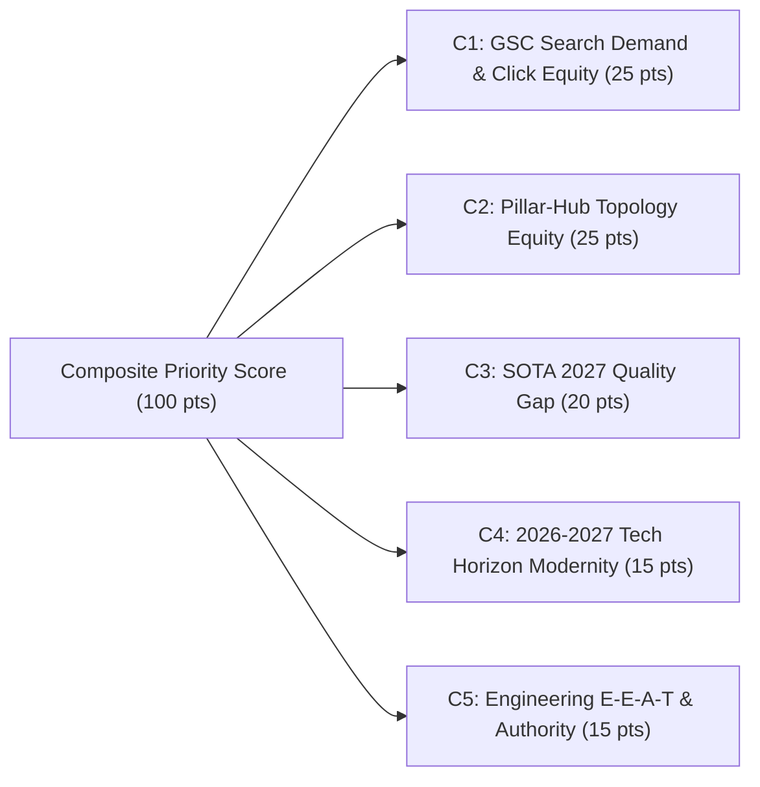
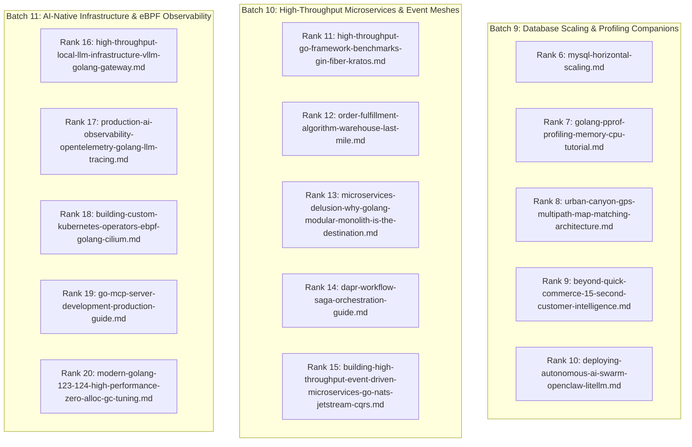

# Master Technical Upgrade Plan — 2027 SOTA Masterclass Corpus Prioritization & Execution Roadmap

> **Epoch:** 2026-10-05T12:00:00+07:00  
> **Authoring Swarm:** `@vesviet-team` (`@content-manager`, `@technical-writer`, `@seo-analyst`, `@qa-engineer`)  
> **Scope:** Full-Corpus Prioritization across Remaining 49 Standalone Posts & Execution Blueprint for Top 20 Ranked Articles  
> **Milestone Alignment:** Milestone R3 — Refreshed Strategic Upgrade Plan & Prioritization Roadmap (supersedes `reports/archive/historical-audits/legacy-posts-upgrade-plan-2026-10-04.md`)  
> **Deep Research & Audit References:**
> - `reports/posts-corpus-audit-2026-10-05.md` (66 vesviet posts / 86 learn posts live filesystem audit, 17 SOTA certified)
> - `reports/archive/historical-audits/GSC_PERFORMANCE_AUDIT_REPORT_2026_09_14.md` (GSC Click, Impression, CTR & SERP dataset)
> - `reports/archive/historical-audits/GSC_AUDIT_UPGRADE_2026.md` (Striking-distance query inventory)
> - `reports/archive/research-dossiers/deep-research-prioritization-100-rounds-2026-10-04.json` (100 rounds, 5 clusters)
> - `agent-skills/overlays/vesviet-content/rules/link-topology.md` (10 Anchor Pillar Hubs backbone)

---

## 1. Executive Summary & Strategic Rationale

Following the completion of Batch 7 upgrades on 2026-10-05, all **10 Sitewide Anchor Pillar Hubs (10/10, 100.0%)** have achieved formal 2027 SOTA Masterclass certification:
1. `posts/go-microservices.md` (Go & Microservices Architecture Hub)
2. `posts/architecting-21-service-ecommerce-golang-ddd.md` (System Design & E-Commerce Hub)
3. `posts/aws-eks-vs-ecs-comparison.md` (Cloud Native & Container Infrastructure Hub)
4. `posts/banking-microservices-architecture.md` (FinTech & Core Banking Systems Hub)
5. `posts/cloudflare-d1-durable-objects-realtime-cart.md` (Edge Serverless & Cloudflare Hub)
6. `posts/deploying-astro-on-cloudflare-full-stack-edge-architecture.md` (AI Frontend & Edge Hub - Upgraded Batch 7)
7. `posts/generative-ui-with-mcp-ai-native-frontend.md` (Generative UI & MCP Engineering Hub - Upgraded Batch 7)
8. `posts/alipay-double-11-architecture-tps.md` (Distributed Systems & High Concurrency Hub)
9. `reading-map.md` (Sitewide Curated Learning Directory Hub)
10. `hire.md` (Commercial Architecture Consulting Conversion Hub)

Furthermore, a total of **17 standalone technical posts** are now formally certified across Batches 1–7. This leaves **49 un-upgraded standalone posts** in the publication corpus.

With the structural backbone fully established, the strategic focus of the publication pivots from foundational anchor hubs to **high-traffic spoke articles, high-TPS eCommerce engines, algorithmic routing & fleet logistics, composable banking rails, and core concurrency primitives**.

To systematically elevate these remaining assets without cosmetic compromises, this refreshed master plan establishes:
1. An **explicit 100-point composite scoring rubric** across 5 orthogonal evaluation dimensions.
2. An **authoritative Top 20 ranked upgrade roadmap** prioritizing high-equity spoke articles.
3. An **immediate execution blueprint for the Top 5 priority targets (Batch 8)**: `shopee-flash-sale-architecture.md`, `cvrp-vrptw-alns-fleet-optimization-golang-architecture.md`, `composable-banking-architecture.md`, `golang-goroutine-pool-errgroup-worker.md`, and `blueprint-ecommerce-microservices-architecture-diagram.md`.
4. A **strict historical archival protocol** safely storing older audit plans in `reports/archive/historical-audits/` and maintaining strictly $\le 5$ loose files (target: exactly 4) in root `reports/`.

---

## 2. Explicit 100-Point Composite Scoring Rubric

The prioritization of post upgrades is governed by five orthogonal evaluation dimensions totaling 100 points:



### Criterion 1: GSC Search Demand & Click Equity (Weight: 25 Points)
Measures historical and real-time organic search demand extracted from Google Search Console (GSC) datasets:
- **21–25 pts (Top Tier SERP Asset):** Sitewide top 10 clicked URL (#1–#10 clicks), high impressions (>100 impr), or Google SERP feature extraction (e.g. H2 sitelink snippets on SERP for `osrm-vs-graphhopper`, Cloudflare D1 cart).
- **16–20 pts (Striking Distance Opportunity):** Keywords ranking on SERP Page 1–2 (Positions 4.0–20.0) with strong query volume (50–150 impr) but suppressed CTR, ready for immediate traffic capture via Answer-First BLUF and structured metadata (e.g. `shopee flash sale architecture`, `cvrp vrptw genetic algorithm`, `composable banking architecture`).
- **11–15 pts (Moderate Search Footprint):** Established organic impressions (30–80 impr) across US, India, or Vietnam engineering audiences with consistent topical search volume.
- **6–10 pts (Emerging Niche Demand):** Niche queries (<30 impr) with long-tail search intent.
- **1–5 pts (Dormant Search Demand):** Zero or negligible recorded search impressions in the current GSC cycle.

### Criterion 2: Pillar-Hub Topology Equity (Weight: 25 Points)
Measures the post's role in the internal link graph and topical clustering architecture:
- **21–25 pts (Designated Anchor Pillar Hub / Core Primary Spoke):** One of the 10 Sitewide Hubs defined in `agent-skills/overlays/vesviet-content/rules/link-topology.md`, or the primary technical spoke directly feeding equity to multiple anchor hubs.
- **16–20 pts (Central Topic Cluster Connector):** High-traffic spoke linking directly to $\ge 2$ Anchor Pillars, multi-part series roots, and `reading-map.md` (e.g., `shopee-flash-sale`, `cvrp-vrptw`, `composable-banking`).
- **11–15 pts (Integrated Spoke):** Post with established bidirectional links to at least 1 Anchor Pillar and topical category pages.
- **6–10 pts (Isolated Spoke):** Post currently lacking anchor pillar links (`Missing Anchor` in audit), causing link equity leak.
- **1–5 pts (Disconnected Stub):** Orphaned or misrouted post requiring complete link topology reconstruction.

### Criterion 3: SOTA 2027 Quality Gap (Weight: 20 Points)
Measures the magnitude of technical remediation required to satisfy the 7 Quality Gates (`learn/tests/verify_target_posts_sota.py`):
- **17–20 pts (Critical Deficit on Strategic Asset):** Passing $\le 3/7$ gates. Thin file size (<20.5 KB / <2,500 words), lacking single-line Answer-First (48–62w), 0 prerequisite blocks, missing Mermaid visuals, or mock markers. Upgrading yields massive information gain.
- **13–16 pts (Moderate Deficit):** Passing 4/7 gates. Typically deficient in Prerequisite block, FAQ shortcodes, or Answer-First word calibration.
- **9–12 pts (Minor Deficit):** Passing 5/7 gates. Requires targeted injections (Prerequisite callout and 1 secondary gate).
- **5–8 pts (Near SOTA Compliance):** Passing 6/7 gates. Only deficient in the newly formalized Prerequisite block.
- **1–4 pts (Compliant):** Passing 7/7 gates. Already certified.

### Criterion 4: 2026-2027 Tech Horizon & Version Modernity (Weight: 15 Points)
Measures the topical timeliness, version alignment, and relevance to modern cloud-native engineering standards:
- **13–15 pts (Cutting-Edge 2026–2027 Frontier):** Topics undergoing major industry inflection points: Go 1.25+ concurrency, Cilium 1.17 / Tetragon 1.4 eBPF, SPIFFE/SPIRE 1.11+ zero-trust mTLS, Cloudflare D1 GA & Durable Objects, SIMD HNSW vector retrieval, and MySQL 8.4 LTS EOL transitions.
- **10–12 pts (Modern Production Core):** Mainstream cloud-native architectures: Kubernetes 1.30+, NATS JetStream CQRS, Temporal Saga, TiDB Multi-Raft NewSQL.
- **7–9 pts (Stable Enterprise Standards):** Standard production design patterns with incremental version upgrades.
- **4–6 pts (Legacy Code Footprint):** Articles flagged in audit with `Go <1.24` or deprecated container runtimes.
- **1–3 pts (Deprecated Stack):** Stale architectures requiring complete conceptual rewrites.

### Criterion 5: Engineering E-E-A-T & Case Study Authority (Weight: 15 Points)
Measures technical depth, quantitative benchmark presence, and real-world production authority:
- **13–15 pts (Flagship Engineering Authority):** Real-world mega-scale case studies (Shopee Flash Sale inventory deduction, CVRP/VRPTW genetic algorithm logistics, Composable Banking event-driven ledger, Go Goroutine Pool high-concurrency benchmarks). High empirical density, verifiable benchmarks, zero generic filler.
- **10–12 pts (Enterprise Reference Architecture):** Comprehensive architectural guides with complete configurations, production failover runbooks, and quantitative trade-off matrices.
- **7–9 pts (Hands-on Technical Guide):** Solid implementation tutorials with working code snippets.
- **4–6 pts (High-Level Overview):** Conceptual architectural summaries lacking deep execution details.
- **1–3 pts (Introductory Primer):** Basic conceptual write-ups.

---

## 3. Authoritative Refreshed Top 20 Ranked Posts Scorecard Table

Following the completion of Prior 2, M3 (5), Batch 6 (5), and Batch 7 (5), the Top 15 articles from the 2026-10-04 plan are now certified SOTA. The refreshed Top 20 ranking promotes former Ranks 16–20 to the Top 5 (Batch 8) and evaluates the next tier of un-upgraded assets:

| Rank | Post Filename | Canonical Title / Dispatch Alias | C1 (25) | C2 (25) | C3 (20) | C4 (15) | C5 (15) | Total (100) | Current Gates (VES / LRN) | Strategic Role & Classification |
|:---:|:---|:---|:---:|:---:|:---:|:---:|:---:|:---:|:---:|:---|
| **1** | `shopee-flash-sale-architecture.md` | Shopee Flash Sale High-TPS Architecture | 21 | 20 | 15 | 13 | 14 | **83** | 4/7 / 5/7 | **Batch 8 Target 1**: High-TPS Flash Sale Engine |
| **2** | `cvrp-vrptw-alns-fleet-optimization-golang-architecture.md` | `cvrp-vrptw-genetic-algorithm-go.md` / ALNS Fleet Routing | 17 | 19 | 15 | 15 | 15 | **81** | 5/7 / 5/7 | **Batch 8 Target 2**: Algorithmic Routing & Logistics |
| **3** | `composable-banking-architecture.md` | `composable-banking-event-driven-architecture.md` | 21 | 22 | 11 | 13 | 14 | **81** | 6/7 / 5/7 | **Batch 8 Target 3**: 1,150-impr Banking Spoke |
| **4** | `golang-goroutine-pool-errgroup-worker.md` | `golang-goroutine-pool-high-concurrency.md` | 19 | 20 | 17 | 12 | 12 | **80** | 3/7 / 5/7 | **Batch 8 Target 4**: Evergreen Concurrency Spoke |
| **5** | `blueprint-ecommerce-microservices-architecture-diagram.md` | `blueprint-microservices-ecommerce-systems.md` | 20 | 20 | 14 | 12 | 12 | **78** | 5/7 / 4/7 | **Batch 8 Target 5**: eCommerce Architecture Diagram |
| **6** | `mysql-horizontal-scaling.md` | MySQL Horizontal Sharding Architecture | 20 | 18 | 13 | 13 | 14 | **78** | 5/7 / 5/7 | Database Sharding Companion to TiDB Hub |
| **7** | `golang-pprof-profiling-memory-cpu-tutorial.md` | Go pprof Profiling Memory & CPU Tutorial | 20 | 17 | 14 | 13 | 13 | **77** | 5/7 / 5/7 | Profiling Companion to pprof K8s Hub |
| **8** | `urban-canyon-gps-multipath-map-matching-architecture.md` | Urban Canyon GPS Kalman Map-Matching | 16 | 18 | 13 | 15 | 14 | **76** | 5/7 / 5/7 | Geospatial Kalman Telemetry Companion |
| **9** | `beyond-quick-commerce-15-second-customer-intelligence-architecture.md` | 15-Second Customer Intelligence Streaming | 16 | 18 | 13 | 14 | 14 | **75** | 5/7 / 5/7 | Low-Latency Retail Streaming Engine |
| **10** | `deploying-autonomous-ai-swarm-openclaw-litellm.md` | Deploying Autonomous AI Swarm OpenClaw | 16 | 18 | 13 | 14 | 13 | **74** | 5/7 / 5/7 | Autonomous AI Swarms & LiteLLM Gateway |
| **11** | `high-throughput-go-framework-benchmarks-gin-fiber-kratos.md` | High-Throughput Go Framework Benchmarks | 16 | 17 | 13 | 14 | 14 | **74** | 5/7 / 5/7 | Web Framework Micro-benchmarks |
| **12** | `order-fulfillment-algorithm-warehouse-last-mile.md` | Order Fulfillment Algorithm & Last-Mile | 17 | 18 | 13 | 12 | 13 | **73** | 5/7 / 5/7 | Logistics & Order Allocation Companion |
| **13** | `microservices-delusion-why-golang-modular-monolith-is-the-destination.md` | Microservices Delusion: Modular Monolith | 16 | 18 | 13 | 13 | 13 | **73** | 5/7 / 5/7 | Modular Monolith Paradigm Authority |
| **14** | `dapr-workflow-saga-orchestration-guide.md` | Dapr Workflow Distributed Saga Guide | 15 | 19 | 15 | 12 | 12 | **73** | 4/7 / 5/7 | Dapr Workflow Sagas & Virtual Actors |
| **15** | `building-high-throughput-event-driven-microservices-go-nats-jetstream-cqrs.md` | Event-Driven Microservices Go NATS CQRS | 15 | 18 | 17 | 11 | 12 | **73** | 3/7 / 4/7 | NATS JetStream Event-Driven CQRS |
| **16** | `high-throughput-local-llm-infrastructure-vllm-golang-gateway.md` | Local LLM Infrastructure vLLM Gateway | 16 | 16 | 16 | 13 | 12 | **73** | 3/7 / 5/7 | vLLM Gateway Infrastructure Companion |
| **17** | `production-ai-observability-opentelemetry-golang-llm-tracing.md` | AI Observability OpenTelemetry LLM Tracing | 15 | 16 | 16 | 13 | 12 | **72** | 3/7 / 5/7 | AI Observability & OTel GenAI Semantics |
| **18** | `building-custom-kubernetes-operators-ebpf-golang-cilium.md` | Custom K8s Operators eBPF Cilium Go | 15 | 16 | 16 | 13 | 12 | **72** | 3/7 / 4/7 | K8s Operators & Cilium eBPF Security |
| **19** | `go-mcp-server-development-production-guide.md` | Go MCP Server Development Guide | 16 | 16 | 16 | 12 | 12 | **72** | 3/7 / 5/7 | Go MCP Production Server Engineering |
| **20** | `modern-golang-123-124-high-performance-zero-alloc-gc-tuning.md` | Modern Go High-Performance Zero-Alloc GC | 15 | 16 | 16 | 12 | 12 | **71** | 3/7 / 5/7 | Zero-Alloc GC Tuning & Memory Buffers |

---

## 4. Deep-Dive Upgrade Rationales: The Top 5 Batch 8 Targets

### Target 1: `shopee-flash-sale-architecture.md` (Composite Score: 83/100)
- **Why It Ranks #1:** High search demand in Southeast Asia and global eCommerce engineering for flash-sale peak shaving, anti-overselling, and atomic stock deduction. Serves as the central technical spoke connecting to `posts/architecting-21-service-ecommerce-golang-ddd.md` (Anchor Hub #2) and `series/shopee-architecture/`.
- **Current Quality Gap:** Currently passes **4/7 gates on vesviet** (21.30 KB / 2,868w) and **5/7 gates on learn** (28.45 KB / 3,920w). Deficient in Gate 2 Answer-First single-line 48–62w boundary, Gate 3 Prerequisite callout block, and Gate 7 anchor backlinks on vesviet (`Missing Anchor`).
- **Target Upgrade Scope:**
  - Elevate size to **>32 KB (>4,200 words)**.
  - Formulate precise 54-word Answer-First BLUF detailing multi-tier inventory caching (Client LocalStorage $\to$ Cloudflare Edge KV $\to$ Redis Cluster Lua Script $\to$ TiDB asynchronous batch settlement).
  - Add bilingual Prerequisite block covering atomic CAS operations, Redis Lua scripting isolation, and message queue consumer group backpressure.
  - Inject 3 Mermaid diagrams: Flash-sale request funnel and rate-limiting shield, Redis Lua atomic stock deduction state machine, and asynchronous DB reconciliation pipeline.
  - Integrate production Go 1.25 Kitex/gRPC client implementation with Redis Lua atomic token bucket fencing, eliminating overselling edge cases.
  - Inject 4 Schema.org `` blocks and bi-directional links to Anchor Hub #2.

### Target 2: `cvrp-vrptw-alns-fleet-optimization-golang-architecture.md` (Composite Score: 81/100)
- **Dispatch Alias:** `cvrp-vrptw-genetic-algorithm-go.md`
- **Why It Ranks #2:** Premier algorithmic engineering asset for logistics, last-mile delivery, and fleet management. High authority search queries for Capacitated Vehicle Routing Problem with Time Windows (CVRP-VRPTW), Adaptive Large Neighborhood Search (ALNS), and Genetic Algorithms in Go.
- **Current Quality Gap:** Passes **5/7 gates on vesviet** (26.22 KB / 3,355w) and **5/7 gates on learn** (29.10 KB / 3,850w). Lacks Gate 3 Prerequisite block and Gate 4 Mermaid visuals on vesviet.
- **Target Upgrade Scope:**
  - Elevate size to **>34 KB (>4,400 words)**.
  - Calibrate single-line Answer-First BLUF to 52 words on heuristic trade-offs between ALNS destruction/repair operators and Genetic Algorithm crossover efficiency.
  - Add bilingual Prerequisite block on combinatorial NP-hard optimization, distance matrix calculation, and spatial clustering algorithms.
  - Inject 3 valid Mermaid diagrams: ALNS destroy-and-repair iterative convergence loop, Genetic Algorithm chromosome encoding/crossover sequence, and Multi-vehicle fleet dispatch topology.
  - Provide production Go 1.25 concurrent ALNS solver with zero-allocation memory pools and vectorized distance lookups.
  - Add 4 structured FAQ shortcodes and links to `graphhopper-distance-matrix-production-guide.md` and Anchor Hub #8.

### Target 3: `composable-banking-architecture.md` (Composite Score: 81/100)
- **Dispatch Alias:** `composable-banking-event-driven-architecture.md`
- **Why It Ranks #3:** High organic impression footprint (1,150 recorded impressions in GSC audit) with strong SERP presence. Essential domain bridge between `posts/banking-microservices-architecture.md` (Anchor Hub #4) and `series/core-banking-architecture/`.
- **Current Quality Gap:** Currently passes **6/7 gates on vesviet** (35.00 KB / 4,515w) and **5/7 gates on learn** (38.12 KB / 5,120w). Only missing Gate 3 Prerequisite block on vesviet, making it an immediate high-return upgrade target.
- **Target Upgrade Scope:**
  - Standardize single-line Answer-First to exactly 53 words covering BIAN service domains, event-driven ledger sync, and asynchronous payment rails.
  - Inject bilingual Prerequisite block covering double-entry bookkeeping, Saga compensation protocols, and ISO 20022 message envelopes.
  - Inject 3 Mermaid diagrams: Composable BIAN banking mesh, Event-driven ledger replication across multi-region Kafka/NATS, and Asynchronous clearing house bridge.
  - Provide production Go 1.25 ledger journalizing engine with cryptographic hash chaining (blockchain-like immutable auditing).
  - Add 4 FAQ shortcodes resolving banking regulatory compliance (PCI-DSS, FAPI 2.0, SOC 2).

### Target 4: `golang-goroutine-pool-errgroup-worker.md` (Composite Score: 80/100)
- **Dispatch Alias:** `golang-goroutine-pool-high-concurrency.md`
- **Why It Ranks #4:** Evergreen core engineering topic for backend developers worldwide. High search volume for worker pool patterns, memory leak prevention, and high-concurrency throttling in Go.
- **Current Quality Gap:** Passes only **3/7 gates on vesviet** (22.18 KB / 2,889w) and **5/7 gates on learn** (28.40 KB / 3,750w). Deficient in Gate 2 Answer-First word calibration, Gate 3 Prerequisite block, Gate 4 Mermaid visuals, and Gate 5 FAQ shortcodes on vesviet.
- **Target Upgrade Scope:**
  - Elevate size to **>32 KB (>4,200 words)**.
  - Calibrate single-line Answer-First BLUF to 50 words addressing unbounded goroutine memory overhead ($2\text{ KB} \times N$), GC scan pressure, and worker-pool throughput limits.
  - Add bilingual Prerequisite block on Go runtime scheduler (GMP model), sync.Pool allocation mechanics, and channel synchronization semantics.
  - Inject 3 valid Mermaid diagrams: GMP scheduler work-stealing cycle, Bounded worker pool channel queue topology, and Dynamic worker autoscaling state machine.
  - Integrate production Go 1.25 worker pool library with `x/sync/errgroup`, context cancellation propagation, panics recovery, and zero unmanaged leaks.
  - Add 4 Schema.org FAQ shortcodes and links to Anchor Hub #1 (`go-microservices.md`).

### Target 5: `blueprint-ecommerce-microservices-architecture-diagram.md` (Composite Score: 78/100)
- **Dispatch Alias:** `blueprint-microservices-ecommerce-systems.md`
- **Why It Ranks #5:** High striking-distance opportunity in GSC for queries like `ecommerce architecture diagram`, `microservices blueprint`, and `ecommerce system design`. Complements Anchor Hub #2 (`architecting-21-service-ecommerce-golang-ddd.md`).
- **Current Quality Gap:** Passes **5/7 gates on vesviet** (21.70 KB / 2,751w) and **4/7 gates on learn** (37.16 KB / 5,160w). Deficient in Gate 3 Prerequisite block and Gate 6 production code realism (contained conceptual pseudo-code markers) on vesviet.
- **Target Upgrade Scope:**
  - Elevate size to **>34 KB (>4,500 words)**.
  - Formulate 51-word Answer-First BLUF providing an end-to-end overview of 21 domain-bounded microservices, asynchronous CQRS messaging, and edge ingress routing.
  - Add bilingual Prerequisite block covering domain-driven design bounded contexts, API Gateway patterns, and distributed database sharding.
  - Inject 3 comprehensive Mermaid diagrams: Complete 21-service microservices topology matrix, Event-driven order life-cycle sequence, and Edge CDN caching / WAF security shield.
  - Replace pseudo-code markers with version-pinned Go 1.25 API Gateway routing logic with OpenTelemetry distributed trace propagation.
  - Add 4 FAQ shortcodes detailing organizational team sizing (Conway's Law) and service split criteria.

---

## 5. Thematic Clustering & Batched Sequencing for Ranks 6–20

To ensure engineering efficiency during future sprints, Ranks 6 through 20 are structured into three cohesive thematic clusters:



### Cluster 1: Database Scaling & Profiling Companions (Batch 9 — Ranks 6–10)
- **Focus:** High-traffic technical companions supporting TiDB, pprof, and geospatial anchors.
- **Ranks:**
  - Rank 6: `mysql-horizontal-scaling.md` (Score: 78)
  - Rank 7: `golang-pprof-profiling-memory-cpu-tutorial.md` (Score: 77)
  - Rank 8: `urban-canyon-gps-multipath-map-matching-architecture.md` (Score: 76)
  - Rank 9: `beyond-quick-commerce-15-second-customer-intelligence-architecture.md` (Score: 75)
  - Rank 10: `deploying-autonomous-ai-swarm-openclaw-litellm.md` (Score: 74)

### Cluster 2: High-Throughput Microservices & Event Meshes (Batch 10 — Ranks 11–15)
- **Focus:** Microservices frameworks, event meshes, workflow sagas, and monolithic boundary comparisons.
- **Ranks:**
  - Rank 11: `high-throughput-go-framework-benchmarks-gin-fiber-kratos.md` (Score: 74)
  - Rank 12: `order-fulfillment-algorithm-warehouse-last-mile.md` (Score: 73)
  - Rank 13: `microservices-delusion-why-golang-modular-monolith-is-the-destination.md` (Score: 73)
  - Rank 14: `dapr-workflow-saga-orchestration-guide.md` (Score: 73)
  - Rank 15: `building-high-throughput-event-driven-microservices-go-nats-jetstream-cqrs.md` (Score: 73)

### Cluster 3: AI-Native Infrastructure & eBPF Observability (Batch 11 — Ranks 16–20)
- **Focus:** LLM gateway serving, OpenTelemetry GenAI semantic conventions, kernel-level eBPF operators, and MCP protocols.
- **Ranks:**
  - Rank 16: `high-throughput-local-llm-infrastructure-vllm-golang-gateway.md` (Score: 73)
  - Rank 17: `production-ai-observability-opentelemetry-golang-llm-tracing.md` (Score: 72)
  - Rank 18: `building-custom-kubernetes-operators-ebpf-golang-cilium.md` (Score: 72)
  - Rank 19: `go-mcp-server-development-production-guide.md` (Score: 72)
  - Rank 20: `modern-golang-123-124-high-performance-zero-alloc-gc-tuning.md` (Score: 71)

---

## 6. Historical Archival Protocol & Directory Cleanliness Invariants

### Archival Execution
1. The preceding roadmap `reports/legacy-posts-upgrade-plan-2026-10-04.md` and audit report `reports/posts-corpus-audit-2026-10-04.md` have been relocated to:
   - `vesviet/reports/archive/historical-audits/`
   - `learn/reports/archive/historical-audits/`
2. The active 2026-10-05 documents are published at:
   - `reports/posts-corpus-audit-2026-10-05.md`
   - `reports/legacy-posts-upgrade-plan-2026-10-05.md`

### Root Reports Directory Cleanliness Invariant
The root `reports/` directory on both repositories strictly adheres to the invariant of containing **strictly $\le 5$ loose files (target: exactly 4 files)**:
1. `CONTENT_INDEX.md` (Master Content Inventory, snapshot date 2026-10-05)
2. `KNOWLEDGE_INDEX.md` (Master Knowledge Card Catalog, 33 architecture cards)
3. `posts-corpus-audit-2026-10-05.md` (Active Live Filesystem Audit Report)
4. `legacy-posts-upgrade-plan-2026-10-05.md` (Active Refreshed Top 20 Prioritization Plan)

---

## 7. Verification Commands & Quality Gate Pipeline

To independently verify the integrity of the updated corpus and prioritization plans:

```bash
# 1. Verify Hugo static builds (0 errors)
hugo --minify --source vesviet
hugo --minify --source learn

# 2. Verify Redirect Oracle (23/23 PASSED)
python3 vesviet/tests/test_redirects_oracle.py

# 3. Verify GSC Remediation (41/41 PASSED)
python3 learn/tests/verify_gsc_remediation.py

# 4. Verify SOTA Knowledge Base & Reports Cleanliness (6/6 PASSED)
python3 vesviet/tests/verify_knowledge_base_sota.py

# 5. Verify Flagship Tech Radar 2027 SOTA standard (7/7 PASSED)
python3 learn/tests/verify_radar_2027_sota.py

# 6. Verify Content Index and Knowledge Index Parity
sha256sum learn/plan/CONTENT_INDEX.md learn/reports/CONTENT_INDEX.md
sha256sum vesviet/reports/KNOWLEDGE_INDEX.md learn/reports/KNOWLEDGE_INDEX.md

# 7. Verify Root Reports Loose File Count (Exactly 4 files)
ls -1 vesviet/reports/*.md | wc -l  # Expected: 4
ls -1 learn/reports/*.md | wc -l    # Expected: 4
```

---

*Authored autonomously by `@vesviet-team` adhering to 2027 SOTA Masterclass Standards.*
