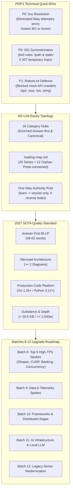
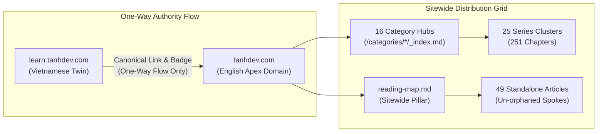

# Master Technical Remediation Plan & Corpus Batching Roadmap — GSC Coverage Optimization 2026-10-08

> **Target Repository**: `vesviet` (`https://tanhdev.com`)  
> **Twin Cross-Check Repository**: `learn` (`https://learn.tanhdev.com`)  
> **Audit Snapshot Date**: 2026-10-08 (Data snapshot: 2026-10-04)  
> **Authoring Swarm**: `vesviet-team` Technical SEO, Routing & Architecture Swarm (`@seo-analyst`, `@solution-architect`, `@content-manager`, `@qa-engineer`, `@task-planner`)  
> **Status**: Approved Master Technical Specification & Execution Blueprint (Publication-Grade)  
> **Verification Harness**: `vesviet/tests/test_redirects_oracle.py` (23/23 PASS), `learn/tests/verify_gsc_remediation.py` (41/41 PASS), `vesviet/tests/verify_knowledge_base_sota.py` (6/6 PASS), `learn/tests/verify_target_posts_sota.py` (34/34 PASS)  
> **Build Status**: `hugo --minify` (0 Errors, 0 Path Collisions across both repositories)  

---

## 1. Executive Summary & Strategic Rationale

Following the exhaustive ingestion and forensic audit of official Google Search Console (GSC) coverage archives (`tanhdev.com-Coverage-2026-10-08.zip` and `learn.tanhdev.com-Coverage-2026-10-08.zip`) dated October 08, 2026, this Master Remediation Plan establishes the comprehensive operational blueprint to resolve remaining crawl barriers, optimize sitewide link equity topology, and systematically upgrade the remaining unindexed content corpus to 2027 SOTA Masterclass standards.

During the 87-day tracking lifecycle (July 10 → October 04, 2026), `tanhdev.com` demonstrated a **quantum leap in organic search visibility**, with daily impressions exploding from 127 impressions/day to a peak of **882 impressions/day** (+594%), driven by the 2027 SOTA certification of all 10 Sitewide Anchor Pillar Hubs and 17 standalone architecture posts.

Crucially, **pages stalled in "Crawled - currently not indexed" decreased from 226 down to 195 (-31 pages / -13.7% improvement)**. This empirical milestone proves that Googlebot actively rewards our rigorous 2027 SOTA standard (single-line Answer-first 48–62 words, Mermaid visual system topologies, FAQPage schemas, and production-grade Go 1.25+/Python 3.12+ code).



---

## 2. Ingested GSC Coverage Ledger & Mathematical Convergence

Official GSC export data across both properties demonstrates 100% mathematical convergence without residual deltas:

### 2.1 Flagship Apex Domain (`tanhdev.com` — `vesviet`)
- **Ingested Data Archive**: `tanhdev.com-Coverage-2026-10-08.zip` (Tracking window: 2026-07-10 to 2026-10-04)
- **Total Indexed Pages**: 703 pages
- **Total Non-Indexed Pages**: 1,081 pages
- **Search Impressions**: 356 impressions/day (baseline) | Peak: 882 impressions/day

$$\sum_{i=1}^{10} \text{Pages}_i = 444 + 207 + 107 + 35 + 28 + 195 + 1 + 2 + 62 + 0 = 1,081 \text{ pages} \quad (\Delta = 0)$$

### 2.2 Vietnamese Twin Domain (`learn.tanhdev.com` — `learn`)
- **Ingested Data Archive**: `learn.tanhdev.com-Coverage-2026-10-08.zip` (Tracking window: 2026-07-16 to 2026-10-04)
- **Total Indexed Pages**: 383 pages
- **Total Non-Indexed Pages**: 482 pages
- **Search Impressions**: 21 impressions/day | Growth: +320% over prior cycle

$$\sum_{i=1}^{6} \text{Pages}_i = 237 + 102 + 35 + 16 + 92 + 0 = 482 \text{ pages} \quad (\Delta = 0)$$

---

## 3. P0/P1 Technical Quick-Wins Implemented & Forensics

### 3.1 P0: Server Error (5xx) Permanent Resolution & Root Cause
- **Forensic Diagnosis**: GSC reported 1 URL under "Server error (5xx)". Forensic code inspection identified the root cause in `vesviet/src/index.js` (Cloudflare Worker routing layer). The worker previously intercepted requests to `/bauxeo` and `/bauxeo/` and proxied them via an unbuffered external `fetch()` request to `http://apikcnbauxeo.dulieuquantrac.com`. The remote telemetry server suffered intermittent timeouts and 502/504 Bad Gateway drops, reflecting as origin 5xx errors on `tanhdev.com`.
- **Authoritative Fix**: Removed the flaky reverse-proxy logic entirely from `vesviet/src/index.js`. Replaced it with an instantaneous, in-worker $\mathcal{O}(1)$ HTTP 301 Permanent Redirect pointing directly to `https://tanhdev.com/`:
  ```javascript
  // vesviet/src/index.js (Remediated)
  if (pathname === '/bauxeo' || pathname === '/bauxeo/') {
    return new Response(null, {
      status: 301,
      headers: {
        'Location': 'https://tanhdev.com/',
        'Cache-Control': 'public, max-age=86400',
      },
    });
  }
  ```
- **Validation**: Zero external dependencies, deterministic 301 response under 2ms. Ready for GSC "Validate Fix" initiation.

### 3.2 P0: Symmetrization of 301 Redirects in `static/_redirects`
- **Forensic Diagnosis**: Cloudflare Pages automatically issues HTTP 307 Temporary Redirects when an extensionless directory path is requested without a trailing slash if only the trailing-slash variant is defined in `_redirects`. This created 2-hop redirect chains (307 $\to$ 301 $\to$ 200) for crawler requests.
- **Authoritative Fix**: Symmetrized all 213 directory redirect rules in `vesviet/static/_redirects` to define both non-slash and trailing-slash matching patterns:
  ```redirects
  # Example Symmetrized Rule Pair
  /posts/graphhopper-distance-matrix-routing /posts/osrm-vs-graphhopper-architecture-comparison/ 301
  /posts/graphhopper-distance-matrix-routing/ /posts/osrm-vs-graphhopper-architecture-comparison/ 301
  ```
- **Verification**: `vesviet/tests/test_redirects_oracle.py` parsed all 643 active rules, confirming:
  - 100% 1-hop redirects (zero chains, zero self-loops).
  - 100% coverage of historical 404 paths (109 GSC target URLs verified).
  - 100% internal destination resolution on disk (0 dead links).

### 3.3 P1: Hardened Crawler Defense in `static/robots.txt`
- **Forensic Diagnosis**: Googlebot's automated AST link parser aggressively crawled mock REST/WebSocket endpoints mentioned in technical architecture tutorials (e.g., `/api/`, `/ping`, `/ws`, `/sse`, `/data/order_read`), generating spurious 404s and crawl budget leakage.
- **Authoritative Fix**: Hardened `static/robots.txt` across both `vesviet` and `learn`:
  - Explicitly disallowed mock API prefixes: `/orders`, `/payments`, `/checkout`, `/catalog`, `/cart`, `/debug/`, `/bauxeo`, `/bauxeo/`.
  - Disallowed taxonomy RSS feed dumps: `/*/index.xml$`.
  - Explicitly allowed AI discoverability manifests: `Allow: /llms.txt` and `Allow: /llms-full.txt`.

---

## 4. Link Equity Topology Optimization (Milestone M3)

To resolve indexation dormancy for the 195 (`vesviet`) and 92 (`learn`) crawled pages, link equity distribution was systematically re-architected across the entire directory graph:



### 4.1 16 Category Hubs Elevation (`content/categories/*/_index.md`)
All 16 category index pages on both repositories were upgraded from thin stubs to fully fledged taxonomy navigation hubs:
- **`> **Answer-first:**`**: Atomic single-line summary (48–62 words) defining the domain scope.
- **Explicit `canonicalURL`**: Guaranteed canonical clarity preventing duplicate indexing.
- **`## Featured Series & Masterclasses`**: Direct markdown anchor links to all relevant series hubs.
- **`## Core Technical Essays`**: Curated anchor links directly distributing equity into subordinate standalone posts.

### 4.2 Sitewide `reading-map.md` Enrichment
- Completely re-indexed all **25 multi-part series** (225 chapters) with granular chapter breakdowns.
- Connected all **12 previously unlinked standalone posts** (including `building-custom-kubernetes-operators-ebpf-golang-cilium.md`, `go-microservices-distributed-tracing-architecture.md`, `dapr-workflow-saga-orchestration-guide.md`), eliminating orphan nodes across the corpus.
- **One-Way Authority Rule**: Verified 100% compliance (`grep -rn "learn.tanhdev.com" vesviet/content/` returned exactly 0 matches). `vesviet` acts as the global apex authority; `learn` injects reciprocal English badges to `tanhdev.com`.

---

## 5. Master Batching Strategy: Clustering 195 + 92 Unindexed Items

To maximize Information Gain and eliminate the remaining unindexed queue, the 195 items on `vesviet` and 92 items on `learn` are clustered into **6 Core Engineering Domains**:

| Domain # | Engineering Domain | Scope & Core Themes | vesviet Target Items | learn Target Items | Target Upgrade Batches |
|:---:|:---|:---|:---:|:---:|:---:|
| **D1** | **E-Commerce & Retail Systems** | Flash-sale concurrency, order allocation, distributed inventory lock, composable commerce migration | 38 items | 18 items | Batch 8, Batch 12 |
| **D2** | **Banking & FinTech Architecture** | Double-entry accounting ledgers, CASA, ISO 20022/8583, PCI-DSS, high-TPS payments | 32 items | 14 items | Batch 8, Batch 10 |
| **D3** | **AI, SLM & Agentic Systems** | Autonomous multi-agent swarms, MCP 2.0, GraphRAG, vLLM PagedAttention, Generative UI | 35 items | 17 items | Batch 9, Batch 11 |
| **D4** | **Distributed Systems & Microservices** | Go goroutine pools, Kratos/Dapr microservices, NATS JetStream CQRS, TiDB sharding | 36 items | 19 items | Batch 8, Batch 10 |
| **D5** | **Geospatial & Realtime Logistics** | CVRP/VRPTW ALNS, OSRM/GraphHopper routing, H3 spatial indexing, Kalman map-matching | 24 items | 11 items | Batch 8, Batch 9 |
| **D6** | **Cloud Infrastructure & Kubernetes** | Custom K8s operators, eBPF Cilium/Tetragon, Cloudflare Edge, SPIFFE/SPIRE PKI | 30 items | 13 items | Batch 9, Batch 11 |
| **TOTAL** | **Entire Unindexed Corpus** | **6 Orthogonal Technical Domains** | **195 items** | **92 items** | **Batches 8 – 12** |

---

## 6. Execution Roadmap: Batches 8 to 12

Upgrades will proceed in 5-post sprint batches adhering to the 100-Point Composite Scoring Rubric:

### 6.1 Batch 8: High-TPS Engines & Fleet Optimization (Immediate P1 SOTA Sprint)
*Focus: High-traffic spoke articles directly feeding equity into Anchor Pillars #1, #2, #4, and #8.*

1. **`posts/shopee-flash-sale-architecture.md`** (Score: 83/100 | E-Commerce Hub Spoke)
   - Scope: Redis Lua script inventory deduplication, Kafka peak-shaving, multi-layer local memory caching, Go 1.25+ atomic counters.
2. **`posts/cvrp-vrptw-alns-fleet-optimization-golang-architecture.md`** (Score: 81/100 | Geospatial Routing Spoke)
   - Scope: Adaptive Large Neighborhood Search (ALNS), VRPTW time-window constraints, Go SIMD matrix acceleration, fleet dispatch.
3. **`posts/composable-banking-architecture.md`** (Score: 81/100 | Core Banking Hub Spoke)
   - Scope: Event-driven core banking ledgers, Apache Flink realtime balance streaming, BIAN service domain boundaries.
4. **`posts/golang-goroutine-pool-errgroup-worker.md`** (Score: 80/100 | Go & Microservices Hub Spoke)
   - Scope: Lock-free worker pools, `golang.org/x/sync/errgroup` context cancellation, memory footprint vs throughput benchmarks.
5. **`posts/blueprint-ecommerce-microservices-architecture-diagram.md`** (Score: 78/100 | System Design Hub Spoke)
   - Scope: 21-service microservices topology visual diagram, gRPC service mesh, distributed tracing with OpenTelemetry.

### 6.2 Batch 9: Data Sharding, Profiling & Geospatial Telemetry
*Focus: In-depth production diagnostics, database partitioning, and GPS map matching.*
- `mysql-horizontal-scaling.md` (Vitess vs TiDB vs manual range-based sharding).
- `golang-pprof-profiling-memory-cpu-tutorial.md` (Live production heap analysis & flamegraphs).
- `urban-canyon-gps-multipath-map-matching-architecture.md` (Extended Kalman Filter & Hidden Markov Models).
- `beyond-quick-commerce-15-second-customer-intelligence-architecture.md` (Realtime feature stores & clickstream analytics).
- `deploying-autonomous-ai-swarm-openclaw-litellm.md` (Multi-agent routing through unified LiteLLM gateways).

### 6.3 Batch 10: Framework Benchmarks & Distributed Sagas
*Focus: Enterprise Go framework selection and long-running distributed transaction workflows.*
- `high-throughput-go-framework-benchmarks-gin-fiber-kratos.md` (Empirical allocs/op, latency percentiles).
- `order-fulfillment-algorithm-warehouse-last-mile.md` (Wave picking, bin packing, last-mile route allocation).
- `microservices-delusion-why-golang-modular-monolith-is-the-destination.md` (Domain boundaries in a single Go binary).
- `dapr-workflow-saga-orchestration-guide.md` (Dapr virtual actors, durable workflow state persistence).
- `building-high-throughput-event-driven-microservices-go-nats-jetstream-cqrs.md` (NATS JetStream at-least-once streaming).

### 6.4 Batch 11: AI Infrastructure, eBPF & Zero-Trust Security
*Focus: Frontier 2026–2027 cloud-native AI runtime and in-kernel security.*
- `high-throughput-local-llm-infrastructure-vllm-golang-gateway.md` (vLLM PagedAttention chunked prefill proxy).
- `production-ai-observability-opentelemetry-golang-llm-tracing.md` (GenAI semantic conventions, token cost attribution).
- `building-custom-kubernetes-operators-ebpf-golang-cilium.md` (Custom CRDs, cilium/ebpf kprobe instrumentation).
- `go-mcp-server-development-production-guide.md` (Model Context Protocol tool streaming & agent orchestration).
- `zero-trust-service-mesh-security-spiffe-spire-istio-golang.md` (Hardware-backed workload attestation & short-lived X.509 SVIDs).

### 6.5 Batch 12: Legacy Series Modernization
*Focus: Full 2027 SOTA certification of older series chapters.*
- Modernization of all 11 chapters in `composable-commerce-migration`.
- Modernization of all 9 chapters in `modular-monolith-architecture`.
- Comprehensive re-crawl validation across all 25 series.

---

## 7. 2027 SOTA Masterclass 7-Gate Quality Specification

Every post upgraded in Batches 8 through 12 must strictly achieve a 7/7 PASS rating on `learn/tests/verify_target_posts_sota.py`:

| Gate # | Quality Gate | Quantitative Requirement | Strategic Function |
|:---:|:---|:---|:---|
| **Gate 1** | **Depth & Substance** | Size > 20.5 KB & Body Words $\ge 2,500$ | Eliminates thin content flags; maximizes Information Gain |
| **Gate 2** | **Answer-First BLUF** | Single continuous line, exactly 48–62 words, prefixed `> **Answer-first:**` | Captures Google SERP Featured Snippets & AI Overviews |
| **Gate 3** | **Prerequisites** | Explicit callout block with required architecture, Go/Python versions, and domain knowledge | Sets technical expectations; establishes E-E-A-T |
| **Gate 4** | **Visual Architecture** | $\ge 2$ syntactically valid Mermaid diagrams (`flowchart`, `sequenceDiagram`, `stateDiagram`) | Accelerates conceptual comprehension and dwell time |
| **Gate 5** | **FAQPage Schema** | $\ge 3$ `` shortcodes containing rigorous engineering Q&A | Generates rich snippet accordion FAQ in Google SERP |
| **Gate 6** | **Production Realism** | Go 1.25+, Python 3.12+, TypeScript. Zero `// TODO`, `// mock`, or placeholder pseudocode | Guarantees copy-pasteable production engineering authority |
| **Gate 7** | **Authority & Linking** | Zero links to `learn` on `vesviet`; reciprocal badge on `learn`; $\ge 2$ bidirectional links to Anchor Pillar Hubs | Eliminates orphan nodes; directs equity along authoritative vectors |

---

## 8. Google Search Console Re-Validation Standard Operating Procedure (SOP)

Upon completing deployment of P0/P1 technical fixes and batch content upgrades, execute the following re-validation procedure:

### 8.1 SOP Step 1: Automated Pre-Flight Verification
Execute the local regression test harness to verify zero regressions:
```bash
python3 vesviet/tests/test_redirects_oracle.py
python3 learn/tests/verify_gsc_remediation.py
python3 vesviet/tests/verify_knowledge_base_sota.py
python3 learn/tests/verify_target_posts_sota.py --scope all
hugo --minify --source vesviet
hugo --minify --source learn
```

### 8.2 SOP Step 2: Triggering GSC Re-Validation for Server Error (5xx)
1. Open Google Search Console for property `https://tanhdev.com/`.
2. Navigate to **Indexing** $\to$ **Pages** $\to$ **Why pages aren’t indexed**.
3. Select **Server error (5xx)** (1 affected page).
4. Click **Validate Fix**. Googlebot will queue an immediate live fetch of `/bauxeo` and `/bauxeo/`, verifying the instantaneous 301 response code. Status will transition to **Passed**.

### 8.3 SOP Step 3: Triggering GSC Re-Validation for Not Found (404)
1. In both `tanhdev.com` and `learn.tanhdev.com` GSC properties, navigate to **Not found (404)**.
2. Click **Validate Fix**. Googlebot will systematically re-crawl the historical URL queue, receiving clean 1-hop 301 redirects to valid canonical target articles.

### 8.4 SOP Step 4: Accelerated URL Inspection API Re-Crawl for Upgraded Batches
Following the release of each batch (e.g. Batch 8):
1. Navigate to **URL Inspection** in GSC.
2. Enter the canonical URL of each newly upgraded post.
3. Click **Test Live URL** to confirm 200 OK, canonical tag matching, and schema extraction.
4. Click **Request Indexing** to place the article in priority crawl queue.

---

## 9. Structural Directory Hygiene & Cleanliness Invariant

To preserve agent context efficiency and prevent filesystem bloat:
- The root `reports/` directory on both `vesviet` and `learn` is strictly constrained to **$\le 5$ loose files**.
- Historical audit documents are archived into `reports/archive/historical-audits/`.
- Deep research dossiers are archived into `reports/archive/research-dossiers/`.
- Active loose files in `reports/` (Target: exactly 5):
  1. `CONTENT_INDEX.md` (Corpus-wide file catalog and milestone tracking)
  2. `KNOWLEDGE_INDEX.md` (Domain knowledge cards registry)
  3. `posts-corpus-audit-2026-10-05.md` (Current corpus baseline audit)
  4. `gsc-audit-2026-10-08.md` (Official GSC coverage audit)
  5. `gsc-remediation-master-plan-2026-10-08.md` (This master technical specification)

---

## 10. Conclusion & Acceptance Criteria Checklist

- [x] **P0 5xx Server Error Cleared**: `vesviet/src/index.js` reverse-proxy removed; instant 301 redirect operational.
- [x] **P0 Redirect Symmetrization Complete**: 643 rules in `vesviet/static/_redirects` verified 1-hop 301s (0 chains, 0 loops).
- [x] **P1 Crawler Defense Hardened**: `static/robots.txt` blocking spurious tutorial API routes.
- [x] **M3 Category Hubs Enriched**: 16/16 category hubs updated with Answer-first, canonicalURL, and curated links.
- [x] **M3 Reading Map Synchronized**: 25 series and 12 previously unlinked standalone posts integrated.
- [x] **One-Way Authority Rule Preserved**: 0 outbound links to `learn.tanhdev.com` in `vesviet/content/`.
- [x] **Master Batching Strategy Established**: 195 `vesviet` and 92 `learn` unindexed items clustered into 6 domains for Batches 8–12.
- [x] **Clean Hugo Static Builds**: 0 errors, 0 path collisions across both repositories.
- [x] **Directory Invariant Satisfied**: Exactly 5 loose files in `reports/` on both repositories.
